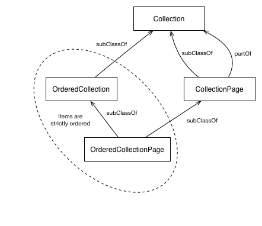

[목차로 돌아가기](ActivityStreams2.0Contents.md)

# [Activity Streams 2.0](https://www.w3.org/TR/activitystreams-core/)
<abbr title="World Wide Web Consortium">W3C</abbr> Recommendation 23 May 2017

**This version:**
- https://www.w3.org/TR/2017/REC-activitystreams-core-20170523/

**Latest published version:**
- https://www.w3.org/TR/activitystreams-core/

**Latest editor's draft:**
- http://w3c.github.io/activitystreams/core/

**Test suite:**
- https://github.com/w3c/activitystreams/tree/master/test

**Implementation report:**
- https://github.com/w3c/activitystreams/tree/master/implementation-reports

**Previous version:**
- https://www.w3.org/TR/2017/PR-activitystreams-core-20170413/

**Editors:**
- [James M Snell](http://jasnell.me/), IBM 
- [Evan Prodromou](https://fuzzy.ai/about), Fuzzy.ai 

**Repository:**
- [Github](https://github.com/w3c/activitystreams) 
- [Issues](https://github.com/w3c/activitystreams/issues) 
- [Commits](https://github.com/w3c/activitystreams/commits/master) 

**Test:**
- [Validator](https://as2.rocks/) 

Please check the [**errata**](https://github.com/w3c/activitystreams/blob/master/ERRATA.md) for any errors or issues reported since publication.

The English version of this specification is the only normative version. Non-normative [translations](https://www.w3.org/2003/03/Translations/byTechnology?technology=https://www.w3.org/TR/activitystreams-vocabulary/) may also be available.

[Copyright](https://www.w3.org/Consortium/Legal/ipr-notice#Copyright) © 2017 [<abbr title="World Wide Web Consortium">W3C</abbr>](https://www.w3.org/)® (<abbr title="Massachusetts Institute of Technology">[MIT](https://www.csail.mit.edu/)</abbr>, <abbr title="European Research Consortium for Informatics and Mathematics">[ERCIM](https://www.ercim.eu/)</abbr>, [Keio](https://www.keio.ac.jp/), [Beihang](http://ev.buaa.edu.cn/)). <abbr title="World Wide Web Consortium">W3C</abbr> [liability](https://www.w3.org/Consortium/Legal/ipr-notice#Legal_Disclaimer), [trademark](https://www.w3.org/Consortium/Legal/ipr-notice#W3C_Trademarks) and [permissive document license](https://www.w3.org/Consortium/Legal/2015/copyright-software-and-document) rules apply.

-----

## Abstract

This specification details a model for representing potential and completed activities using the JSON format. It is intended to be used with vocabularies that detail the structure of activities, and define specific types of activities.

### Author's Note

_This section is non-normative._

This draft is heavily influenced by the JSON Activity Streams 1.0 specification originally co-authored by Martin Atkins, Will Norris, Chris Messina, Monica Wilkinson, Rob Dolin and James Snell. The author is very thankful for their significant contributions and gladly stands on their shoulders. Some portions of the original text of Activity Streams 1.0 are used in this document.

## Status of This Document

This section describes the status of this document at the time of its publication. Other documents may supersede this document. A list of current <abbr title="World Wide Web Consortium">W3C</abbr> publications and the latest revision of this technical report can be found in the [<abbr title="World Wide Web Consortium">W3C</abbr> technical reports index](https://www.w3.org/TR/) at https://www.w3.org/TR/.

This document was published by the [Social Web Working Group](https://www.w3.org/Social/WG) as a Recommendation. Comments regarding this document are welcome. Please send them to [public-socialweb@w3.org](public-socialweb@w3.org) ([subscribe](public-socialweb-request@w3.org), [archives](https://lists.w3.org/Archives/Public/public-socialweb/)).

Please see the Working Group's [implementation report](https://github.com/w3c/activitystreams/tree/master/implementation-reports).

This document has been reviewed by <abbr title="World Wide Web Consortium">W3C</abbr> Members, by software developers, and by other <abbr title="World Wide Web Consortium">W3C</abbr> groups and interested parties, and is endorsed by the Director as a <abbr title="World Wide Web Consortium">W3C</abbr> Recommendation. It is a stable document and may be used as reference material or cited from another document. <abbr title="World Wide Web Consortium">W3C</abbr>'s role in making the Recommendation is to draw attention to the specification and to promote its widespread deployment. This enhances the functionality and interoperability of the Web.

This document was produced by a group operating under the [5 February 2004 <abbr title="World Wide Web Consortium">W3C</abbr> Patent Policy](https://www.w3.org/Consortium/Patent-Policy-20040205/). <abbr title="World Wide Web Consortium">W3C</abbr> maintains a [public list of any patent disclosures](https://www.w3.org/2004/01/pp-impl/72531/status) made in connection with the deliverables of the group; that page also includes instructions for disclosing a patent. An individual who has actual knowledge of a patent which the individual believes contains [Essential Claim(s)](https://www.w3.org/Consortium/Patent-Policy-20040205/#def-essential) must disclose the information in accordance with [section 6 of the <abbr title="World Wide Web Consortium">W3C</abbr> Patent Policy](https://www.w3.org/Consortium/Patent-Policy-20040205/#sec-Disclosure).

This document is governed by the [1 March 2017 <abbr title="World Wide Web Consortium">W3C</abbr> Process Document](https://www.w3.org/2017/Process-20170301/).

## Table of Contents

1 Introduction

- 1.1 Relationship to Other Social Standards
- 1.2 Relationship to JSON Activity Streams 1.0

2 Serialization

- 2.1 JSON-LD
- 2.2 IRIs and URLs
- 2.3 Date and Times

3 Examples

- 3.1 Minimal Activity
- 3.2 Basic activity with some additional detail
- 3.3 An extended activity

4 Model

- 4.1 Object
- 4.2 Link
- 4.3 Actor
- 4.4 Activity
- 4.5 IntransitiveActivity
- 4.6 Collection
- 4.7 Natural Language Values
- 4.8 Marking up language

5 Extensibility

- 5.1 Support for Compact URIs
- 5.2 Re-serialization of Extensions

6 Privacy Considerations

7 Security Considerations

8 IANA Considerations

- 8.1 The `application/activity+json` Media Type

9 Conformance

- 9.1 Documents
- 9.2 Implementations

A Acknowledgements

B Deprecated Activity Streams 1.0 Syntax

C Example using Multiple Vocabularies

D Changelog

E Table of Figures

F References

- F.1 Normative references
- F.2 Informative references

## 1. Introduction

In the most basic sense, an "Activity" is a semantic description of an action. It is the goal of this specification to provide a JSON-based syntax that is sufficient to express metadata about activities in a rich, human-friendly but machine-processable and extensible manner. This can include constructing natural-language descriptions or visual representations about the activity, associating actionable information with various types of objects, communicating or recording activity logs, or delegation of potential actions to other applications.

The key words "*MUST*", "*MUST NOT*", "*REQUIRED*", "*SHALL*", "*SHALL NOT*", " *SHOULD*", "*SHOULD NOT*", "*RECOMMENDED*", "*MAY*", and "*OPTIONAL*" in this document are to be interpreted as described in [[RFC2119](https://www.w3.org/TR/activitystreams-core/#bib-RFC2119)].

### 1.1 Relationship to Other Social Standards

_This section is non-normative._

Activity Streams 2.0 is suitable as a social data syntax. It forms part of the [[SWP](https://www.w3.org/TR/activitystreams-core/#bib-SWP)] suite of related standards.

### 1.2 Relationship to JSON Activity Streams 1.0

_This section is non-normative._

The JSON Activity Streams 1.0 [[AS1](https://www.w3.org/TR/activitystreams-core/#bib-AS1)] specification was published in May of 2011 and provided a baseline extensible syntax for the expression of completed activities. This specification builds upon that initial foundation by incorporating lessons learned through extensive implementation, community feedback and related ongoing work from a variety of other communities.

Some of the issues that specifically motivated the evolution of Activity Streams 2.0 from Activity Streams 1.0 include:

- Multi-lingual representation of activities
- Unification of "verb" and "objectType" to "type"
- Removal of activity types and object types that weren't core to social use cases
- Introduction of the Link type for richly-described links
- Incorporation of audience targeting into the core spec
- The generalized "Undo" activity type, so all activities can be undone
- Consistent collection and paging representation
- Formalizing the namespace of the base vocabulary of object types and activity types
- Extensibility framework for other types and properties
- Compatibility with JSON-LD

The terms `displayName`, `verb`, `title` and `objectType` should be treated as reserved terms that *SHOULD NOT* be used within Activity Streams 2.0 documents. When encountered in an Activity Streams 2.0 document, they SHOULD be processed in accordance to the guidelines listed in [B. Deprecated Activity Streams 1.0 Syntax](https://www.w3.org/TR/activitystreams-core/#activitystreams-1.0a)

## 2. Serialization

This specification describes a JSON-based [[RFC7159](https://www.w3.org/TR/activitystreams-core/#bib-RFC7159)] serialization syntax for the [Activity Vocabulary](https://www.w3.org/TR/activitystreams-vocabulary/) that conforms to a subset of [[JSON-LD](https://www.w3.org/TR/activitystreams-core/#bib-JSON-LD)] syntax constraints but does not require JSON-LD processing. While other serialization forms are possible, such alternatives are not discussed by this document.

When serialized, absent properties are represented by either (a) setting the property value to null, or (b) by omitting the property declaration altogether at the option of the publisher. These representations are semantically equivalent. If a property has an array value, the absence of any items in that array MUST be represented by omitting the property entirely or by setting the value to null. The appropriate interpretation of an omitted or explicitly null value is that no value has been assigned as opposed to the view that the given value is empty or nil.

An **Activity Streams Document** is a JSON document whose root value is an Activity Streams [Object](https://www.w3.org/TR/activitystreams-core/#asobject) of any type, including a [Collection](https://www.w3.org/TR/activitystreams-core/#collection), and whose MIME media type is " `application/activity+json`".

Activity Streams 2.0 documents *MUST* be serialized using the UTF-8 character encoding.

### 2.1 JSON-LD

The serialized JSON form of an Activity Streams 2.0 document *MUST* be consistent with what would be produced by the standard JSON-LD 1.0 Processing Algorithms and API [[JSON-LD-API](https://www.w3.org/TR/activitystreams-core/#bib-JSON-LD-API)] Compaction Algorithm using, at least, the normative JSON-LD @context definition provided [here](https://www.w3.org/ns/activitystreams). Implementations *MAY* augment the provided @context with additional @context definitions but *MUST NOT* override or change the normative context. Implementations *MAY* also use additional properties and values not defined in the JSON-LD @context with the understanding that any such properties will likely be unsupported and ignored by consuming implementations that use the standard JSON-LD algorithms. See the [Extensibility](https://www.w3.org/TR/activitystreams-core/#extensibility) section for more information on handling extensions within Activity Streams 2.0 documents.

JSON-LD uses the special `@context` property to define the [processing context](http://www.w3.org/TR/json-ld/#the-context). The value of the `@context` property is defined by the [[JSON-LD](https://www.w3.org/TR/activitystreams-core/#bib-JSON-LD)] specification. Implementations producing Activity Streams 2.0 documents *SHOULD* include a `@context` property with a value that includes a reference to the normative [Activity Streams 2.0 JSON-LD @context definition](https://www.w3.org/ns/activitystreams) using the URL " `https://www.w3.org/ns/activitystreams`". Implementations *MAY* use the alternative URL " `http://www.w3.org/ns/activitystreams`" instead. This can be done using a string, object, or array.

### 2.1.1 Context with a string

<div align="center"><em>
Figure 1 Document providing a context as a string.
</em></div>

><div align="center"> Example 1 </div>
>
>```json
>{
>  "@context": "https://www.w3.org/ns/activitystreams",
>  "summary": "A note",
>  "type": "Note",
>  "content": "My dog has fleas."
>}
>```

### 2.1.2 Context with an object

<div align="center"><em>
Figure 2 Document providing context as an object using the <code>@vocab</code> keyword and a prefix for extension terms.
</em></div>

><div align="center"> Example 2 </div>
>
>```json
>{
>  "@context": {
>     "@vocab": "https://www.w3.org/ns/activitystreams",
>     "ext": "https://canine-extension.example/terms/",
>     "@language": "en"
>  },
>  "summary": "A note",
>  "type": "Note",
>  "content": "My dog has fleas.",
>  "ext:nose": 0,
>  "ext:smell": "terrible"
>}
>```

[//Comment]: # "@language가 en으로 설정되어 있으므로 따로 번역을 하지 않겠습니다."

### 2.1.3 Context with an array

<div align="center"><em>
Figure 3 Document providing context as an array, and including an alias for an additional term.
</em></div>

><div align="center"> Example 3 </div>
>
>```json
>{
>  "@context": [
>     "https://www.w3.org/ns/activitystreams",
>     {
>      "css": "http://www.w3.org/ns/oa#styledBy"
>     }
>  ],
>  "summary": "A note",
>  "type": "Note",
>  "content": "My dog has fleas.",
>  "css": "http://www.csszengarden.com/217/217.css?v=8may2013"
>}
>```

When a JSON-LD enabled Activity Streams 2.0 implementation encounters a JSON document identified using the " `application/activity+json`" MIME media type, and that document does not contain a `@context` property whose value includes a reference to the normative [Activity Streams 2.0 JSON-LD @context definition](https://www.w3.org/ns/activitystreams), the implementation *MUST* assume that the normative @context definition still applies.

### 2.2 IRIs and URLs

This specification uses IRIs [[RFC3987](https://www.w3.org/TR/activitystreams-core/#bib-RFC3987)]. Every URI [[RFC3986](https://www.w3.org/TR/activitystreams-core/#bib-RFC3986)] is also an IRI, so a URI may be used wherever an IRI is named. There are two special considerations: (1) when an IRI that is not also a URI is given for dereferencing, it *MUST* be mapped to a URI using the steps in Section 3.1 of [[RFC3987](https://www.w3.org/TR/activitystreams-core/#bib-RFC3987)] and (2) when an IRI is serving as an "id" value, it *MUST NOT* be so mapped.

Relative IRI (and URL) references *SHOULD NOT* be used within an Activity Streams 2.0 document due to the fact that many JSON parser implementations are not capable of reliably preserving the base context necessary to properly resolve relative references.
2.3 Date and Times

All properties with date and time values *MUST* conform to the "date-time" production in [[RFC3339](https://www.w3.org/TR/activitystreams-core/#bib-RFC3339)] with the one exception that seconds *MAY* be omitted. An uppercase "T" character *MUST* be used to separate date and time, and an uppercase "Z" character *MUST* be used in the absence of a numeric time zone offset.

This is specified using the following [[ABNF](https://www.w3.org/TR/activitystreams-core/#bib-ABNF)] syntax description. The "time-hour", "time-minute", "time-second", "time-secfrac", "time-offset" and "full-date" constructs are as defined in [ [RFC3339](https://www.w3.org/TR/activitystreams-core/#bib-RFC3339)].

```
as2-partial-time = time-hour `":"` time-minute [`":"` time-second]
                   [time-secfrac]
as2-full-time    = as2-partial-time time-offset
as2-date-time    = full-date `"T"` as2-full-time
```

It is important to note that the \`time-offset\` component does not correlate to time-zones, and while times that include the \`time-offset\` component work well for timestamps, they cannot be reliably converted to and from local "wall times" without additional information and processing.

## 3. Examples

_This section is non-normative._

Following are three examples of activities with varying degrees of detail.

Each example is shown using the normative JSON serialization defined by this specification.

### 3.1 Minimal Activity

<div align="center"><em>
Figure 4 Expresses the statement <code>'http://www.test.example/martin' created 'http://example.org/foo.jpg'</code>. No additional detail is given.
</em></div>

><div align="center"> Example 4 </div>
>
>```json
>{
>  "@context": "https://www.w3.org/ns/activitystreams",
>  "summary": "Martin created an image",
>  "type": "Create",
>  "actor": "http://www.test.example/martin",
>  "object": "http://example.org/foo.jpg"
>}
>```

### 3.2 Basic activity with some additional detail

<div align="center"><em>
Figure 5 Expresses the statement "Martin Smith added an article to the blog 'Martin's Blog' at 3:04 PM UTC on February 10, 2015." Some additional details about the article, actor and target blog are given using properties defined by the <a href="https://www.w3.org/TR/activitystreams-vocabulary/">Activity Streams 2.0 Vocabulary</a>.
</em></div>

><div align="center"> Example 5 </div>
>
>```json
>{
>  "@context": "https://www.w3.org/ns/activitystreams",
>  "summary": "Martin added an article to his blog",
>  "type": "Add",
>  "published": "2015-02-10T15:04:55Z",
>  "actor": {
>   "type": "Person",
>   "id": "http://www.test.example/martin",
>   "name": "Martin Smith",
>   "url": "http://example.org/martin",
>   "image": {
>     "type": "Link",
>     "href": "http://example.org/martin/image.jpg",
>     "mediaType": "image/jpeg"
>   }
>  },
>  "object" : {
>   "id": "http://www.test.example/blog/abc123/xyz",
>   "type": "Article",
>   "url": "http://example.org/blog/2011/02/entry",
>   "name": "Why I love Activity Streams"
>  },
>  "target" : {
>   "id": "http://example.org/blog/",
>   "type": "OrderedCollection",
>   "name": "Martin's Blog"
>  }
>}
>```

### 3.3 An extended activity

<div align="center"><em>
Figure 6 A more extensive, single-entry "Activity Stream" follows.
</em></div>

><div align="center"> Example 6 </div>
>
>```json
>{
>  "@context": "https://www.w3.org/ns/activitystreams",
>  "summary": "Martin's recent activities",
>  "type": "Collection",
>  "totalItems": 1,
>  "items" : [
>    {
>      "type": "Add",
>      "published": "2011-02-10T15:04:55Z",
>      "generator": "http://example.org/activities-app",
>      "nameMap": {
>        "en": "Martin added a new image to his album.",
>        "ga": "Martin phost le fisean nua a albam."
>      },
>      "actor": {
>        "type": "Person",
>        "id": "http://www.test.example/martin",
>        "name": "Martin Smith",
>        "url": "http://example.org/martin",
>        "image": {
>          "type": "Link",
>          "href": "http://example.org/martin/image",
>          "mediaType": "image/jpeg",
>          "width": 250,
>          "height": 250
>        }
>      },
>      "object" : {
>        "name": "My fluffy cat",
>        "type": "Image",
>        "id": "http://example.org/album/máiréad.jpg",
>        "preview": {
>          "type": "Link",
>          "href": "http://example.org/album/máiréad.jpg",
>          "mediaType": "image/jpeg"
>        },
>        "url": [
>          {
>            "type": "Link",
>            "href": "http://example.org/album/máiréad.jpg",
>            "mediaType": "image/jpeg"
>          },
>          {
>            "type": "Link",
>            "href": "http://example.org/album/máiréad.png",
>            "mediaType": "image/png"
>          }
>        ]
>      },
>      "target": {
>        "type": "Collection",
>        "id": "http://example.org/album/",
>        "nameMap": {
>          "en": "Martin's Photo Album",
>          "ga": "Grianghraif Mairtin"
>        },
>        "image": {
>          "type": "Link",
>          "href": "http://example.org/album/thumbnail.jpg",
>          "mediaType": "image/jpeg"
>        }
>      }
>    }
>  ]
>}
>```

## 4. Model

The [Activity Vocabulary](https://www.w3.org/TR/activitystreams-vocabulary/) normatively defines the core object types and properties for Activity Streams 2.0.

The object types defined by the vocabulary are segmented into a set of eight core types and an extended set of Activity and Object types common to many social Web applications. The core types include:

- [Object](https://www.w3.org/TR/activitystreams-core/#asobject),
- [Link](https://www.w3.org/TR/activitystreams-core/#dfn-link),
- [Activity](https://www.w3.org/TR/activitystreams-core/#activity),
- [IntransitiveActivity](https://www.w3.org/TR/activitystreams-core/#intransitiveactivity),
- [Collection](https://www.w3.org/TR/activitystreams-core/#collection),
- [`OrderedCollection`](https://www.w3.org/TR/activitystreams-core/#dfn-orderedcollection),
- [`CollectionPage`](https://www.w3.org/TR/activitystreams-core/#dfn-collectionpage), and
- [`OrderedCollectionPage`](https://www.w3.org/TR/activitystreams-core/#dfn-orderedcollectionpage).

Every JSON object in an Activity Streams 2.0 document is either an [Object](https://www.w3.org/TR/activitystreams-core/#asobject) or a [Link](https://www.w3.org/TR/activitystreams-core/#dfn-link). All other types defined in the Activity Vocabulary, as well as all extension types, are derived from these two base types.

A JSON object in the Activity Streams 2.0 document is a [Link](https://www.w3.org/TR/activitystreams-core/#dfn-link) if either: (a) the object contains a `type` property whose value includes "`Link`" or (b) any of the types included in the value of the `type` property are defined as extensions of [Link](https://www.w3.org/TR/activitystreams-core/#dfn-link) (see [Mention](https://www.w3.org/TR/activitystreams-vocabulary/#dfn-mention) for instance); otherwise the JSON object is considered an instance or extension of [Object](https://www.w3.org/TR/activitystreams-core/#asobject).

### 4.1 Object

The [Object](https://www.w3.org/TR/activitystreams-vocabulary/#dfn-object) is the primary base type for the Activity Streams vocabulary.

In addition to having a global identifier (expressed as an absolute IRI using the `id` property) and an "object type" (expressed using the `type` property), all instances of the `Object` type share a common set of properties normatively defined by the [Activity Vocabulary](https://www.w3.org/TR/activitystreams-vocabulary/). 
These include: 
 [attachment](https://www.w3.org/TR/activitystreams-vocabulary/#dfn-attachment) |
 [attributedTo](https://www.w3.org/TR/activitystreams-vocabulary/#dfn-attributedto) |
 [audience](https://www.w3.org/TR/activitystreams-vocabulary/#dfn-audience) |
 [content](https://www.w3.org/TR/activitystreams-vocabulary/#dfn-content) |
 [context](https://www.w3.org/TR/activitystreams-vocabulary/#dfn-context) |
 [contentMap](https://www.w3.org/TR/activitystreams-vocabulary/#dfn-content) |
 [name](https://www.w3.org/TR/activitystreams-vocabulary/#dfn-name) |
 [nameMap](https://www.w3.org/TR/activitystreams-vocabulary/#dfn-name) |
 [endTime](https://www.w3.org/TR/activitystreams-vocabulary/#dfn-endtime) |
 [generator](https://www.w3.org/TR/activitystreams-vocabulary/#dfn-generator) |
 [icon](https://www.w3.org/TR/activitystreams-vocabulary/#dfn-icon) |
 [image](https://www.w3.org/TR/activitystreams-vocabulary/#dfn-image-term) |
 [inReplyTo](https://www.w3.org/TR/activitystreams-vocabulary/#dfn-inreplyto) |
 [location](https://www.w3.org/TR/activitystreams-vocabulary/#dfn-location) |
 [preview](https://www.w3.org/TR/activitystreams-vocabulary/#dfn-preview) |
 [published](https://www.w3.org/TR/activitystreams-vocabulary/#dfn-published) |
 [replies](https://www.w3.org/TR/activitystreams-vocabulary/#dfn-replies) |
 [startTime](https://www.w3.org/TR/activitystreams-vocabulary/#dfn-starttime) |
 [summary](https://www.w3.org/TR/activitystreams-vocabulary/#dfn-summary) |
 [summaryMap](https://www.w3.org/TR/activitystreams-vocabulary/#dfn-summary) |
 [tag](https://www.w3.org/TR/activitystreams-vocabulary/#dfn-tag) |
 [updated](https://www.w3.org/TR/activitystreams-vocabulary/#dfn-updated) |
 [url](https://www.w3.org/TR/activitystreams-vocabulary/#dfn-url) |
 [to](https://www.w3.org/TR/activitystreams-vocabulary/#dfn-to) |
 [bto](https://www.w3.org/TR/activitystreams-vocabulary/#dfn-bto) |
 [cc](https://www.w3.org/TR/activitystreams-vocabulary/#dfn-cc) |
 [bcc](https://www.w3.org/TR/activitystreams-vocabulary/#dfn-bcc) |
 [mediaType](https://www.w3.org/TR/activitystreams-vocabulary/#dfn-mediatype) |
 [duration](https://www.w3.org/TR/activitystreams-vocabulary/#dfn-duration)

All properties are optional (including the `id` and `type`).

<div align="center"><em>
Figure 7 Following is an example Object that uses the `id` and `type` properties to express the global identifier and object type:
</em></div>

><div align="center"> Example 7 </div>
>
>```json
>{
>  "@context": "https://www.w3.org/ns/activitystreams",
>  "id": "http://example.org/foo",
>  "type": "Note",
>  "name": "My favourite stew recipe",
>  "attributedTo": {
>    "id": "http://joe.website.example/",
>    "type": "Person",
>    "name": "Joe Smith"
>  },
>  "published": "2014-08-21T12:34:56Z"
>}
>```

The [Activity Vocabulary](https://www.w3.org/TR/activitystreams-vocabulary/) defines a range of `Object` types that are common to many social Web applications. This specification stops short of defining semantically specific properties for most of these objects. External vocabularies can be used to express additional detail not covered by the Activity Vocabulary.

Furthermore, while implementations are free to introduce new types of Objects beyond those defined by the Activity Vocabulary, interoperability issues can arise when applications rely too much on extension types that are not recognized by other implementations. Care should be taken to not unduly overlap with or duplicate the existing Object types.

When an implementation uses an extension type that overlaps with a core vocabulary type, the implementation *MUST* also specify the core vocabulary type. For instance, some vocabularies (e.g. The Good Relations Vocabulary) define their own types for describing locations. An implementation that wishes, for example, to use a http://purl.org/goodrelations/v1#Location as an object type *MUST* also identify the object as being a [Place](https://www.w3.org/TR/activitystreams-vocabulary/#dfn-place) as illustrated in the following:

<div align="center"><em>
Figure 8 An Object that is both a <code>Place</code> and a <code>gr:Location</code>:
</em></div>

><div align="center"> Example 8 </div>
>
>```json
>{
>  "@context": [
>    "https://www.w3.org/ns/activitystreams",
>    {
>      "gr": "http://purl.org/goodrelations/v1#"
>    }
>  ],
>  "type": ["Place", "gr:Location"],
>  "name": "Sally's Restaurant",
>  "longitude": 12.34,
>  "latitude": 56.78,
>  "gr:category": "restaurants/french_restaurants"
>}
>```

Certain properties defined by some External Vocabularies can overlap or duplicate those defined by the Activity Vocabulary. Where such overlap exists, for the sake of consistent interoperability, implementations MUST favor the use of properties defined by the Activity Vocabulary.

### 4.1.1 Text representations of Object types

Activity Streams consumers often need a text representation of an Activity Streams object, e.g. for display in a Web browser or console interface.

The [name](https://www.w3.org/TR/activitystreams-vocabulary/#dfn-name) property *SHOULD* be derived from input by the creator or another user.

The [summary](https://www.w3.org/TR/activitystreams-vocabulary/#dfn-summary) property *SHOULD* be used as a fallback text representation, possibly automatically generated by the publisher. If there is no `name` property, the `summary` property *SHOULD NOT* include markup, and *SHOULD* be short enough to be used as a reasonable text representation of the object.

<div align="center"><em>
Figure 9 A note with a name defined by the author
</em></div>

><div align="center"> Example 9 </div>
>
>```json
>{
>  "@context": "https://www.w3.org/ns/activitystreams",
>  "type": "Note",
>  "id": "http://example.org/note/123",
>  "name": "Our Weather Is Fine",
>  "content": "I feel that the weather is appropriate to our season and location."
>}
>```

<div align="center"><em>
Figure 10 A note with an automatically-generated summary
</em></div>

><div align="center"> Example 10 </div>
>
>```json
>{
>  "@context": "https://www.w3.org/ns/activitystreams",
>  "type": "Note",
>  "id": "http://example.org/note/124",
>  "summary": "A note by Sally",
>  "content": "Everything is OK here."
>}
>```

The `name` and `summary` *MAY* be absent, *MAY* lack explicit values in the end user's current language, and MAY be longer than appropriate for use as a text representation of the Object in the current language context. Consumer implementations *SHOULD* have fallback strategies for text representation of Objects in these cases.

### 4.2 Link

A `Link` describes a qualified, indirect reference to another resource that is closely related to the conceptual model of Links as established in [[RFC5988](https://www.w3.org/TR/activitystreams-core/#bib-RFC5988)]. The properties of the Link object are not the properties of the referenced resource, but are provided as hints for rendering agents to understand how to make use of the resource. For example, `height` and `width` might represent the desired rendered size of a referenced image, rather than the actual pixel dimensions of the referenced image.

The target URI of the Link is expressed using the required [href](https://www.w3.org/TR/activitystreams-vocabulary/#dfn-href) property. In addition, all `Link` instances share the following common set of optional properties as normatively defined by the [Activity Vocabulary](https://www.w3.org/TR/activitystreams-vocabulary/):
 [id](https://www.w3.org/TR/activitystreams-vocabulary/#dfn-id) |
 [name](https://www.w3.org/TR/activitystreams-vocabulary/#dfn-name) |
 [hreflang](https://www.w3.org/TR/activitystreams-vocabulary/#dfn-hreflang) |
 [mediaType](https://www.w3.org/TR/activitystreams-vocabulary/#dfn-mediatype) |
 [rel](https://www.w3.org/TR/activitystreams-vocabulary/#dfn-rel) |
 [height](https://www.w3.org/TR/activitystreams-vocabulary/#dfn-height) |
 [width](https://www.w3.org/TR/activitystreams-vocabulary/#dfn-width)

For example, all [Objects](https://www.w3.org/TR/activitystreams-core/#asobject) can contain an [image](https://www.w3.org/TR/activitystreams-vocabulary/#dfn-image-term) property whose value describes a graphical representation of the containing object. This property will typically be used to provide the URL to an image (e.g. JPEG, GIF or PNG) resource that can be displayed to the user. Any given object might have multiple such visual representations -- multiple screenshots, for instance, or the same image at different resolutions. In Activity Streams 2.0, there are essentially three ways of describing such references.

<div align="center"><em>
Figure 11 To reference a single image without any additional metadata, a direct association can be expressed as a JSON string containing an absolute IRI.
</em></div>

><div align="center"> Example 11 </em>
>
>```json
>{
>  "@context": "https://www.w3.org/ns/activitystreams",
>  "type": "Application",
>  "id": "http://example.org/application/123",
>  "name": "Exampletron 3000",
>  "image": "http://example.org/application/123.png"
>}
>```

<div align="center"><em>
Figure 12 Alternatively, if additional metadata is required (such as the MIME content type of the referenced resource) a <a href="https://www.w3.org/TR/activitystreams-core/#dfn-link">Link</a> can be used:
</em></div>

><div align="center"> Example 12 </div>
>
>```json
>{
>  "@context": "https://www.w3.org/ns/activitystreams",
>  "type": "Application",
>  "id": "http://example.org/application/123",
>  "name": "Exampletron 3000",
>  "image": {
>    "type": "Link",
>    "href": "http://example.org/application/123.png",
>    "mediaType": "image/png"
>  }
>}
>```

Formally, the former example establishes an unqualified direct relationship with the image resource while the latter creates a [qualified, indirect relationship](http://patterns.dataincubator.org/book/qualified-relation.html) that allows additional properties about the relationship to be specified.

<div align="center"><em>
Figure 13 If more than one value is to be expressed, A JSON Array with a mix of strings and <a href="https://www.w3.org/TR/activitystreams-core/#dfn-link">Link</a>s can be used:
</em></div>

><div align="center"> Example 13 </div>
>
>```json
>{
>  "@context": "https://www.w3.org/ns/activitystreams",
>  "type": "Application",
>  "id": "http://example.org/application/123",
>  "name": "Exampletron 3000",
>  "image": [
>    "http://example.org/application/abc.gif",
>    {
>      "type": "Link",
>      "href": "http://example.org/application/123.png",
>      "mediaType": "image/png"
>    }
>  ]
>}
>```

Individual items contained in such an array are independent of one another and no significance is given to the ordering.

RFC 5988 defines that all Links have a "link relation" that describes the contextual purpose of the link. Within a [Link](https://www.w3.org/TR/activitystreams-core/#dfn-link), the [rel](https://www.w3.org/TR/activitystreams-vocabulary/#dfn-rel) property provides the link relation value. If no `rel` property is specified, the link relation is considered to be unspecified. Any given Link can have multiple link relation values. In the JSON serialization, a single link relation is expressed as a single JSON string. Multiple link relations are expressed as an array of JSON strings.

The scope of the link relation is the object in which the [Link](https://www.w3.org/TR/activitystreams-core/#dfn-link) is an immediate child.

In the following example, two separate references are provided. The link relation of the first is unspecified, while the link relation of the second is "`thumbnail`".

<div align="center"><em>
Figure 14
</em></div>

><div align="center"> Example 14 </div>
>
>```json
>{
>  "@context": "https://www.w3.org/ns/activitystreams",
>  "type": "Application",
>  "id": "http://example.org/application/123",
>  "name": "Exampletron 3000",
>  "image": [
>    "http://example.org/application/abc.gif",
>    {
>      "type": "Link",
>      "href": "http://example.org/application/123.png",
>      "mediaType": "image/png",
>      "rel": "thumbnail"
>    }
>  ]
>}
>```

It ought to be noted that the [[HTML5](https://www.w3.org/TR/activitystreams-core/#bib-HTML5)] specification provides its own alternative definition of a "link relation" that differs slightly from the [[RFC5988](https://www.w3.org/TR/activitystreams-core/#bib-RFC5988)] definition. In the HTML5 definition, any string that does not contain the "space" U+0020, "tab" (U+0009), "LF" (U+000A), "FF" (U+000C), "CR" (U+000D) or "," (U+002C) characters can be used as a valid link relation. To promote interoperability, Activity Streams 2.0 implementations *MUST* only use link relations that are syntactically valid in terms of both the [[RFC5988](https://www.w3.org/TR/activitystreams-core/#bib-RFC5988)] and [[HTML5](https://www.w3.org/TR/activitystreams-core/#bib-HTML5)] definitions. Implementations *MAY* use link relation values that are not registered.

Note that the [Link](https://www.w3.org/TR/activitystreams-core/#dfn-link) and [Object](https://www.w3.org/TR/activitystreams-core/#asobject) types are disjoint from one another. That is, any given [Object](https://www.w3.org/TR/activitystreams-core/#asobject) cannot also be a [Link](https://www.w3.org/TR/activitystreams-core/#dfn-link).

### 4.3 Actor

Actor objects are specializations of the base [Object](https://www.w3.org/TR/activitystreams-core/#asobject) type that represent entities capable of carrying out an Activity. The [Activity Vocabulary](https://www.w3.org/TR/activitystreams-vocabulary/) provides the normative definition of five specific types of Actors:
 [Application](https://www.w3.org/TR/activitystreams-vocabulary/#dfn-application) |
 [Group](https://www.w3.org/TR/activitystreams-vocabulary/#dfn-group) |
 [Organization](https://www.w3.org/TR/activitystreams-vocabulary/#dfn-organization) |
 [Person](https://www.w3.org/TR/activitystreams-vocabulary/#dfn-person) |
 [Service](https://www.w3.org/TR/activitystreams-vocabulary/#dfn-service).

This specification intentionally defines Actors in only the most generalized way, stopping short of defining semantically specific properties for each. All Actor objects are specializations of [Object](https://www.w3.org/TR/activitystreams-core/#asobject) and inherit all of the core properties common to all Objects. External vocabularies can be used to express additional detail not covered by the Activity Vocabulary. VCard [ [vcard-rdf](https://www.w3.org/TR/activitystreams-core/#bib-vcard-rdf)] *SHOULD* be used to provide additional metadata for [Person](https://www.w3.org/TR/activitystreams-vocabulary/#dfn-person), [Group](https://www.w3.org/TR/activitystreams-vocabulary/#dfn-group), and [Organization](https://www.w3.org/TR/activitystreams-vocabulary/#dfn-organization) instances.

<div align="center"><em>
Figure 15 An Activity with a Person actor extended with VCard properties:
</em></div>

><div align="center"> Example 15 </div>
>
>```json
>{
>  "@context": [
>    "https://www.w3.org/ns/activitystreams",
>    {"vcard": "http://www.w3.org/2006/vcard/ns#"}
>  ],
>  "summary": "Sally created a note",
>  "type": "Create",
>  "actor": {
>    "type": ["Person", "vcard:Individual"],
>    "id": "http://sally.example.org",
>    "name": "Sally Smith",
>    "vcard:given-name": "Sally",
>    "vcard:family-name": "Smith"
>  },
>  "object": {
>    "type": "Note",
>    "content": "This is a simple note"
>  }
>}
>```

While implementations are free to introduce new types of Actors beyond those defined by the Activity Vocabulary, interoperability issues can arise when applications rely too much on extension types that are not recognized by other implementations. Care should be taken to not unduly overlap with or duplicate the existing Actor types.

When an implementation uses an extension type that overlaps with a core vocabulary type, the implementation *MUST* also specify the core vocabulary type. For instance, some vocabularies (e.g. VCard) define their own types for describing people. An implementation that wishes, for example, to use a `vcard:Individual` as an Actor *MUST* also identify that Actor as a [Person](https://www.w3.org/TR/activitystreams-vocabulary/#dfn-person) as illustrated in the previous example.

### 4.4 Activity

Activity objects are specializations of the base [Object](https://www.w3.org/TR/activitystreams-core/#asobject) type that provide information about actions that have either already occurred, are in the process of occurring, or may occur in the future.

In addition to common properties supported by all [Object](https://www.w3.org/TR/activitystreams-core/#asobject) instances, Activity objects support the following additional properties defined by the [Vocabulary](https://www.w3.org/TR/activitystreams-vocabulary/):
 [actor](https://www.w3.org/TR/activitystreams-vocabulary/#dfn-actor) |
 [object](https://www.w3.org/TR/activitystreams-vocabulary/#dfn-object-term) |
 [target](https://www.w3.org/TR/activitystreams-vocabulary/#dfn-target) |
 [origin](https://www.w3.org/TR/activitystreams-vocabulary/#dfn-origin) |
 [result](https://www.w3.org/TR/activitystreams-vocabulary/#dfn-result) |
 [instrument](https://www.w3.org/TR/activitystreams-vocabulary/#dfn-instrument)

The `type` property is used to identify the type of action the Activity Statement represents.

<div align="center"><em>
Figure 16 The following example illustrates a simple Activity:
</em></div>

><div align="center"> Example 16 </div>
>
>```json
>{
>  "@context": "https://www.w3.org/ns/activitystreams",
>  "summary": "Joe liked a note",
>  "type": "Like",
>  "id": "http://www.test.example/activity/1",
>  "actor": "http://example.org/profiles/joe",
>  "object": "http://example.com/notes/1",
>  "published": "2014-09-30T12:34:56Z"
>}
>```

The [Activity Vocabulary](https://www.w3.org/TR/activitystreams-vocabulary/) defines a small number of `Activity` types that are common to many social Web applications. This specification stops short of defining semantically specific properties for most of these activities. External vocabularies can be used to express additional detail not covered by the Activity Vocabulary.

While implementations are free to introduce new types of Activites beyond those defined by the Activity Vocabulary, interoperability issues can arise when applications rely too much on extension types that are not recognized by other implementations. Care should be taken to not unduly overlap with or duplicate the existing Activity types.

When an implementation uses an extension type that overlaps with a core vocabulary type, the implementation *MUST* also specify the core vocabulary type. For instance, some vocabularies (e.g. Schema.org) define their own types for describing actions. An implementation that wishes, for example, to use http://schema.org/LikeAction as an Activity *MUST* also identify that Object as being a [Like](https://www.w3.org/TR/activitystreams-vocabulary/#dfn-like) as illustrated in the following:

<div align="center"><em>
Figure 17 An Activity that is both a <a href="https://www.w3.org/TR/activitystreams-vocabulary/#dfn-like">Like</a> and a <code>http://schema.org/LikeAction:</code>
</em></div>

><div align="center"> Example 17 </div>
>
>```json
>{
>  "@context": "https://www.w3.org/ns/activitystreams",
>  "summary": "Joe liked a note",
>  "type": ["Like", "http://schema.org/LikeAction"],
>  "id": "http://www.test.example/activity/1",
>  "actor": "http://example.org/profiles/joe",
>  "object": "http://example.com/notes/1",
>  "published": "2014-09-30T12:34:56Z"
>}
>```

Implementations are free to use Activity objects in both passive and imperative operations. In the passive sense, the Activity is used to record that an activity has or is occurring. In the imperative sense, the Activity can be used as a form of command, instructing an application to modify state in some manner consistent with the action being described. However, because this specification does not define a normative processing model that constrains how applications make use of the format, the distinction about whether an Activity statement is to be interpreted as a passive notification or as an imperative command can vary across implementations.

### 4.5 IntransitiveActivity

IntransitiveActivity objects are specializations of the [Activity](https://www.w3.org/TR/activitystreams-core/#activity) type that represent intransitive actions. IntransitiveActivity objects do not have an [object](https://www.w3.org/TR/activitystreams-vocabulary/#dfn-object-term) property.

### 4.6 Collection

`Collection` objects are a specialization of the base [Object](https://www.w3.org/TR/activitystreams-core/#asobject) that serve as a container for other [Objects](https://www.w3.org/TR/activitystreams-core/#asobject) or [Links](https://www.w3.org/TR/activitystreams-core/#dfn-link).

In addition to the base properties inherited by all [Objects](https://www.w3.org/TR/activitystreams-core/#asobject), all [Collection](https://www.w3.org/TR/activitystreams-core/#collection) types contain the additional properties:
 [items](https://www.w3.org/TR/activitystreams-vocabulary/#dfn-items) |
 [totalItems](https://www.w3.org/TR/activitystreams-vocabulary/#dfn-totalitems) |
 [first](https://www.w3.org/TR/activitystreams-vocabulary/#dfn-first) |
 [last](https://www.w3.org/TR/activitystreams-vocabulary/#dfn-last) |
 [current](https://www.w3.org/TR/activitystreams-vocabulary/#dfn-current)

The items within a [Collection](https://www.w3.org/TR/activitystreams-core/#collection) can be ordered or unordered. The `OrderedCollection` type *MAY* be used to identify a Collection whose items are always ordered. In the JSON serialization, the unordered items of a Collection are represented using the `items` property while ordered items are represented using the `orderedItems` property.

<div align="center"><em>
Figure 18 The following is a simple unordered collection:
</em></div>

><div align="center"> Example 18 </div>
>
>```json
>{
>  "@context": "https://www.w3.org/ns/activitystreams",
>  "summary": "Object history",
>  "type": "Collection",
>  "totalItems": 2,
>  "items": [
>    {
>      "type": "Create",
>      "actor": "http://www.test.example/sally",
>      "object": "http://example.org/foo"
>    },
>    {
>      "type": "Like",
>      "actor": "http://www.test.example/joe",
>      "object": "http://example.org/foo"
>    }
>  ]
>}
>```

<div align="center"><em>
Figure 19 The following is a simple ordered collection:
</em></div>

><div align="center"> Example 19 </div>
>
>```json
>{
>  "@context": "https://www.w3.org/ns/activitystreams",
>  "summary": "Object history",
>  "type": "OrderedCollection",
>  "totalItems": 2,
>  "orderedItems": [
>    {
>      "type": "Create",
>      "actor": "http://www.test.example/sally",
>      "object": "http://example.org/foo"
>    },
>    {
>      "type": "Like",
>      "actor": "http://www.test.example/joe",
>      "object": "http://example.org/foo"
>    }
>  ]
>}
>```

### 4.6.1 Collection Paging

A Collection can contain a large number of items. Often, it becomes impractical for an implementation to serialize every item contained by a Collection using the `items` (or `orderedItems`) property alone. In such cases, the items within a Collection can be divided into distinct subsets or "pages". A page is identified using the `CollectionPage` type.

The [`CollectionPage`](https://www.w3.org/TR/activitystreams-core/#dfn-collectionpage) type extends from the base [Collection](https://www.w3.org/TR/activitystreams-core/#collection) type and inherits all of it's properties. The following additional properties can also be specified:
 [partOf](https://www.w3.org/TR/activitystreams-vocabulary/#dfn-partof) |
 [next](https://www.w3.org/TR/activitystreams-vocabulary/#dfn-next) |
 [prev](https://www.w3.org/TR/activitystreams-vocabulary/#dfn-prev) |

The `partOf` property identifies the [Collection](https://www.w3.org/TR/activitystreams-core/#collection) to which the items contained by the `CollectionPage` belong.

The `first`, `next`, `prev`, `last`, and `current` properties are used to reference other [`CollectionPage`](https://www.w3.org/TR/activitystreams-core/#dfn-collectionpage) instances that contain additional subsets of items from the parent collection.

As with `Collection` objects, the items within a `CollectionPage` might be ordered or unordered. The *`OrderedCollectionPage`* type *MAY* be used to identify a page whose items are strictly ordered.

The [`OrderedCollectionPage`](https://www.w3.org/TR/activitystreams-core/#dfn-orderedcollectionpage) type extends from both [`CollectionPage`](https://www.w3.org/TR/activitystreams-core/#dfn-collectionpage) and [`OrderedCollection`](https://www.w3.org/TR/activitystreams-core/#dfn-orderedcollection) . In addition to the properties inherited from each of those, the `OrderedCollectionPage` may contain an additional [startIndex](https://www.w3.org/TR/activitystreams-vocabulary/#dfn-startindex) property whose value indicates the relative index position of the first item contained by the page within the `OrderedCollection` to which the page belongs.

<div align="center"><em>
Figure 20 An illustration of the relationship between
 <code>Collection</code>,
 <code>OrderedCollection</code>,
 <code>CollectionPage</code>, and
 <code>OrderedCollectionPage</code>:
</em></div>



~~[Collection type Model](https://www.w3.org/TR/activitystreams-core/paging2.png)~~

[//Link]: # "https://www.w3.org/TR/activitystreams-core/paging2.png"

Whether ordered or not, the pages of a `Collection` are typically arranged in a sequence (either a singly or doubly-linked list). The `first` property is used to identify the first page in this sequence, while the `last` property is used to identify the final page in the sequence. The `prev` and `next` properties identify the pages immediately before and immediately following, respectively.

<div align="center"><em>
Figure 21 A visualization of the Collection paging model:
</em></div>


~~[The Paging Model](https://www.w3.org/TR/activitystreams-core/paging.png)~~

[//Link]: # "https://www.w3.org/TR/activitystreams-core/paging2.png"

The `current` property identifies a page containing the subset of items in the `Collection` that have been created or updated most recently.

The values for the `first`, `last`, `next`, `prev`, and `current` properties can be either a single [`CollectionPage`](https://www.w3.org/TR/activitystreams-core/#dfn-collectionpage) or a [Link](https://www.w3.org/TR/activitystreams-core/#dfn-link) referencing a separate resource containing a [`CollectionPage`](https://www.w3.org/TR/activitystreams-core/#dfn-collectionpage) .

<div align="center"><em>
Figure 22 The following is a simple unordered collection with paging:
</em></div>

><div align="center"> Example 20 </div>
>
>```json
>{
>  "@context": "https://www.w3.org/ns/activitystreams",
>  "summary": "Sally's recent activities",
>  "type": "Collection",
>  "id": "http://example.org/foo",
>  "totalItems": 10,
>  "first": {
>    "type": "CollectionPage",
>    "id": "http://example.org/foo?page=1",
>    "partOf": "http://example.org/foo",
>    "next": "http://example.org/foo?page=2",
>    "items": [
>      {
>        "type": "Create",
>        "actor": "http://www.test.example/sally",
>        "object": "http://example.org/foo"
>      }
>    ]
>  }
>}
>```

Using paging with an `OrderedCollection` can be tricky because there are no guarantees that implementations will process the sequence of pages in any predictable order. Implementations that wish to reconstruct the appropriate complete ordering of member items in the logical collection should navigate to the first (or last) page in the sequence then recursively follow the `next` (or `prev`) link until all pages have been processed. The pages of an `OrderedCollection` *SHOULD* be instances of `OrderedCollectionPage`. If the pages of an `OrderedCollection` are not instances of `OrderedCollectionPage`, a consumer will have no reliable means of reconstructing the appropriate ordering of items.

### 4.7 Natural Language Values

Several properties defined by the [Vocabulary](https://www.w3.org/TR/activitystreams-vocabulary/) are defined as having natural language values. These are human-readable strings using one or more languages. Within the JSON serialization, they are expressed as either (1) a single JSON string or (2) a JSON object mapping well-formed [[BCP47](https://www.w3.org/TR/activitystreams-core/#bib-BCP47)] Language-Tags to localized, equivalent translations of the same string value. In the serialized JSON, these two forms are differentiated using a simple property naming convention, for instance: "`name`" identifies the JSON string form for the [name](https://www.w3.org/TR/activitystreams-vocabulary/#dfn-name) property while "`nameMap`" represents the object form.

<div align="center"><em>
Figure 23 A single name String value without language information:
</em></div>

><div align="center"> Example 21 </div>
>
>```json
>{
>  "@context": "https://www.w3.org/ns/activitystreams",
>  "type": "Object",
>  "name": "This is the title"
>}
>```

<div align="center"><em>
Figure 24 Multiple, language-specific values:
</em></div>

><div align="center">
>Example 22
></div>
>
>```json
>{
>  "@context": "https://www.w3.org/ns/activitystreams",
>  "type": "Object",
>  "nameMap": {
>    "en": "This is the title",
>    "fr": "C'est le titre",
>    "es": "Este es el título"
>  }
>}
>```

Every key in the object form MUST be a well-formed [[BCP47](https://www.w3.org/TR/activitystreams-core/#bib-BCP47)] Language-Tag. The associated values MUST be strings.

The [Activity Vocabulary](https://www.w3.org/TR/activitystreams-vocabulary/) defines three properties that use natural language values:
 [name](https://www.w3.org/TR/activitystreams-vocabulary/#dfn-name),
 [summary](https://www.w3.org/TR/activitystreams-vocabulary/#dfn-summary), and
 [content](https://www.w3.org/TR/activitystreams-vocabulary/#dfn-content).
Accordingly, in the JSON serialization, the terms " `name`", "`summary`", and "`content`" represent the JSON string forms; and the terms " `nameMap`", "`summaryMap`", and " `contentMap`" for represent the object forms.

The special language tag "`und`" can be used within the object form to explicitly identify a value whose language is unknown or undetermined.

<div align="center"><em>
Figure 25 Using the <code>"und"</code> language tag:
</em></div>

><div align="center">
>Example 23
></div>
>
>```json
>{
>  "@context": "https://www.w3.org/ns/activitystreams",
>  "type": "Object",
>  "nameMap": {
>    "und": "This is the title"
>  }
>}
>```

### 4.7.1 Default Language Context

When using [[JSON-LD](https://www.w3.org/TR/activitystreams-core/#bib-JSON-LD)] mechanisms to produce or consume Activity Streams 2.0 documents, the `@language` property *MAY* be used within a `@context` to identify the default language. This mechanism may not be understood by implementations that do not choose to process Activity Streams 2.0 documents using JSON-LD.

<div align="center"><em>
Figure 26 Specifying the default "@language" within the JSON-LD @context:
</em></div>

><div align="center"> Example 24 </div>
>
>```json
>{
>  "@context": [
>    "https://www.w3.org/ns/activitystreams",
>    {
>      "@language": "en"
>    }],
>  "type": "Object",
>  "name": "This is the title"
>}
>```

### 4.7.2 Bidirectional Text

Natural language values within an Activity Streams 2.0 document *MAY* contain bidirectional text. The default base direction of an Activity Streams 2.0 document is Left-to-Right. The base direction of individual natural language values *MAY* be modified as described below.

When specifying bidirectional text for a natural language value, and the base direction of the text cannot be correctly identified by the first strong directional character of that text, publishers *SHOULD* explicitly identify the default direction either by prefixing the value with an appropriate Unicode bidirectional control character, or by using HTML directional markup where permitted.

Consumers of Activity Streams 2.0 documents that contain bidirectional text *SHOULD* identify the base direction of any given natural language value by either scanning the text for the first strong directional character not contained within a markup tag; or by utilizing directional markup where provided. Once the base direction has been identified, consumers *MUST* determine the appropriate rendering and display of natural language values, according to the Unicode Bidirectional Algorithm [[BIDI](https://www.w3.org/TR/activitystreams-core/#bib-BIDI)]. This may necessitate wrapping additional control characters or markup around the string prior to display, in order to apply the base direction.

Property | Value | Direction | Method
--|--|--|--
`name` | `"פעילות הבינאום, W3C"` | Right-to-Left | First strong directional character
`name` | `"The document was titled, '\u2067פעילות הבינאום, W3C\u2069'"` | Left-to-Right | First strong directional character
`name` | `"\u200FHTML היא שפת סימון"` | Right-to-Left | Bidi Control Character
`name` | `"\u200E'سلام' is hello in Persian."` | Left-to-Right | Bidi Control Character
`summary` | `<p dir=\"rtl\">HTML היא שפת סימון>/p>` | Right-to-Left | HTML Markup
`summary` | `<p>פעילות הבינאום, W3C</p>` | Right-to-Left | First strong directional character (ignoring markup)
`summary` | `<p title="سلام">Hello</p>` | Left-to-Right | First strong directional character (ignoring markup)

### 4.8 Marking up language

Activity Streams 2.0 publishers *SHOULD* explicitly mark the language of natural language properties if they are known, using either map properties or a default language tag.

>Note: Examples
>
>Not all examples in this specification explicitly mark the language of natural language properties. This is intentional. The authors and the working group wished to avoid having implementers cut-and-paste examples from the document with explicit language markup as a template for new documents, which would consequently have inaccurate language markup.

## 5. Extensibility

In Activity Streams 2.0, an "extension" is any property, activity, actor or object type not defined by the [Activity Vocabulary](https://www.w3.org/TR/activitystreams-vocabulary/). Consuming implementations that encounter unfamiliar extensions *MUST NOT* stop processing or signal an error and *MUST* continue processing the items as if those properties were not present. Note that support for extensions can vary across implementations and no normative processing model for extensions is defined. Accordingly, implementations that rely too heavily on the use of extensions may experience reduced interoperability with other implementations.

For extensions, [[JSON-LD](https://www.w3.org/TR/activitystreams-core/#bib-JSON-LD)] is used as the primary mechanism for defining and disambiguating extensions. Implementations that wish to fully support extensions *SHOULD* use [[JSON-LD](https://www.w3.org/TR/activitystreams-core/#bib-JSON-LD)] mechanisms.

Some popular extensions are included in the Activity Streams 2.0 namespace document, and can be reviewed at https://www.w3.org/ns/activitystreams#extensions. The [Social Web Incubator Community Group](https://www.w3.org/community/swicg/) maintains a wiki page on [Activity Streams extensions](https://www.w3.org/wiki/Activity_Streams_extensions).

It is important to note that the JSON-LD Processing Algorithms [ [JSON-LD-API](https://www.w3.org/TR/activitystreams-core/#bib-JSON-LD-API)], as currently defined, will silently ignore any property not defined in a JSON-LD @context. Implementations that publish Activity Streams 2.0 documents containing extension properties *SHOULD* provide a @context definition for all extensions.

It is also important to note that there are valid JSON constructs which cannot be used within a JSON-LD document. For instance, JSON-LD forbids "arrays of arrays" as used, for example, by the popular [GeoJSON](http://geojson.org/) specification. While implementations are free to use such constructs as extensions within an Activity Streams 2.0 document, consumers that use the standard JSON-LD Processing Algorithms will be required to either ignore such extensions or map those to alternative compatible constructs prior to applying the JSON-LD algorithms. Simple GeoJSON Points, for instance, can be mapped to [Place](https://www.w3.org/TR/activitystreams-vocabulary/#dfn-place) objects, while more complex geometries can be converted to [GeoSparql](http://www.opengeospatial.org/standards/geosparql) "Well-Known Text" representations as illustrated in the non-normative examples below:

<div align="center"><em>
Figure 27 GeoJSON Point Coordinates:
</em></div>

><div align="center"> Example 25 </div>
>
>```json
>{
>  "type": "Point",
>  "coordinates": [36.74, -119.77]
>}
>```

<div align="center"><em>
Figure 28 The Equivalent Place alternative:
</em></div>

><div align="center"> Example 26 </div>
>
>```json
>{
>  "@context": "https://www.w3.org/ns/activitystreams",
>  "name": "Fresno, California",
>  "type": "Place",
>  "latitude": 36.74,
>  "longitude": -119.77
>}
>```

<div align="center"><em>
Figure 29 GeoJSON Polygon Coordinates:
</em></div>

><div align="center"> Example 27 </div>
>
>```json
>{
>  "type": "Polygon",
>  "coordinates": [
>    [
>      [100.0, 0.0],
>      [101.0, 0.0],
>      [101.0, 1.0],
>      [100.0, 1.0],
>      [100.0, 0.0]
>    ]
>  ]
>}
>```

<div align="center"><em>
Figure 30 The Equivalent GeoSparql Well-Known-Text alternative:
</em></div>

><div align="center"> Example 28 </div>
>
>```json
>{
>  "@context": [
>    "https://www.w3.org/ns/activitystreams",
>    {"gsp": "http://www.opengis.net/ont/geosparql"}
>  ],
>  "summary": "A polygon",
>  "type": "gsp:Geometry",
>  "gsp:asWKT": "Polygon((100.0, 0.0, 101.0, 0.0, 101.0, 1.0, 100.0, 1.0, 100.0, 0.0))"
>}
>```

### 5.1 Support for Compact URIs

The JSON-LD syntax supports the use of "Compact URIs". A "Compact URI" is an alternative encoding of a URI that uses a defined prefix to simplify serialization. For instance, the URI [`http://example.org/term`](http://example.org/term) can be represented as `ex:term` by assigning the `ex:` prefix the value of [`http://example.org/`](http://example.org/)

Within JSON-LD, Compact URI prefixes are defined within the JSON-LD `@context` definition. For example:

<div align="center"><em>
Figure 31 A JSON-LD Compact URI definition
</em></div>

><div align="center"> Example 29 </div>
>
>```json
>{
>"@context": {
>"ex": "http://example.org/",
>"term": {
>  "@type": "id",
>  "@id": "ex:term"
>}
>},
>"term": "ex:Foo"
>}
>```

In this example, both the property name `term` and the value `ex:Foo` are Compact URIs. The property name `term` expands to [`http://example.org/term`](http://example.org/term) and the value `ex:Foo` expands to [`http://example.org/Foo`](http://example.org/Foo)

In JSON-LD, Compact URI expansion of values applies to properties explicitly defined as `"type"`: `"id"` in the `@context` definition. Specifically, Compact URIs can be used anywhere an IRI (or URI) value is expected.

Activity Streams 2.0 implementations that wish to fully support extensions *MUST* support Compact URI expansion as defined by the JSON-LD specification. Such expansion applies to all property names as well as all property values explicitly defined as type `@id` in the JSON-LD @context.

Over reliance on the Compact URI form can lead to ambiguity and interoperability issues between implementations. Therefore, Compact URI use *SHOULD* be avoided in all cases other than property names and the value(s) of the `type` property.

### 5.2 Re-serialization of Extensions

Implementations that use JSON-LD mechanisms to parse and then reserialize Activity Streams 2.0 documents that contain extension properties *SHOULD* take sufficient care to ensure that extension properties used within the original document are preserved and serialized appropriately.

For instance, consider the following simple Activity Stream object containing hypothetical `foo` and `bar` extension properties. The `foo` extension is defined within the JSON-LD `@context` while the `bar` extension property is not.

<div align="center"><em>
Figure 32 A simple extended Object
</em></div>

><div align="center"> Example 30 </div>
>
>```json
>{
>  "@context": [
>    "https://www.w3.org/ns/activitystreams",
>    {"foo": "http://example.org/foo"}
>  ],
>  "type": "Note",
>  "content": "This is a simple note",
>  "foo": 123,
>  "bar": 321
>}
>```

An implementation that receives this Note object can choose to parse the object as an ordinary JSON object or it can use the standard JSON-LD Expansion algorithm.

If the implementation chooses to parse the object as ordinary JSON and then reserializes the object (e.g. for storage or redistribution), then it would simply preserve the values of the `@context`, `foo` and `bar` properties as they are and include those in the reserialized output.

However, if the implementation chooses to use the JSON-LD expansion algorithm, the `@context` will be removed from the expanded result and the `bar` property will be mapped to the "blank node" `_:bar`. If this document is then reserialized using the normative Activity Streams 2.0 context, the JSON-LD compacted form would be:

<div align="center"><em>
Figure 33 The reserialized compacted form:
</em></div>

><div align="center"> Example 31 </div>
>
>{
>  "@context": "https://www.w3.org/ns/activitystreams",
>  "type": "Note",
>  "content": "This is a simple note",
>  "http://example.org/foo": 123,
>  "bar": 321
>}

While this is close to the original, the use of fully expanded URI label for the `foo` property is not ideal. To ensure that the reserialized object is serialized correctly, implementations that perform JSON-LD expansion of received documents *SHOULD* preserve the original `@context` used when performing the JSON-LD expansion, then reuse that when reserializing the object into the JSON-LD compacted form.

## 6. Privacy Considerations

Activity Streams 2.0 documents can (and likely will) contain potentially sensitive personal information such as identity, contact information, physical location, physical characteristics, and so forth. Furthermore, Activity data, in general, can be analyzed to generate profiles of the behavior of individual or groups of Actors.

Implementations that produce or consume Activity Streams 2.0 documents *MUST* take steps to openly and publicly document and communicate to all potential users: (a) the kinds of potentially sensitive personal information published, consumed or collected by the implementation, (b) the reasons for publishing, consuming and collecting that information, (c) the manner in which that information is being used, (d) the identity of any other party with whom that information is being shared, and (e) the reason the information is being shared with other parties.

Implementations that publish Activity Streams 2.0 documents *SHOULD* assume a default position of limiting both the kind and amount of sensitive personal information included in the document unless users have "opted in" to sharing additional detail.

Implementations that consume Activity Streams 2.0 documents *SHOULD NOT*, by default, store or share sensitive personal information included within consumed documents unless users have "opted in" to allowing that information to be stored or shared.

In this context, "opting in" does not necessarily require explicit action on the part of the user. If, for instance, the use of certain sensitive personal information is clearly implicit in the use of an implementation (a location tracking service, for example), then any use of that implementation can be considered an implicit acknowledgement that the sensitive personal information will be used and shared so long as the documentation guidelines listed above are followed.

## 7. Security Considerations

Publishers or Consumers implementing Activity Streams as a stream of public data may also want to consider the potential for unsolicited commercial or malicious content and should take preventative measures to recognize such content and either identify it or not include it in their implementations.

Publishers should take reasonable measures to ensure potentially malicious user input such as cross-site scripting attacks are not included in the Activity Streams data they publish.

Consumers that re-emit ingested content to end-users *MUST* take reasonable measures if emitting ingested content to make sure potentially malicious ingested input is not re-emitted.

Consumers that re-emit ingested content for crawling by search engines should take reasonable measures to limit any use of their site as a Search Engine Optimization loophole. This may include converting untrusted hyperlinks to text or including a rel="nofollow" attribute.

Consumers should be aware of the potential for spoofing attacks where the attacker publishes activities or objects with falsified property values with the intent of injecting malicious content, hiding or corrupting legitimate content, or misleading users.

Activity Streams are JSON Documents and are subject to the same security considerations described in [[RFC7159](https://www.w3.org/TR/activitystreams-core/#bib-RFC7159)].

Activity Streams implementations handle URIs. See Section 7 of [ [RFC3986](https://www.w3.org/TR/activitystreams-core/#bib-RFC3986)].

Activity Streams implementations handle IRIs. See Section 8 of [ [RFC3987](https://www.w3.org/TR/activitystreams-core/#bib-RFC3987)].

## 8. IANA Considerations

### 8.1 The `application/activity+json` Media Type

This specification registers the `application/activity+json` MIME Media Type specifically for identifying documents conforming to the Activity Streams 2.0 format.

.| |
---|---
Type name: | application
Subtype name: | activity+json
Required parameters: | None
Optional parameters: | profile: The profile parameter for the application/activity+json media type allows one or more profile URIs to be specified. These profile URIs have the identifier semantics defined in [[RFC6906](https://www.w3.org/TR/activitystreams-core/#bib-RFC6906)]. The "profile" media type parameter *MUST* be quoted. It contains a non-empty list of space-separated URIs (the profile URIs). </br> * profile-param = <code>"profile="</code> profile-value </br> profile-value = <"> profile-URI 0*( 1*SP profile-URI ) <"> </br> * profile-URI   = URI </br> The "URI" in the above grammar refers to the "URI" as defined in Section 3 of [[RFC3986](https://www.w3.org/TR/activitystreams-core/#bib-RFC3986)].
Encoding considerations: | Resources that use the "`application/activity+json`" Media Type are required to conform to all of the requirements for the "`application/json`" Media Type and are therefore subject to the same encoding considerations specified in Section 11 of [[RFC7159](https://www.w3.org/TR/activitystreams-core/#bib-RFC3986)].
Security considerations: | As defined in this specification.
Contact:  | James M Snell <jasnell@gmail.com>

Note that while the Activity Streams 2.0 format uses JSON-LD conventions, there are a number of constraints and additional requirements for Activity Streams 2.0 implementations that justify the use of a specific media type.

Because Activity Streams 2.0 can be considered a restricted profile of JSON-LD, Implementations *SHOULD* consider the \`application/ld+json; profile="https://www.w3.org/ns/activitystreams"\` media type as being equivalent to \`application/activity+json\`.

## 9. Conformance

All diagrams, examples, and notes in this specification are non-normative, as are all sections explicitly marked non-normative. Everything else in this specification is normative.

### 9.1 Documents

Conforming documents are those that comply with all the conformance criteria for documents. For readability, some of these conformance requirements are phrased as conformance requirements on publishers; such requirements are implicitly requirements on documents: by definition, all documents are assumed to have a publisher.

Conforming documents must not include deprecated or obsolete syntax from Activity Streams 1.0. Conforming documents must include properties and types from the Activity Vocabulary. Conforming documents that use other vocabularies must also include equivalent Activity Vocabulary properties and types as illustrated in Section C. Conforming documents must not use features of JSON-LD or other serialization features disallowed in this specification, as in Section 2. Conforming documents that include types or properties beyond those defined in the Activity Streams 2.0 Vocabulary must use the extensibility features defined in section 5.

A non-exhaustive list of examples of documents includes:

- A document representing an actor
- A document representing an object
- A document representing an activity
- A document representing a collection of the activities done by an actor
- A document representing a collection of the activities done to an object
- A document representing a collection of the activities addressed to an actor or object

### 9.2 Implementations

Conforming implementations are software that publish, store, analyze, consume or otherwise process conforming documents. The two main kinds of implementations are publishers and consumers.

#### 9.2.1 Publishers

Conforming publishers are implementations that create and publish conforming documents. Conforming publishers must make conforming documents available according to the serialization requirements of section 2. Conforming publishers must consider privacy as described in section 6. Conforming publishers must consider security as described in section 7.

A non-exhaustive list of example publishers includes:

- A social network
- A personal web site
- A document publishing system
- A bridge from a non-conforming social network
- A document converter from similar document types such as RSS or Atom

#### 9.2.2 Consumers

Conforming consumers are implementations that read and analyze conforming documents. Conforming consumers must tolerate deprecated or obsolete properties or types from Activity Streams 1.0. Conforming consumers must ignore properties or types that are not applicable to their application domain.

Conforming consumers may re-publish conforming documents in other other data formats. Conforming consumers may present conforming documents to a user on screen, in print, in audio format, or using other presentation mechanisms. Conforming consumers must faithfully translate the information represented in conforming documents into these other formats or media. Conforming consumers that re-publish conforming documents must consider privacy as described in section 6 and security as described in section 7.

A non-exhaustive list of example consumers includes:

- A social network
- A search engine
- A feed reader
- A document validator
- A feed aggregator
- A statistical analyzer

## A. Acknowledgements

The Activity Streams 2.0 specification is a product of the <abbr title="World Wide Web Consortium">W3C</abbr> Social Web Working Group. The editors thank all of the Working Group members who contributed to the conversations, issues and testing that helped shape the current specification.

The editor's also wish to thank all of those who contributed to Activity Streams prior to the specification being picked up as a contribution to the <abbr title="World Wide Web Consortium">W3C</abbr> Social Web Working Group. Activity Streams 1.0 was a community driven effort and the specification would not be where it is today without the earlier contributions from the community, including, but not limited to: Abdul Qabiz, Adina Levin, Adrian Chan, Adriana Javier, Alan Hoffman, Alex Kessinger, Alexander Ovchinnikov, Alexander Zhuravlev, Alexandre Loureiro Solleiro, Amy Walgenbach, Andres Vidal, Angel Robert Marquez, Ari Steinberg, Arjan Scherpenisse, Arne Roomann-Kurrik, Beau Lebens, Ben Hedrington, Ben Metcalfe, Ben Werdmuller, Benjamin Goering, Bill de hOra, Bo Xing, Bob Aman, Bob Wyman, Brett Slatkin, Brian Walsh, Brynn Evans, Charlie Cauthen, Chris Chabot, Chris Messina, Chris Toomey, Christian Crumlish, Dan Brickley, Dan Scott, Daniel Chapman, Danny Ayers, Dare Obasanjo, Darren Bounds, David Cramer, David Nelson, David Recordon, DeWitt Clinton, Douglas Pearce, Ed Summers, Elias Bizannes, Elisabeth Norris, Eric Marcoullier, Eric Woods, Evan Prodromou, Gee-Hsien Chuang, Greg Biggers, Gregory Foster, Henry Saputra, Hillary Madsen, Howard Liptzin, Hung Tran, Ian Kennedy, Ian Mulvany, Ivan Pulleyn, Jacob Kim, James Falkner, James Pike, James Walker, Jason Kahn, Jason Kantz, Jeff Kunins, Jeff Martin, Jian Lin, Johannes Ernst, John Panzer, Jon Lebkowsky, Jon Paul Davies, Jonathan Coffman, Jonathan Dugan, Joseph Boyle, Joseph Holsten, Joseph Smarr, Josh Brewer, Jud Valeski, Julien Chaumond, Julien Genestoux, Jyri Engestroem, Kaliya Hamlin, Kevin Marks, Laurent Eschenauer, Laurie Voss, Leah Culver, Libby Miller, Manu Mukerji, Mark Weitzel, Marko Degenkolb, Marshall Kirkpatrick, Martin Atkins, Martin Svensson, Marty Alchin, Mary Hoder, Matt Leventi, Matt Wilkinson, Matthias Mueller-Prove, Max Engel, Max Wegmueller, Melvin Carvalho, Michael Buckbee, Michael Chan, Michael Richardson, Michael Sullivan, Mike Macgirvin, Mislav Marohnić, Mo Jangda, Monica Wilkinson, Nate Benes, NeilFred Picciotto, Nick Howard, Nick Lothian, Nissan Dookeran, Nitya Narasimhan, Pablo Martin, Padraic Brady, Pat Cappelaere, Patrick Aljord, Peter Ferne, Peter Reiser, Peter Saint-Andre, Phil Wolff, Philip (flip) Kromer, Richard Cunningham, Richard Zhao, Rick Severson, Robert Hall, Robert Langbert, Robert Dolin, Robin Cover, Ryan Boyd, Sam Sethi, Scott Raymond, Scott Seely, Simon Grant, Simon Wistow, Stephen Garcia, Stephen Sisk, Stephen Paul Weber, Steve Ivy, Steve Midgley, Steven Livingstone-Perez, Sylvain Carle, Sylvain Hellegouarch, Tantek Çelik, Tatu Saloranta, Tim Moore, Timothy Young, Todd Barnard, Tosh Meston, Tyler Gillies, Will Norris, Zach Copley, Laurent-Walter Goix, Matthew Marum, Andy Smith, and Zach Shepherd.

## B. Deprecated Activity Streams 1.0 Syntax

_This section is non-normative._

Note: While this appendix sections is non-normative, it uses normative terms such as *MUST*. Where used, the meaning is to indicate what would be required to properly implement the Activity Streams 1.0 backwards compatibility model described in this appendix if an implementer chose to do so.

While the syntax defined by this specification diverges from that defined by JSON Activity Streams 1.0, the fundamental model defined by that original specification remains intact. Specific processing rules are defined by this specification that allow existing Activity Streams 1.0 documents to be mapped to and processed as an Activity Streams 2.0 document.

The JSON syntax defined by this specification differs somewhat from that defined in the original JSON Activity Streams 1.0 [ [AS1](https://www.w3.org/TR/activitystreams-core/#bib-AS1)] specification in ways that are not backwards compatible. Implementations can choose to continue supporting the JSON Activity Streams 1.0 syntax but ought consider it to be deprecated. This means that while implementations can continue to consume the 1.0 syntax, they should not output the 1.0 syntax unless specifically interacting with older non-2.0 compliant implementations.

Specifically:

1. Implementations can use the "`application/stream+json`" MIME media type when producing a JSON serialization using the Activity Streams 1.0 syntax, and "`application/activity+json`" when producing a serialization conforming to the 2.0 syntax.
2. Implementations that process serializations identified using either the "`application/stream+json`" or the more generic "`application/json`" MIME media type *MUST* follow the syntax and processing rules set by [[AS1](https://www.w3.org/TR/activitystreams-core/#bib-AS1)]. The 2.0 syntax and processing rules apply only when handling serializations using the "`application/activity+json`" media type.
3. When processing Activity Streams 1.0 documents using a JSON-LD processing model, implementations can use the special AS 1.0 to AS 2.0 expansion @context definition provided [here](https://www.w3.org/ns/activitystreams1-context.jsonld) to produce the JSON-LD expanded representation. Refer to the [JSON-LD Processing Algorithms and API](http://www.w3.org/TR/json-ld-api/#expansion-algorithms) for details.
4. When processing Activity Streams 1.0 documents and converting those to 2.0, implementations ought to treat `id` as an alias for the JSON-LD `@id` key word; and the `objectType` and `verb` properties as aliases for the JSON-LD `@type` keyword.
5. Activity Streams 1.0 uses the `displayName` property which has been renamed to `name` in Activity Streams 2.0. Implementations ought to treat `displayName` as an alias for `name`.
6. Activity Streams 1.0 uses the `title` property which has been dropped from Activity Streams 2.0. Implementations processing Activity Streams 1.0 documents as Activity Streams 2.0 ought to treat instances of the `title` property as an extension.
7. This document redefines the [content](https://www.w3.org/TR/activitystreams-vocabulary/#dfn-content) and [summary](https://www.w3.org/TR/activitystreams-vocabulary/#dfn-summary) properties as natural language values which means their values can be expressed as either a string or an object mapping language tags to string values. In the 1.0 syntax, these are expressed solely as String values. Because the 1.0 values are a valid subset allowed by this specification, implementations are not required to take any specific action to continue supporting those values.
8. This document redefines a large number of common properties defined originally as Objects in 1.0 as either [Objects](https://www.w3.org/TR/activitystreams-core/#asobject) or [Links](https://www.w3.org/TR/activitystreams-core/#dfn-link). The JSON-LD serialization allows such property values to be expressed as either an IRI String, an JSON object, or an Array of IRI Strings and JSON objects. Because the 1.0 values are a valid subset allowed by this specification, existing implementations are not required to take any specific action to continue supporting those values.
9. This specification deprecates the `upstreamDuplicates` and `downstreamDuplicates` properties defined by Activity Streams 1.0 and does not provide a replacement. This is due largely to lack of any reasonable implementation evidence. While the `upstreamDuplicates` and `downstreamDuplicates` properties MAY continue to be used, implementations *SHOULD* avoid them.
10. In Activity Streams 1.0, the "`post`" verb was defined to describe the action of both creating an object and "posting" or uploading it to a service. This specification replaces the "`post`" verb with separate [Create](https://www.w3.org/TR/activitystreams-vocabulary/#dfn-create) and [Add](https://www.w3.org/TR/activitystreams-vocabulary/#dfn-add) Activity types. When processing Activity Streams 1.0 documents and converting those into 2.0, implementations *SHOULD* treat instances of the " `post`" verb as equivalent to [Create](https://www.w3.org/TR/activitystreams-vocabulary/#dfn-create) if there is _no `target` property specified_; and equivalent to [Add](https://www.w3.org/TR/activitystreams-vocabulary/#dfn-add) if there is a *target* property specified.

By following these guidelines, all JSON Activity Streams 1.0 serializations can be processed successfully by 2.0 implementations.

## C. Example using Multiple Vocabularies

_This section is non-normative._

It is possible use multiple vocabularies to cover particular characteristics of the activities like data provenance and annotations, which can compliment the Activity Vocabulary. For example: Eric writes a short note to be shared with his followers. After posting the note, he notices a spelling error. He edits the note and re-posts it. Later, Eric decides that the information in the note is incorrect. He deletes the note.

<div align="center"><em>
Figure 34 A series of activities; creating, editing, and deleting a note.
</em></div>

><div align="center"> Example 32 </div>
>
>```json
>{
>  "@context": [
>    "https://www.w3.org/ns/activitystreams",
>    {
>      "oa": "http://www.w3.org/ns/oa#",
>      "prov": "http://www.w3.org/ns/prov#",
>      "dcterms": "http://purl.org/dc/terms/",
>      "dcterms:created": {
>        "@id": "dcterms:created",
>        "@type": "xsd:dateTime"
>      }
>    }
>  ],
>  "summary": "Editing history of a note",
>  "type": "Collection",
>  "items": [
>    {
>      "id": "http://example.org/activity/20150101000000",
>      "type": [ "Create", "prov:Activity" ],
>      "actor": {
>        "id": "http://example.org/#eric",
>        "name": "Eric"
>      },
>      "summary": "Eric wrote a note.",
>      "object": {
>        "id": "http://example.org/entry/20150101000000",
>        "type": [ "Note", "prov:Entity" ],
>        "attributedTo": "http://example.org/#eric",
>        "content": "Remember... all I'm offering is the trooth. Nothing more."
>      },
>      "published": "2015-01-01T00:00:00Z"
>    },
>    {
>      "id": "http://example.org/activity/20150101000059",
>      "type": [ "Update", "prov:Activity", "oa:Annotation" ],
>      "summary": "Eric edited a note.",
>      "dcterms:created": "2015-01-01T00:00:59Z",
>      "dcterms:creator": { "@id": "http://example.org/#eric" },
>      "oa:hasBody": {
>        "id": "http://example.org/entry/20150101000059",
>        "type": [ "Note", "prov:Entity" ],
>        "content": "Remember... all I'm offering is the truth. Nothing more.",
>        "prov:wasAttributedTo": { "@id": "http://example.org/#eric" },
>        "prov:wasRevisionOf": { "@id": "http://example.org/entry/20150101000000" }
>      },
>      "oa:hasTarget": { "@id": "http://example.org/entry/20150101000000" },
>      "oa:motivatedBy": { "@id": "oa:editing" },
>      "prov:generated": { "@id": "http://example.org/entry/20150101000059" },
>      "prov:wasInformedBy": { "@id": "http://example.org/activity/20150101000000" }
>    },
>    {
>      "id": "http://example.org/activity/20150101010101",
>      "type": [ "Delete", "prov:Activity" ],
>      "actor": "http://example.org/#eric",
>      "summary": "Eric deleted a note.",
>      "object": "http://example.org/entry/20150101000059",
>      "published": "2015-01-01T01:01:01Z"
>    }
>  ]
>}
>```

## D. Changelog

_This section is non-normative._

The following notable changes have been made to this document since the previous candidate recommendation of [2016-12-15](https://www.w3.org/TR/2016/CR-activitystreams-core-20161215/#changelog).

- Removed process sections, especially those noting exit criteria and at-risk features.
- Updated Collection Paging to clarify additional [`CollectionPage`](https://www.w3.org/TR/activitystreams-core/#dfn-collectionpage) properties.
- Used better wording for summary as text representation.
- Updated context examples to include more realistic complex contexts.

## E. Table of Figures

- [Figure 1 Document providing a context as a string.](https://www.w3.org/TR/activitystreams-core/#fig-document-providing-a-context-as-a-string.x)
- [Figure 2 Document providing context as an object using the `@vocab` keyword and a prefix for extension terms.](https://www.w3.org/TR/activitystreams-core/#fig-document-providing-context-as-an-object-using-the-vocab-keyword-and-a-prefix-for-extension-terms.x)
- [Figure 3 Document providing context as an array, and including an alias for an additional term.](https://www.w3.org/TR/activitystreams-core/#fig-document-providing-context-as-an-array-and-including-an-alias-for-an-additional-term.x)
- [Figure 4 Expresses the statement `'http://www.test.example/martin' created 'http://example.org/foo.jpg'`. No additional detail is given.](https://www.w3.org/TR/activitystreams-core/#fig-expresses-the-statement-http-www.test.example-martin-created-http-example.org-foo.jpg-.-no-additional-detail-is-given.x)
- [Figure 5 Expresses the statement "Martin Smith added an article to the blog 'Martin's Blog' at 3:04 PM UTC on February 10, 2015." Some additional details about the article, actor and target blog are given using properties defined by the Activity Streams 2.0 Vocabulary.](https://www.w3.org/TR/activitystreams-core/#fig-expresses-the-statement-martin-smith-added-an-article-to-the-blog-martin-s-blog-at-3-04-pm-utc-on-february-10-2015.-some-additional-details-about-the-article-actor-and-target-blog-are-given-using-properties-defined-by-the-activity-streams-2.0-vocabulary.x)
- [Figure 6 A more extensive, single-entry "Activity Stream" follows.](https://www.w3.org/TR/activitystreams-core/#fig-expresses-the-statement-martin-smith-added-an-article-to-the-blog-martin-s-blog-at-3-04-pm-utc-on-february-10-2015.-some-additional-details-about-the-article-actor-and-target-blog-are-given-using-properties-defined-by-the-activity-streams-2.0-vocabulary.x)
- [Figure 7 Following is an example Object that uses the `id` and `type` properties to express the global identifier and object type:](https://www.w3.org/TR/activitystreams-core/#fig-following-is-an-example-object-that-uses-the-id-and-type-properties-to-express-the-global-identifier-and-object-type)
- [Figure 8 An Object that is both a `Place` and a `gr:Location`:](https://www.w3.org/TR/activitystreams-core/#fig-an-object-that-is-both-a-place-and-a-gr-location)
- [Figure 9 A note with a name defined by the author](https://www.w3.org/TR/activitystreams-core/#fig-a-note-with-a-name-defined-by-the-author)
- [Figure 10 A note with an automatically-generated summary](https://www.w3.org/TR/activitystreams-core/#fig-a-note-with-an-automatically-generated-summary)
- [Figure 11 To reference a single image without any additional metadata, a direct association can be expressed as a JSON string containing an absolute IRI.](https://www.w3.org/TR/activitystreams-core/#fig-to-reference-a-single-image-without-any-additional-metadata-a-direct-association-can-be-expressed-as-a-json-string-containing-an-absolute-iri.x)
- [Figure 12 Alternatively, if additional metadata is required (such as the MIME content type of the referenced resource) a Link can be used:](https://www.w3.org/TR/activitystreams-core/#fig-alternatively-if-additional-metadata-is-required-such-as-the-mime-content-type-of-the-referenced-resource-a-link-can-be-used)
- [Figure 13 If more than one value is to be expressed, A JSON Array with a mix of strings and Links can be used:](https://www.w3.org/TR/activitystreams-core/#fig-if-more-than-one-value-is-to-be-expressed-a-json-array-with-a-mix-of-strings-and-links-can-be-used)
- [Figure 14](https://www.w3.org/TR/activitystreams-core/#fig-example-14-context-https-www.w3.org-ns-activitystreams-type-application-id-http-example.org-application-123-name-exampletron-3000-image-http-example.org-application-abc.gif-type-link-href-http-example.org-application-123.png-mediatype-image-png-rel-thumbnail)
- [Figure 15 An Activity with a Person actor extended with VCard properties:](https://www.w3.org/TR/activitystreams-core/#fig-an-activity-with-a-person-actor-extended-with-vcard-properties)
- [Figure 16 The following example illustrates a simple Activity:](https://www.w3.org/TR/activitystreams-core/#fig-the-following-example-illustrates-a-simple-activity)
- [Figure 17 An Activity that is both a `Like` and a `http://schema.org/LikeAction`:](https://www.w3.org/TR/activitystreams-core/#fig-an-activity-that-is-both-a-like-and-a-http-schema.org-likeaction)
- [Figure 18 The following is a simple unordered collection:](https://www.w3.org/TR/activitystreams-core/#fig-the-following-is-a-simple-unordered-collection)
- [Figure 19 The following is a simple ordered collection:](https://www.w3.org/TR/activitystreams-core/#fig-the-following-is-a-simple-ordered-collection)
- [Figure 20 An illustration of the relationship between `Collection`, `OrderedCollection`, `CollectionPage`, and `OrderedCollectionPage`:](https://www.w3.org/TR/activitystreams-core/#fig-an-illustration-of-the-relationship-between-collection-orderedcollection-collectionpage-and-orderedcollectionpage)
- [Figure 21 A visualization of the Collection paging model:](https://www.w3.org/TR/activitystreams-core/#fig-a-visualization-of-the-collection-paging-model)
- [Figure 22 The following is a simple unordered collection with paging:](https://www.w3.org/TR/activitystreams-core/#fig-the-following-is-a-simple-unordered-collection-with-paging)
- [Figure 23 A single name String value without language information:](https://www.w3.org/TR/activitystreams-core/#fig-a-single-name-string-value-without-language-information)
- [Figure 24 Multiple, language-specific values:](https://www.w3.org/TR/activitystreams-core/#fig-multiple-language-specific-values)
- [Figure 25 Using the `"und"` language tag:](https://www.w3.org/TR/activitystreams-core/#fig-using-the-und-language-tag)
- [Figure 26 Specifying the default `"@language"` within the JSON-LD `@context`:](https://www.w3.org/TR/activitystreams-core/#fig-specifying-the-default-language-within-the-json-ld-context)
- [Figure 27 GeoJSON Point Coordinates:](https://www.w3.org/TR/activitystreams-core/#fig-geojson-point-coordinates)
- [Figure 28 The Equivalent Place alternative:](https://www.w3.org/TR/activitystreams-core/#fig-the-equivalent-place-alternative)
- [Figure 29 GeoJSON Polygon Coordinates:](https://www.w3.org/TR/activitystreams-core/#fig-geojson-polygon-coordinates)
- [Figure 30 The Equivalent GeoSparql Well-Known-Text alternative:](https://www.w3.org/TR/activitystreams-core/#fig-the-equivalent-geosparql-well-known-text-alternative)
- [Figure 31 A JSON-LD Compact URI definition](https://www.w3.org/TR/activitystreams-core/#fig-a-json-ld-compact-uri-definition)
- [Figure 32 A simple extended Object](https://www.w3.org/TR/activitystreams-core/#fig-a-simple-extended-object)
- [Figure 33 The reserialized compacted form:](https://www.w3.org/TR/activitystreams-core/#fig-the-reserialized-compacted-form)
- [Figure 34 A series of activities; creating, editing, and deleting a note.](https://www.w3.org/TR/activitystreams-core/#fig-a-series-of-activities-creating-editing-and-deleting-a-note.x)

## F. References

### F.1 Normative references

[BCP47]
- [Tags for Identifying Languages](https://tools.ietf.org/html/bcp47). A. Phillips; M. Davis. IETF. September 2009. IETF Best Current Practice. URL: https://tools.ietf.org/html/bcp47 

[BIDI]
- [Unicode Bidirectional Algorithm](http://www.unicode.org/reports/tr9/tr9-35.html). Mark Davis; Aharon Lanin; Andrew Glass. Unicode Consortium. 18 May 2016. Unicode Standard Annex #9. URL: http://www.unicode.org/reports/tr9/tr9-35.html 

[HTML5]
- [HTML5](https://www.w3.org/TR/html5/). Ian Hickson; Robin Berjon; Steve Faulkner; Travis Leithead; Erika Doyle Navara; Theresa O'Connor; Silvia Pfeiffer. W3C. 28 October 2014. W3C Recommendation. URL: https://www.w3.org/TR/html5/ 

[JSON-LD]
- [JSON-LD 1.0](https://www.w3.org/TR/json-ld/). Manu Sporny; Gregg Kellogg; Markus Lanthaler. W3C. 16 January 2014. W3C Recommendation. URL: https://www.w3.org/TR/json-ld/ 

[JSON-LD-API]
- [JSON-LD 1.0 Processing Algorithms and API](https://www.w3.org/TR/json-ld-api/). Markus Lanthaler; Gregg Kellogg; Manu Sporny. W3C. 16 January 2014. W3C Recommendation. URL: https://www.w3.org/TR/json-ld-api/ 

[RFC2119]
- [Key words for use in RFCs to Indicate Requirement Levels. S. Bradner](https://tools.ietf.org/html/rfc2119). IETF. March 1997. Best Current Practice. URL: https://tools.ietf.org/html/rfc2119 

[RFC3339]
- [Date and Time on the Internet: Timestamps](https://tools.ietf.org/html/rfc3339). G. Klyne; C. Newman. IETF. July 2002. Proposed Standard. URL: https://tools.ietf.org/html/rfc3339 

[RFC3986]
- [Uniform Resource Identifier (URI): Generic Syntax](https://tools.ietf.org/html/rfc3986). T. Berners-Lee; R. Fielding; L. Masinter. IETF. January 2005. Internet Standard. URL: https://tools.ietf.org/html/rfc3986 

[RFC3987]
- [Internationalized Resource Identifiers (IRIs)](https://tools.ietf.org/html/rfc3987). M. Duerst; M. Suignard. IETF. January 2005. Proposed Standard. URL: https://tools.ietf.org/html/rfc3987 

[RFC5988]
- [Web Linking](https://tools.ietf.org/html/rfc5988). M. Nottingham. IETF. October 2010. Proposed Standard. URL: https://tools.ietf.org/html/rfc5988 

[RFC6906]
- [The 'profile' Link Relation Type](https://tools.ietf.org/html/rfc6906). E. Wilde. IETF. March 2013. Informational. URL: https://tools.ietf.org/html/rfc6906 

[RFC7159]
- [The JavaScript Object Notation (JSON) Data Interchange Format](https://tools.ietf.org/html/rfc7159). T. Bray, Ed.. IETF. March 2014. Proposed Standard. URL: https://tools.ietf.org/html/rfc7159 

### F.2 Informative references

[ABNF]
- [Augmented BNF for Syntax Specifications](https://tools.ietf.org/html/rfc5234): ABNF. D. Crocker, Ed.; P. Overell. IETF. January 2008. Internet Standard. URL: https://tools.ietf.org/html/rfc5234 

[AS1]
- [JSON Activity Streams 1.0](http://activitystrea.ms/specs/json/1.0/). J. Snell; M. Atkins; W. Norris; C. Messina; M. Wilkinson; R. Dolin. http://activitystrea.ms. unofficial. URL: http://activitystrea.ms/specs/json/1.0/ 

[SWP]
- [Social Web Protocols](https://www.w3.org/TR/social-web-protocols/). A. Guy.URL: https://www.w3.org/TR/social-web-protocols/ 

[vcard-rdf]
- [vCard Ontology - for describing People and Organizations](https://www.w3.org/TR/vcard-rdf/). Renato Iannella; James McKinney. W3C. 22 May 2014. W3C Note. URL: https://www.w3.org/TR/vcard-rdf/ 
