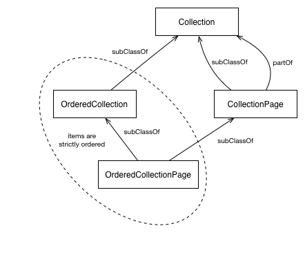

[README로 돌아가기](README.md)

# [액티비티스트림(Activity Streams) 2.0](https://www.w3.org/TR/activitystreams-core/)

2017년 5월 23일 <abbr title="World Wide Web Consortium">W3C</abbr>권고안

**현재 버전**
- https://www.w3.org/TR/2017/REC-activitystreams-core-20170523/

**최신 게시 버전**
- https://www.w3.org/TR/activitystreams-core/

**최신 편집자 초안**
- http://w3c.github.io/activitystreams/core/

**테스트 모음**
- https://github.com/w3c/activitystreams/tree/master/test

**구현 보고서**
- https://github.com/w3c/activitystreams/tree/master/implementation-reports

**이전 버전**
- https://www.w3.org/TR/2017/PR-activitystreams-core-20170413/

**편집자:**
- [James M Snell](http://jasnell.me/), IBM 
- [Evan Prodromou](https://fuzzy.ai/about), Fuzzy.ai 

**저장소**
- [Github](https://github.com/w3c/activitystreams) 
- [이슈들](https://github.com/w3c/activitystreams/issues) 
- [커밋들](https://github.com/w3c/activitystreams/commits/master) 

**테스트**
- [검증기](https://as2.rocks/)

이 게시물 이후 보고된 오류나 이슈에 대해서는 [**정오표**](https://github.com/w3c/activitystreams/blob/master/ERRATA.md) 를 확인해 주시길 바랍니다.

이 표준은 영어 버전만이 유일한 표준 버전입니다. 비-표준적인 [번역본](https://www.w3.org/2003/03/Translations/byTechnology?technology=https://www.w3.org/TR/activitystreams-vocabulary/)들도 제공될 수도 있습니다.

[Copyright](https://www.w3.org/Consortium/Legal/ipr-notice#Copyright) © 2017 [<abbr title="World Wide Web Consortium">W3C</abbr>](https://www.w3.org/)® (<abbr title="매사추세츠 공과대학교">[MIT](https://www.csail.mit.edu/)</abbr>, <abbr title="European Research Consortium for Informatics and Mathematics">[ERCIM](https://www.ercim.eu/)</abbr>, [Keio](https://www.keio.ac.jp/), [Beihang](http://ev.buaa.edu.cn/)). <abbr title="World Wide Web Consortium">W3C</abbr> [법적 책임](https://www.w3.org/Consortium/Legal/ipr-notice#Legal_Disclaimer), [상표](https://www.w3.org/Consortium/Legal/ipr-notice#W3C_Trademarks)와 [문서 허용 라이센스](https://www.w3.org/Consortium/Legal/2015/copyright-software-and-document) 규칙이 적용됩니다.

-----

## 요약 (Abstract)

이 사양은 JSON형식을 사용하여 잠재적이고 완료된 액티비티들을 표현하는 모델을 구체적으로 설명하고 있습니다. 이는 액티비티의 구조를 상세히 기술하고 특정한 액티비티들의 유형을 정의하는 어휘와 함께 사용하기 위하도록 고안되었습니다.

### 글쓴이의 말 (Author's Note)

_이 항목은 비표준입니다._

이 초안은 Martin Atkins, Will Norris, Chris Messina, Monica Wilkinson, Rob Dolin 과 James Snell이 공동 작성한 JSON Activity Streams 1.0 문서의 영향을 많이 받았습니다. 저자는 그들의 중대한 기여에 대해 매우 감사하며 그들의 노고를 잊지 않을겁니다. Activity Streams 1.0 원문의 일부는 이 문서에서 그대로 사용됩니다.

## 이 문서의 상태 (Status of This Document)

_이 문단에서는 현 문서의 발행 당시의 상태에 대하여 기술합니다. 다른 문서가 이 문서를 대체 할 수 있습니다. 현재 <abbr title="World Wide Web Consortium">W3C</abbr> 출판물 목록 및 이 기술보고서의 최신 개정판은 https://www.w3.org/TR/ 에 있는 [<abbr title="World Wide Web Consortium">W3C</abbr> 기술보고서 색인](https://www.w3.org/TR/)에서 찾아볼 수 있습니다._

이 문서는 [소셜 웹 워킹 그룹(Social Web Working Group)](https://www.w3.org/Social/WG)에 의하여 작성된 권고안입니다. 이 문서에 관한 의견은 언제나 환영합니다. 의견이 있을시 public-socialweb@w3.org ([구독](public-socialweb-request@w3.org), [기록들](https://lists.w3.org/Archives/Public/public-socialweb/))로 보내주시길 바랍니다.

작업 그룹의 [구현 레포트](https://github.com/w3c/activitystreams/tree/master/implementation-reports)를 확인해 주시길 바랍니다.

이 문서는 <abbr title="World Wide Web Consortium">W3C</abbr> 회원, 소프트웨어 개발자 및 기타 W3C 그룹과 이해 관계자들에게 검토되었으며, 위원장이 <abbr title="World Wide Web Consortium">W3C</abbr> 권고안으로 발표하였습니다. 이 문서는 안정적이며, 참고자료로 사용되거나 다른 문서에서 인용될수 있습니다. <abbr title="World Wide Web Consortium">W3C</abbr>가 권고안을 만드는 것은 표준사양에 대하여 주의를 환기시키고, 보다 넓은 범위에서 그 사용을 촉진시키기 위함입니다. 이는 웹의 기능성과 보편성을 향상시킬 수 있습니다.

이 문서는 [2004년 02월 05일 <abbr title="World Wide Web Consortium">W3C</abbr> 특허 정책](https://www.w3.org/Consortium/Patent-Policy/)에 따라 운영되는 그룹이 작성하였습니다. <abbr title="World Wide Web Consortium">W3C</abbr>는 그룹의 성과물에 관한 [모든 공개 특허 공개 목록](https://www.w3.org/2004/01/pp-impl/72531/status)을 관리합니다. 이곳에서는 특허 공개에 대한 지시사항도 포함됩니다. [필수 주장(들)](https://www.w3.org/Consortium/Patent-Policy-20040205/#def-essential)을 포함한다고 생각되는 특허에 대하여 실제 지식을 보유한 개인은 [<abbr title="World Wide Web Consortium">W3C</abbr> 특허 정책의 섹션 6](https://www.w3.org/Consortium/Patent-Policy-20040205/#sec-Disclosure)에 의하여 정보를 공개하여야 합니다.

이 문서는 [2017년 3월 1일 <abbr title="World Wide Web Consortium">W3C</abbr> 프로세스 문서](https://www.w3.org/2017/Process-20170301/)를 적용받습니다.

## 목차 (Table of Contents)

1\. [서문 (Introduction)](#1-서문-introduction)

- 1.1 [다른 소셜 표준과의 관계 (Relationship to Other Social Standards)](#11-다른-소셜-표준과의-관계-relationship-to-other-social-standards)
- 1.2 [JSON Activity Streams 1.0과의 관계 (Relationship to JSON Activity Streams 1.0)](#12-json-activity-streams-10과의-관계-relationship-to-json-activity-streams-10)

2\. [직렬화 (Serialization)](#2-직렬화-serialization)

- 2.1 [JSON-LD](#21-json-ld)
- 2.2 [IRI와 URL (IRIs and URLs)](#22-iri와-url-iris-and-urls)
- 2.3 [날짜와 시간 (Date and Times)](#23-날짜와-시간-date-and-times)

3\. [예시 (Examples)](#3-예시-examples)

- 3.1 [최소 액티비티 (Minimal Activity)](#31-최소-액티비티-minimal-activity)
- 3.2 [기본 액티비티 +a (Basic activity with some additional detail)](#32-기본-액티비티-a-basic-activity-with-some-additional-detail)
- 3.3 [확장 액티비티 (An extended activity)](#33-확장-액티비티-an-extended-activity)

4\. [모델 (Model)](#4-모델-model)

- 4.1 [객체 (Object)](#41-객체-object)
- 4.2 [링크 (Link)](#42-링크-link)
- 4.3 [액터 (Actor)](#43-액터-actor)
- 4.4 [액티비티 (Activity)](#44-액티비티-activity)
- 4.5 [비-과도적 액티비티 (IntransitiveActivity)](#45-비-과도적-액티비티-intransitiveactivity)
- 4.6 [컬렉션 (Collection)](#46-컬렉션-collection)
- 4.7 [자연어 값 (Natural Language Values)](#47-자연어-값-natural-language-values)
- 4.8 [언어 표기 (Marking up language)](#48-언어-표기-marking-up-language)

5\. [확장성 (Extensibility)](#5-확장성-extensibility)

- 5.1 [단축 URI 지원 (Support for Compact URIs)](#51-단축-uri-지원-(support-for-compact-uris))
- 5.2 [확장의 재-직렬화 (Re-serialization of Extensions)](#52-확장의-재-직렬화-re-serialization-of-extensions)

6\. [개인정보 고려사항 (Privacy Considerations)](#6-개인정보-고려사항-privacy-considerations)

7\. [보안 고려사항 (Security Considerations)](#7-보안-고려사항-security-considerations)

8\. [IANA 고려사항 (IANA Considerations)](#8-iana-고려사항-iana-considerations)

- 8.1 [`application/activity+json` 미디어 타입 (The `application/activity+json` Media Type)](#81-applicationactivityjson-미디어-타입-the-applicationactivityjson-media-type)

9\. [규칙 (Conformance)](#9-규정-conformance)

- 9.1 [문서 (Documents)](#91-문서-documents)
- 9.2 [구현 (Implementations)](#92-구현-implementations)

A\. [감사의 말 (Acknowledgements)](#a-감사의-말-acknowledgements)

B\. [사양된 Activity Streams 1.0 문법 (Deprecated Activity Streams 1.0 Syntax)](#b-사양된-activity-streams-10-문법-deprecated-activity-streams-10-syntax)

C\. [복수 어휘들 사용예시 (Example using Multiple Vocabularies)](#c-복수-어휘들-사용예시-example-using-multiple-vocabularies)

D\. [변경사항 (Changelog)](#d-변경사항-changelog)

E\. [도표 목록 (Table of Figures)](#e-도표-목록-table-of-figures)

F\. [참고 문헌 (References)](#f-참고-문헌-references)

- F.1 [규정 참고 문헌 (Normative references)](#f1-규정-참고-문헌-normative-references)
- F.2 [정보 참고 문헌 (Informative references)](#f2-정보-참고-문헌-informative-references)

## 1. [서문 (Introduction)](#목차-table-of-contents)

가장 기본적인 의미에서의 "액티비티(Activity)"는 행동에 대한 의미론적인 설명입니다. 본 사양의 목표는 액티비티에 관한 메타데이터를 풍부하고 인간 친화적이지만 기계 처리가 가능하고 확장이 가능한 형식으로 표현하기에 충분한 JSON 기반 구문을 제공하는 것입니다. 여기에는 액티비티에 대한 자연어 설명 또는 시각적 표현 구성, 다양한 유형의 개체와 실행 가능한 정보 연결, 통신 또는 작업 로그 기록, 다른 어플리케이션에 대한 잠재적인 작업 위임 등이 포함됩니다.

이 문서에 있는 "*반드시 (MUST)*", "*절대 하지 말아야 (MUST NOT)*", "*요구한다 (REQUIRED)*", "*할 것이다 (SHALL)*", "*해서는 안될 것이다 (SHALL NOT)*", "*해야 한다 (SHOULD)*", "*해서는 안된다 (SHOULD NOT)*", "*권장한다 (RECOMMENDED)*", "*할 수도 있다 (MAY)*", 그리고 "*선택적으로 (OPTIONAL)*" 의 키워드들의 해석은  [[RFC2119](ActivityVocabularyChapterF.md#rfc2119)] 를 따릅니다.

### 1.1 [다른 소셜 표준과의 관계 (Relationship to Other Social Standards)](#1-서문-introduction)

_이 항목은 비표준입니다._

Activity Streams 2.0은 소셜 데이터 구문으로 사용하기에 적합합니다. 이 표준은 [[SWP](#swp)] 관련 표준 제품군의 일부를 구성합니다.

### 1.2 [JSON Activity Streams 1.0과의 관계 (Relationship to JSON Activity Streams 1.0)](#1-서문-introduction)

_이 항목은 비표준입니다._

JSON Activity Streams 1.0 [[AS1](#as1)] 규격은 2011년 5월에 발표되었으며, 완성된 액티비티의 표현에 대해 확장 가능한 구문의 기반을 제공했습니다. 이 사양은 초기 사양를 기반으로 광범위한 구현, 커뮤니티 피드백 및 기타 다양한 커뮤니티에서 진행 중인 관련 작업을 통해 얻은 교훈을 통합함으로써 만들어졌습니다.

Activity Streams 1.0에서 Activity Streams 2.0로 발전시키는 동기를 부여한 몇 가지의 문제점들은 다음과 같았습니다:

- 액티비티의 다국어 표현
- "verb"와 "objectType"을 "type"으로 통일
- 소셜 유즈케이스의 핵심이 아닌 액티비티 타입 및 객체 타입 제거
- 상세 설명 링크에 대한 Link 타입 도입
- 핵심 사양에 청중 타게팅 포함
- 모든 액티비티를 취소할수 있기 위해 일반화된 "Undo" 액티비티 타입
- 일관된 컬렉션 및 페이징 표현
- 객체 타입 및 액티비티 타입의 기본 어휘 네임스페이스 공식화
- 다른 타입 및 속성에 대한 확장성 프레임워크
- JSON-LD와의 호환성

`displayName`, `verb`, `title` 그리고 `objectType` 용어는 Activity Streams 2.0 문서에서 사용 *하지 않는* 예약된 용어로 간주해야 합니다. 이들이 Activity Streams 2.0 문서에 있는 경우, [B. 사양된 Activity Streams 1.0 문법]() 에 나열된 지침에 따라 처리해야 합니다.

## 2. [직렬화 (Serialization)](#목차-table-of-contents)

이 사양에서는 [[JSON-LD](#json-ld)] 구문 제약 조건의 하위 집합을 준수하지만 JSON-LD 처리가 필요 없는 [Activity 어휘](https://www.w3.org/TR/activitystreams-vocabulary/)에 대한 JSON 기반 [[RFC7159](#rfc7159)] 직렬화 구문을 설명합니다. 다른 직렬화 양식도 가능하지만, 이러한 대체 양식은 본 문서에서 다루지 않습니다.

직렬화할 때 비어있는 속성들은 (a) 속성 값을 null로 설정하거나 (b) 게시자의 옵션에서 속성 선언을 모두 생략하여 표시합니다. 이러한 표현은 어느쪽이나 의미론적으로는 동일합니다. 속성에 배열 값이 존재하는 경우, 해당 배열에 비어있는 항목의 속성을 *반드시* 완전히 생략하거나 값을 null로 설정하여 표시해야 합니다. 생략되거나 명시적으로 null 값에 대한 적절한 해석은 지정된 값이 비어 있거나 nil이라는 견해가 아닌, 할당된 값이 없다는 것입니다.

_**Activity Streams 문서**_ 는 기반 값이 [Collection](#46-컬렉션-collection)을 포함한 모든 유형의 Activity Streams [Object](#41-객체-object)이며, 이것의 MIME 미디어 타입은 " `application/activity+json`"입니다.

Activity Streams 2.0 문서는 *반드시* UTF-8 문자 인코딩을 사용하여 직렬화해야 합니다.

### 2.1 [JSON-LD](#2-직렬화-serialization)

Activity Streams 2.0 문서의 직렬화된 JSON 양식은 표준 JSON-LD 1.0 처리 알고리즘과 최소한 [여기](https://www.w3.org/ns/activitystreams)에서 제공된 표준 JSON-LD @context의 정의 같은 정의를 사용한 API [[JSON-LD-API](#json-ld-api)] 압축 알고리즘에 의해 생성될 내용은 *반드시* 일관적이여야 합니다. 구현 시 제공된 @context를 추가 @context 정의로 확장 *할 수도* 있지만 규범적인 컨텍스트를 재 정의하거나 변경해서는 *절대 안 됩니다*. 또한 구현은 표준 JSON-LD 알고리즘을 사용하는 구현을 사용함으로써 JSON-LD @context에 정의되지 않은 추가 속성과 값이 지원되지 않거나 무시될 수 있음을 인지하면서 사용 *할 수도* 있습니다. Activity Streams 2.0 문서의 확장자 처리에 대한 자세한 내용은 [확장성]() 섹션을 참조하시길 바랍니다.

JSON-LD는 특수한 `@context` 속성을 사용하여 [컨텍스트 처리](http://www.w3.org/TR/json-ld/#the-context)를 정의합니다. `@context` 속성의 값은 [[JSON-LD](#json-ld)] 규격에 의해 정의됩니다. Activity Streams 2.0 문서를 생성하는 구현에는 "https://www.w3.org/ns/activitystreams" URL 을 사용하는 규범적 [Activity Streams 2.0 JSON-LD @properties 정의](https://www.w3.org/ns/activitystreams)에 대한 참조를 포함하는 값 이 들어가 있는 `@context` 속성을 *포함해야 합니다*. 구현에서는 대체 URL "http://www.w3.org/ns/activitystreams" 을 대신 사용 *할 수도* 있습니다. 문자열, 개체 또는 배열을 사용하여 이 작업을 수행할 수 있습니다.

### 2.1.1 [문자열이 있는 컨텍스트 (Context with a string)](#21-json-ld)

<div align="center" id="도표-1-컨텍스트를-문자열로-제공하는-문서"><em>
도표 1 컨텍스트를 문자열로 제공하는 문서.
</em></div>

><div align="center"> 예시 1 </div>
>
>```json
>{
>  "@context": "https://www.w3.org/ns/activitystreams",
>  "summary": "노트",
>  "type": "Note",
>  "content": "제 개에 벼룩이 있어요."
>}
>```

### 2.1.2 [객체가 있는 컨텍스트 (Context with an object)](#21-json-ld)

<div align="center" id="도표-2-vocab-키워드와-확장-용어의-접두사를-사용하여-컨텍스트를-객체로-제공하는-문서"><em>
도표 2 `@vocab` 키워드와 확장 용어의 접두사를 사용하여 컨텍스트를 객체로 제공하는 문서.
</em></div>

><div align="center"> 예시 2 </div>
>
>```json
>{
>  "@context": {
>     "@vocab": "https://www.w3.org/ns/activitystreams",
>     "ext": "https://canine-extension.example/terms/",
>     "@language": "en"
>  },
>  "summary": "A note",
>  "type": "Note",
>  "content": "My dog has fleas.",
>  "ext:nose": 0,
>  "ext:smell": "terrible"
>}
>```

### 2.1.3 [배열이 있는 컨텍스트 (Context with an array)](#21-json-ld)

<div align="center" id="도표-3-컨텍스트를-배열로-제공하고-추가-용어에-대한-별칭을-포함하는-문서"><em>
도표 3 컨텍스트를 배열로 제공하고 추가 용어에 대한 별칭을 포함하는 문서.
</em></div>

><div align="center"> 예시 3 </div>
>
>```json
>{
>  "@context": [
>     "https://www.w3.org/ns/activitystreams",
>     {
>      "css": "http://www.w3.org/ns/oa#styledBy"
>     }
>  ],
>  "summary": "노트",
>  "type": "Note",
>  "content": "제 개에 벼룩이 있어요.",
>  "css": "http://www.csszengarden.com/217/217.css?v=8may2013"
>}
>```

JSON-LD 가 활성화된 Activity Streams 2.0 구현이 표준 [Activity Streams 2.0 JSON-LD @context 정의](https://www.w3.org/ns/activitystreams)에 대한 참조가 포함된 `@context` 속성이 포함되어 있지 않은, " `application/activity+json`" MIME 미디어 타입을 사용하여 식별된 JSON 문서를 만날 경우, 구현은 *반드시* 규정의 @context 정의가 적용되고 있다고 가정해야 합니다.

### 2.2 [IRI와 URL (IRIs and URLs)](#2-직렬화-serialization)

이 사양은 IRI [[RFC3987](#rfc3987)] 를 사용합니다. 모든 URI [RFC3986]((#rfc3986)) 도 IRI이므로 IRI가 명명된 모든 곳에서 URI를 사용할 수 있습니다. 두가지 특별한 고려 사항이 있는데: (1) URI가 아닌 IRI가 역참조를 위해 제공된 경우 [[RFC3987](#rfc3987)]의 섹션 3.1에 기술된 단계를 사용하여 URI에 매핑되어야 하며, (2) IRI가 "id" 값으로 사용되는 경우 *절대 매핑하지 말아야* 합니다.

상대 IRI(및 URL) 참조는 많은 JSON 파서 구현이 상대 참조를 적절하게 해결하는 데 필요한 기본 컨텍스트를 안정적으로 보존할 수 없기 때문에 Activity Streams 2.0 문서에서는 *사용하지 말아야* 합니다.

## 2.3 [날짜와 시간 (Date and Times)](#2-직렬화-serialization)

날짜 및 시간 값이 있는 모든 속성은 '초'가 생략 *될 수도* 있는 예외를 제외하고 *반드시* [[RFC3339](#rfc3339)]의 "날짜 시간" 생산에 적합해야 합니다. 날짜와 시간을 구분하려면 *반드시* 대문자 "T"를 사용해야 하며 숫자 시간대 오프셋이 없는 경우에는 *반드시* 대문자 "Z"를 사용해야 합니다.

아래 값은 [[ABNF](#abnf)] 구문 설명을 사용하여 지정됩니다. "시간 시(time-hour)", "시간 분(time-minute)", "시간 초(time-minute)", "시간 초(time-second)", "시간 분할초(time-secfrac)", "시간 오프셋(time-offset)" 및 "전체 날짜(full-date)" 구성에 대한 정의는 [ [RFC3339](#rfc3339)] 에 정의된 바와 같습니다.

```lang-none
as2-partial-time = time-hour ":" time-minute [":" time-second]
                   [time-secfrac]
as2-full-time    = as2-partial-time time-offset
as2-date-time    = full-date "T" as2-full-time
```

\`time-offset\` 구성요소는 시간대과 상관관계가 없으며 \`time-offset\` 구성요소를 포함하는 시간은 타임스탬프에 대해 잘 작동하지만, 추가적인 정보와 처리 없이는 현지의 "정확한 시간" 으로 신뢰성 있게 변환될 수 없다는 점에 유의해야 합니다.

## 3. [예시 (Examples)](#목차-table-of-contents)

_이 항목은 비표준입니다._

다음은 다양한 세부 수준을 가진 액티비티들의 세 가지 예시입니다.

각 예시는 이 사양에서 정의된 표준 JSON 직렬화를 사용하여 표시됩니다.

### 3.1 [최소 액티비티 (Minimal Activity)](#3-예시-examples)

<div align="center" id="도표-4-httpwwwtestexamplemartin이-httpexampleorgfoojpg를-생성했음을-나타냄-추가-세부사항은-제공되지-않는다"><em>
도표 4 <code>'http://www.test.example/martin'</code>이 <code>'http://example.org/foo.jpg'</code>를 생성했음을 나타냄. 추가 세부사항은 제공되지 않는다.
</em></div>

><div align="center"> 예시 4 </div>
>
>```json
>{
>  "@context": "https://www.w3.org/ns/activitystreams",
>  "summary": "Martin은 이미지를 생성했습니다",
>  "type": "Create",
>  "actor": "http://www.test.example/martin",
>  "object": "http://example.org/foo.jpg"
>}
>```

### 3.2 [기본 액티비티 +a (Basic activity with some additional detail)](#3-예시-examples)

<div align="center" id="도표-5-martin-smith는-2015년-2월-10일-오후-3시-4분-utc에서-martin의-블로그에-글을-추가했다는-문구를-표현-기사-액터-및-대상-블로그에-대한-추가-세부사항은-activity-streams-20-어휘에-의해-정의된-속성을-사용하여-제공된다"><em>
도표 5 "Martin Smith는 2015년 2월 10일 오후 3시 4분 UTC에서 'Martin의 블로그'에 글을 추가했다"는 문구를 표현. 기사, 액터 및 대상 블로그에 대한 추가 세부사항은 <a href="https://www.w3.org/TR/activitystreams-vocabulary/">Activity Streams 2.0 어휘</a>에 의해 정의된 속성을 사용하여 제공된다.
</em></div>

><div align="center"> 예시 5 </div>
>
>```json
>{
>  "@context": "https://www.w3.org/ns/activitystreams",
>  "summary": "Martin은 자신의 블로그에 글을 올렸습니다",
>  "type": "Add",
>  "published": "2015-02-10T15:04:55Z",
>  "actor": {
>   "type": "Person",
>   "id": "http://www.test.example/martin",
>   "name": "Martin Smith",
>   "url": "http://example.org/martin",
>   "image": {
>     "type": "Link",
>     "href": "http://example.org/martin/image.jpg",
>     "mediaType": "image/jpeg"
>   }
>  },
>  "object" : {
>   "id": "http://www.test.example/blog/abc123/xyz",
>   "type": "Article",
>   "url": "http://example.org/blog/2011/02/entry",
>   "name": "내가 Activity Streams를 사랑하는 이유"
>  },
>  "target" : {
>   "id": "http://example.org/blog/",
>   "type": "OrderedCollection",
>   "name": "Martin의 블로그"
>  }
>}
>```

### 3.3 [확장 액티비티 (An extended activity)](#3-예시-examples)

<div align="center" id="도표-6-보다-광범위한-단일-엔트리-activity-stream이-이어짐"><em>
도표 6 보다 광범위한, 단일-엔트리 "Activity Stream"이 이어짐.
</em></div>

><div align="center"> Example 6 </div>
>
>```json
>{
>  "@context": "https://www.w3.org/ns/activitystreams",
>  "summary": "Martin의 최근 활동",
>  "type": "Collection",
>  "totalItems": 1,
>  "items" : [
>    {
>      "type": "Add",
>      "published": "2011-02-10T15:04:55Z",
>      "generator": "http://example.org/activities-app",
>      "nameMap": {
>        "en": "Martin added a new image to his album.",
>        "ga": "Martin phost le fisean nua a albam."
>      },
>      "actor": {
>        "type": "Person",
>        "id": "http://www.test.example/martin",
>        "name": "Martin Smith",
>        "url": "http://example.org/martin",
>        "image": {
>          "type": "Link",
>          "href": "http://example.org/martin/image",
>          "mediaType": "image/jpeg",
>          "width": 250,
>          "height": 250
>        }
>      },
>      "object" : {
>        "name": "나의 복실복실한 고양이",
>        "type": "Image",
>        "id": "http://example.org/album/máiréad.jpg",
>        "preview": {
>          "type": "Link",
>          "href": "http://example.org/album/máiréad.jpg",
>          "mediaType": "image/jpeg"
>        },
>        "url": [
>          {
>            "type": "Link",
>            "href": "http://example.org/album/máiréad.jpg",
>            "mediaType": "image/jpeg"
>          },
>          {
>            "type": "Link",
>            "href": "http://example.org/album/máiréad.png",
>            "mediaType": "image/png"
>          }
>        ]
>      },
>      "target": {
>        "type": "Collection",
>        "id": "http://example.org/album/",
>        "nameMap": {
>          "en": "Martin's Photo Album",
>          "ga": "Grianghraif Mairtin"
>        },
>        "image": {
>          "type": "Link",
>          "href": "http://example.org/album/thumbnail.jpg",
>          "mediaType": "image/jpeg"
>        }
>      }
>    }
>  ]
>}
>```

## 4. [모델 (Model)](#목차-table-of-contents)

[Activity Vocabulary](https://www.w3.org/TR/activitystreams-vocabulary/)는 Activity Streams 2.0의 핵심 객체 타입들 및 속성을 규범적으로 정의합니다.

어휘에 의해 정의된 객체 타입은 8개의 핵심 타입 집합과 많은 소셜 웹 어플리케이션에 공통되는 확장된 액티비티 및 객체 타입 집합으로 구분됩니다. 핵심 타입들은 다음과 같습니다:

- [Object](#41-객체-object),
- [Link](#42-링크-link),
- [Activity](#44-액티비티-activity),
- [IntransitiveActivity](#45-비-과도적-액티비티-intransitiveactivity),
- [Collection](#46-컬렉션-collection),
- [`OrderedCollection`](#orderedcollection),
- [`CollectionPage`](#collectionpage), 그리고
- [`OrderedCollectionPage`](#orderedcollectionpage) 입니다.

Activity Streams 2.0 문서의 모든 JSON 객체는 [Object](#41-객체-object) 거나 [Link](#42-링크-link) 입니다. Activity 어휘에 정의된 다른 모든 타입들과 모든 확장 타입들은 일거한 두 가지 기본 타입에서 파생됩니다.

Activity Streams 2.0 문서의 JSON 객체는 다음 중 아무 조건이나 만족할 경우 [Link](#42-링크-link) 입니다: (a) 객체 값에 "`Link`"가 포함된 `type` 속성이 있거나, (b) `type` 속성 값에 포함된 모든 타입들이 [Link](#42-링크-link)의 확장으로 정의되었을 경우 ([Mention](https://www.w3.org/TR/activitystreams-vocabulary/#dfn-mention) 을 참조하시길 바랍니다); 위 사항에 해당하지 않을 경우 JSON 객체는 [Object](#41-객체-object)의 인스턴스나 확장으로 간주됩니다.

### 4.1 [객체 (Object)](#4-모델-model)

[Object](https://www.w3.org/TR/activitystreams-vocabulary/#dfn-object)는 Activity Streams 어휘의 주요 기반 타입입니다.

전역 식별자(`id` 속성을 사용하여 절대 IRI로 표시됨)와 "객체 타입"(`type` 속성을 사용하여 표시됨)을 갖는 것 외에도, `Object` 타입의 모든 인스턴스는 [Activity 어휘](https://www.w3.org/TR/activitystreams-vocabulary/)에 의해 규범적으로 정의된 공통 속성 집합을 공유합니다. 여기에는 다음이 포함됩니다:
 [attachment](https://www.w3.org/TR/activitystreams-vocabulary/#dfn-attachment) |
 [attributedTo](https://www.w3.org/TR/activitystreams-vocabulary/#dfn-attributedto) |
 [audience](https://www.w3.org/TR/activitystreams-vocabulary/#dfn-audience) |
 [content](https://www.w3.org/TR/activitystreams-vocabulary/#dfn-content) |
 [context](https://www.w3.org/TR/activitystreams-vocabulary/#dfn-context) |
 [contentMap](https://www.w3.org/TR/activitystreams-vocabulary/#dfn-content) |
 [name](https://www.w3.org/TR/activitystreams-vocabulary/#dfn-name) |
 [nameMap](https://www.w3.org/TR/activitystreams-vocabulary/#dfn-name) |
 [endTime](https://www.w3.org/TR/activitystreams-vocabulary/#dfn-endtime) |
 [generator](https://www.w3.org/TR/activitystreams-vocabulary/#dfn-generator) |
 [icon](https://www.w3.org/TR/activitystreams-vocabulary/#dfn-icon) |
 [image](https://www.w3.org/TR/activitystreams-vocabulary/#dfn-image-term) |
 [inReplyTo](https://www.w3.org/TR/activitystreams-vocabulary/#dfn-inreplyto) |
 [location](https://www.w3.org/TR/activitystreams-vocabulary/#dfn-location) |
 [preview](https://www.w3.org/TR/activitystreams-vocabulary/#dfn-preview) |
 [published](https://www.w3.org/TR/activitystreams-vocabulary/#dfn-published) |
 [replies](https://www.w3.org/TR/activitystreams-vocabulary/#dfn-replies) |
 [startTime](https://www.w3.org/TR/activitystreams-vocabulary/#dfn-starttime) |
 [summary](https://www.w3.org/TR/activitystreams-vocabulary/#dfn-summary) |
 [summaryMap](https://www.w3.org/TR/activitystreams-vocabulary/#dfn-summary) |
 [tag](https://www.w3.org/TR/activitystreams-vocabulary/#dfn-tag) |
 [updated](https://www.w3.org/TR/activitystreams-vocabulary/#dfn-updated) |
 [url](https://www.w3.org/TR/activitystreams-vocabulary/#dfn-url) |
 [to](https://www.w3.org/TR/activitystreams-vocabulary/#dfn-to) |
 [bto](https://www.w3.org/TR/activitystreams-vocabulary/#dfn-bto) |
 [cc](https://www.w3.org/TR/activitystreams-vocabulary/#dfn-cc) |
 [bcc](https://www.w3.org/TR/activitystreams-vocabulary/#dfn-bcc) |
 [mediaType](https://www.w3.org/TR/activitystreams-vocabulary/#dfn-mediatype) |
 [duration](https://www.w3.org/TR/activitystreams-vocabulary/#dfn-duration)

모든 속성은 선택사항입니다 (`id`와 `type`도 해당함).

<div align="center" id="도표-7-다음은-id와-type-속성을-사용하여-전역-식별자와-객체-타입을-나타내는-객체object의-예시"><em>
도표 7 다음은 `id`와 `type` 속성을 사용하여 전역 식별자와 객체 타입을 나타내는 객체(Object)의 예시:
</em></div>

><div align="center"> 예시 7 </div>
>
>```json
>{
>  "@context": "https://www.w3.org/ns/activitystreams",
>  "id": "http://example.org/foo",
>  "type": "Note",
>  "name": "내가 가장 좋아하는 스튜 요리법",
>  "attributedTo": {
>    "id": "http://joe.website.example/",
>    "type": "Person",
>    "name": "Joe Smith"
>  },
>  "published": "2014-08-21T12:34:56Z"
>}
>```

[Activity 어휘](https://www.w3.org/TR/activitystreams-vocabulary/)는 많은 소셜 웹 어플리케이션에게 공통적인 `Object` 타입을 정의합니다. 이 사양은 이러한 대부분의 객체(objects)에 대해 의미론적으로 세부적인 특정 속성들을 정의하지는 않습니다. 외부 어휘를 사용하여 Activity 어휘에서 다루지 않는 추가적인 세부 정보를 표현할 수 있습니다.

또한, 구현은 Activity 어휘에서 정의한 것과 다른 새로운 객체(Objects) 타입을 자유롭게 도입할 수 있지만, 어플리케이션이 다른 구현에서 인식하지 못하는 확장 타입에 너무 많이 의존할 경우 상호 운용성 문제가 발생할 수 있습니다. 기존의 Object 타입과 과도하게 겹치거나 중복되지 않도록 주의해야 합니다.

구현에서 핵심 어휘 타입과 겹치는 확장 타입을 사용하는 경우, 구현에서는 *반드시* 핵심 어휘 타입도 지정해야 합니다. 예를 들어, 일부 어휘(예: Good Relations 어휘)는 위치를 설명하기 위한 고유한 타입을 정의합니다. 예를 들어, http://purl.org/goodrelations/v1#Location을 객체 타입으로 사용하려는 구현에서는 *반드시* 다음 도표처럼 객체를 [Place](https://www.w3.org/TR/activitystreams-vocabulary/#dfn-place) 로 식별해야 합니다.

<div align="center" id="도표-8-place이면서-grlocation인-객체"><em>
도표 8 <code>Place</code>이면서 <code>gr:Location</code>인 객체:
</em></div>

><div align="center"> 예시 8 </div>
>
>```json
>{
>  "@context": [
>    "https://www.w3.org/ns/activitystreams",
>    {
>      "gr": "http://purl.org/goodrelations/v1#"
>    }
>  ],
>  "type": ["Place", "gr:Location"],
>  "name": "Sally의 레스토랑",
>  "longitude": 12.34,
>  "latitude": 56.78,
>  "gr:category": "restaurants/french_restaurants"
>}
>```

일부 외부 어휘에 의해 정의된 특정 속성은 Activity 어휘에 의해 정의된 속성과 겹치거나 중복될 수 있습니다. 이러한 중복이 존재하는 경우, 일관된 상호 운용성을 위해 구현은 *반드시* Activity 어휘에 의해 정의된 속성을 선호해야 합니다.

### 4.1.1 [객체 타입의 텍스트 표현 Text representations of Object types](#41-객체-object)

Activity Streams 소비자는 웹 브라우저 또는 콘솔 인터페이스에 표시하기 위한것 처럼 Activity Streams 객체의 텍스트 표시가 필요한 경우가 많습니다.

[name](https://www.w3.org/TR/activitystreams-vocabulary/#dfn-name) 속성은 작성자 또는 다른 사용자의 입력에서 *파생되어야 합니다*.

[summary](https://www.w3.org/TR/activitystreams-vocabulary/#dfn-summary) 속성은 게시자가 자동으로 생성하는 예비 텍스트 표현으로 *사용해야 합니다*. `name` 속성이 없는 경우 `summary` 속성은 마크업을 *포함하지 말아야* 하며 객체의 적절한 텍스트 표현으로 사용할 수 있을 정도로 *짧아야 합니다*.

<div align="center" id="도표-9-저자가-정의한-이름을-가지고-있는-노트"><em>
도표 9 저자가 정의한 이름을 가지고 있는 노트
</em></div>

><div align="center"> 예시 9 </div>
>
>```json
>{
>  "@context": "https://www.w3.org/ns/activitystreams",
>  "type": "Note",
>  "id": "http://example.org/note/123",
>  "name": "저희 날씨는 괜찮아요",
>  "content": "날씨가 저희의 계절과 장소에 적합하다고 생각되어요."
>}
>```

<div align="center" id="도표-10-자동으로-생성된-요약본이-있는-노트"><em>
도표 10 자동으로 생성된 요약본이 있는 노트
</em></div>

><div align="center"> 예시 10 </div>
>
>```json
>{
>  "@context": "https://www.w3.org/ns/activitystreams",
>  "type": "Note",
>  "id": "http://example.org/note/124",
>  "summary": "Sally의 노트",
>  "content": "여긴 아무 문제 없어요."
>}
>```

`name`과 `summary` 없을 *수도* 있으며, 최종 사용자의 현재 언어에 명시적 값이 부족할 *수도* 있으며, 현재 언어 컨텍스트에서 객체의 텍스트 표현으로 사용하기에 적절하지 않을 *수도* 있습니다. 소비자의 구현은 이러한 경우의 객체의 텍스트 표현을 위한 대비책이 *있어야 합니다*.

### 4.2 [링크 (Link)](#4-모델-model)

`Link`는 [[RFC5988](https://www.w3.org/TR/activitystreams-core/#bib-RFC5988)]에서 설정된 링크(Links)의 개념 모델과 밀접하게 관련된, 다른 리소스에 대한 적격적인 간접 참조를 설명합니다. Link 객체의 속성은 참조된 리소스의 속성은 아니지만, 렌더링 에이전트에게 리소스 사용 방법을 이해시키기 위한 힌트로 제공됩니다. 예를 들어 `height`와 `width`는 참조된 이미지의 실제 픽셀 치수가 아니라 참조된 이미지의 원하는 렌더링 크기를 나타낼 수 있습니다.

Link의 대상 URI는 필요한 [href](https://www.w3.org/TR/activitystreams-vocabulary/#dfn-href) 속성을 사용하여 표시됩니다. 또한 모든 `Link` 인스턴스는 [Activity 어휘](https://www.w3.org/TR/activitystreams-vocabulary/)에 의해 표준으로 정의된 다음과 같은 공통 선택 속성 집합을 공유합니다:
 [id](https://www.w3.org/TR/activitystreams-vocabulary/#dfn-id) |
 [name](https://www.w3.org/TR/activitystreams-vocabulary/#dfn-name) |
 [hreflang](https://www.w3.org/TR/activitystreams-vocabulary/#dfn-hreflang) |
 [mediaType](https://www.w3.org/TR/activitystreams-vocabulary/#dfn-mediatype) |
 [rel](https://www.w3.org/TR/activitystreams-vocabulary/#dfn-rel) |
 [height](https://www.w3.org/TR/activitystreams-vocabulary/#dfn-height) |
 [width](https://www.w3.org/TR/activitystreams-vocabulary/#dfn-width)

예를 들어 모든 [Objects](#41-객체-object)는 포함된 객체의 그래픽 표현을 설명하는 값을 가진 [image](https://www.w3.org/TR/activitystreams-vocabulary/#dfn-image-term) 속성을 포함할 수 있습니다. 이 속성은 일반적으로 사용자에게 표시할 수 있는 이미지(예: JPEG, GIF 또는 PNG) 리소스에 URL을 제공하는 데 사용됩니다. 지정된 객체에는 이러한 여러 시각적 표현(예: 여러 스크린샷 또는 다른 해상도의 동일한 이미지)이 있을 수 있습니다. Activity Streams 2.0 에서는 기본적으로 이러한 참조를 설명하는 세 가지 방법이 있습니다.

<div align="center" id="도표-11-추가-메타데이터-없이-단일-이미지를-참조하기-위해-직접-연관을-절대-iri를-포함하는-json-문자열로-표현할수-있다"><em>
도표 11 추가 메타데이터 없이 단일 이미지를 참조하기 위해, 직접 연관을 절대 IRI를 포함하는 JSON 문자열로 표현할수 있다.
</em></div>

><div align="center"> 예시 11 </em>
>
>```json
>{
>  "@context": "https://www.w3.org/ns/activitystreams",
>  "type": "Application",
>  "id": "http://example.org/application/123",
>  "name": "예시제조기 3000",
>  "image": "http://example.org/application/123.png"
>}
>```

<div align="center" id="도표-12-다르게-추가-메타데이터가-필요한-경우-예-참조된-리소스의-mime-컨텐츠-타입-Link를-사용할수-있다"><em>
도표 12 다르게, 추가 메타데이터가 필요한 경우 (예: 참조된 리소스의 MIME 컨텐츠 타입) <a href="#42-링크-link">Link</a>를 사용할수 있다:
</em></div>

><div align="center"> 예시 12 </div>
>
>```json
>{
>  "@context": "https://www.w3.org/ns/activitystreams",
>  "type": "Application",
>  "id": "http://example.org/application/123",
>  "name": "예시제조기 3000",
>  "image": {
>    "type": "Link",
>    "href": "http://example.org/application/123.png",
>    "mediaType": "image/png"
>  }
>}
>```

정식적으로 보면, 전자의 예는 이미지 리소스와 부적격적인 직접 관계를 만드는 반면, 후자는 해당 관계에 대한 추가 속성을 지정할 수 있는 [적격적인 간접 관계](http://patterns.dataincubator.org/book/qualified-relation.html)를 만듭니다.

<div align="center"><em>
도표 13 둘 이상의 값을 표현하려는 경우, 문자열과 <a href="#42-링크-link">Link</a>가 혼합된 JSON 배열을 사용할수 있다:
</em></div>

><div align="center"> 예시 13 </div>
>
>```json
>{
>  "@context": "https://www.w3.org/ns/activitystreams",
>  "type": "Application",
>  "id": "http://example.org/application/123",
>  "name": "예시제조기 3000",
>  "image": [
>    "http://example.org/application/abc.gif",
>    {
>      "type": "Link",
>      "href": "http://example.org/application/123.png",
>      "mediaType": "image/png"
>    }
>  ]
>}
>```

이러한 배열에 포함된 개별 항목들은 서로 독립적이며 순서에 의미를 두지 않습니다.

RFC 5988은 모든 링크가 링크의 상황별 목적을 설명하는 "링크 관계(link relation)"를 가지고 있다고 정의합니다. [Link](#42-링크-link) 내에서 [rel](https://www.w3.org/TR/activitystreams-vocabulary/#dfn-rel) 속성은 링크 관계 값을 제공합니다. `rel` 속성을 지정하지 않으면 링크 관계가 지정되지 않은 것으로 간주됩니다. 어떠한 Link던 상관없이 여러 링크 관계 값을 보유하고 있을 수 있습니다. JSON 직렬화에서 단일 링크 관계는 단일 JSON 문자열로 표현됩니다. 다중 링크 관계는 JSON 문자열의 배열로 표현됩니다.

링크 관계의 범위는 [Link](#42-링크-link)가 직계 하위 항목인 객체입니다.

다음 예에서는 두 개의 서로 다른 참조가 제공됩니다. 첫 번째 링크의 관계는 지정되지 않은 반면 두 번째 링크의 관계는 ""`thumbnail`" 입니다.

<div align="center" id="도표-14"><em>
도표 14
</em></div>

><div align="center"> 예시 14 </div>
>
>```json
>{
>  "@context": "https://www.w3.org/ns/activitystreams",
>  "type": "Application",
>  "id": "http://example.org/application/123",
>  "name": "예시제조기 3000",
>  "image": [
>    "http://example.org/application/abc.gif",
>    {
>      "type": "Link",
>      "href": "http://example.org/application/123.png",
>      "mediaType": "image/png",
>      "rel": "thumbnail"
>    }
>  ]
>}
>```

[[HTML5](#html5)] 사양은 [[RFC5988](#rfc5988)] 정의와 약간 다른 "링크 관계"에 대한 자체적인 대체 정의를 제공한다는 점에 유의해야 합니다. HTML5 정의에서 "space" U+0020, "tab"(U+0009), "LF"(U+000A), "FF"(U+000C), "CR"(U+000D) 또는 ""(U+002C) 문자를 포함하지 않는 문자열을 유효한 링크 관계로 사용할 수 있습니다. 상호 운용성을 향상시키려면 Activity Streams 2.0 구현에서 [[RFC5988](#rfc5988)] 및 [[HTML5](#html5)] 정의의 관점에서 *반드시* 구문적으로 유효한 링크 관계만 사용해야 합니다. 구현에서는 등록되지 않은 링크 관계 값을 사용 *할 수도* 있습니다.

[Link](#42-링크-link) 타입과 [Object](#41-객체-object) 타입은 서로 분리되어 있는 점을 유의하시길 바랍니다. 즉, 어떠한 [Object](#41-객체-object)도 [Link](#42-링크-link)가 될 수 없습니다.

### 4.3 [액터 (Actor)](#4-모델-model)

액터 객체는 Activity을 수행할 수 있는 개체를 나타내는 기본 [Object](#41-객체-object) 타입의 특수화된 경우 입니다. Activity 어휘는 다섯 가지 타입의 액터에 대한 규범적인 정의를 제공합니다:
 [Application](https://www.w3.org/TR/activitystreams-vocabulary/#dfn-application) |
 [Group](https://www.w3.org/TR/activitystreams-vocabulary/#dfn-group) |
 [Organization](https://www.w3.org/TR/activitystreams-vocabulary/#dfn-organization) |
 [Person](https://www.w3.org/TR/activitystreams-vocabulary/#dfn-person) |
 [Service](https://www.w3.org/TR/activitystreams-vocabulary/#dfn-service).

이 사양은 의도적으로 액터(Actors)를 가장 일반화된 방식으로만 정의하며, 각 Actor에 대해 의미론적으로 세부적인 특정 속성들을 정의하지는 않습니다. 모든 Actor 객체는 [Object](#41-객체-object)의 특수화된 경우이며 모든 Objects에 공통되는 모든 핵심 속성들을 상속합니다. 외부 어휘를 사용하여 Activity 어휘에서 다루지 않는 추가 세부 정보를 표현할 수 있습니다. VCard [ [vcard-rdf](#vcard-rdf)]를 사용하여 [Person](https://www.w3.org/TR/activitystreams-vocabulary/#dfn-person), [Group](https://www.w3.org/TR/activitystreams-vocabulary/#dfn-group) 및 [Organization](https://www.w3.org/TR/activitystreams-vocabulary/#dfn-organization) 인스턴스에 추가 메타데이터를 *제공해야 합니다*.

<div align="center" id="도표-15-vcard-속성으로-확장된-person-액터가-있는-액티비티"><em>
도표 15 vCard 속성으로 확장된 Person 액터가 있는 액티비티:
</em></div>

><div align="center"> 예시 15 </div>
>
>```json
>{
>  "@context": [
>    "https://www.w3.org/ns/activitystreams",
>    {"vcard": "http://www.w3.org/2006/vcard/ns#"}
>  ],
>  "summary": "Sally는 노트를 생성했습니다",
>  "type": "Create",
>  "actor": {
>    "type": ["Person", "vcard:Individual"],
>    "id": "http://sally.example.org",
>    "name": "Sally Smith",
>    "vcard:given-name": "Sally",
>    "vcard:family-name": "Smith"
>  },
>  "object": {
>    "type": "Note",
>    "content": "이것은 간단한 노트입니다"
>  }
>}
>```

구현은 Activity 어휘에서 정의한 것 이상의 새로운 타입의 액터를 자유롭게 도입할 수 있지만, 어플리케이션이 다른 구현에서 인식하지 못하는 확장 타입에 너무 많이 의존할 경우 상호 운용성 문제가 발생할 수 있습니다. 기존 액터 타입과 과도하게 겹치거나 중복되지 않도록 주의해야 합니다.

구현에서 핵심 어휘 타입과 겹치는 확장 타입을 사용하는 경우, 구현에서는 *반드시* 핵심 어휘 타입도 지정해야 합니다. 예를 들어, 일부 어휘(예: VCard)는 사용자를 설명하기 위한 고유한 타입을 정의합니다. 예를 들어, `vcard:Individual`를 액터로 사용하고자 하는 구현은 이전의 예시처럼 *반드시* 액터를 [Person](https://www.w3.org/TR/activitystreams-vocabulary/#dfn-person)으로 식별해야 합니다.

### 4.4 [액티비티 (Activity)](#4-모델-model)

Activity 객체는 이미 발생했거나 현재 발생 중이거나 향후 발생할 수 있는 작업에 대한 정보를 제공하는 기본 [Object](#41-객체-object) 타입의 특수화된 경우입니다.

모든 [Object](#41-객체-object) 인스턴스가 지원하는 공통 속성 외에도 Activity 객체는 [어휘](https://www.w3.org/TR/activitystreams-vocabulary/)에 의해 정의된 다음과 같은 추가 속성을 지원합니다:
 [actor](https://www.w3.org/TR/activitystreams-vocabulary/#dfn-actor) |
 [object](https://www.w3.org/TR/activitystreams-vocabulary/#dfn-object-term) |
 [target](https://www.w3.org/TR/activitystreams-vocabulary/#dfn-target) |
 [origin](https://www.w3.org/TR/activitystreams-vocabulary/#dfn-origin) |
 [result](https://www.w3.org/TR/activitystreams-vocabulary/#dfn-result) |
 [instrument](https://www.w3.org/TR/activitystreams-vocabulary/#dfn-instrument)

`type` 속성은 Activity 정책이 나타내는 행동의 타입을 식별하는 데 사용됩니다.

<div align="center" id="도표-16-다음-예시는-간단한-액티비티를-보여준다"><em>
도표 16 다음 예시는 간단한 액티비티를 보여준다:
</em></div>

><div align="center"> 예시 16 </div>
>
>```json
>{
>  "@context": "https://www.w3.org/ns/activitystreams",
>  "summary": "Joe는 노트를 좋아했습니다",
>  "type": "Like",
>  "id": "http://www.test.example/activity/1",
>  "actor": "http://example.org/profiles/joe",
>  "object": "http://example.com/notes/1",
>  "published": "2014-09-30T12:34:56Z"
>}
>```

[Activity 어휘](https://www.w3.org/TR/activitystreams-vocabulary/)는 많은 소셜 웹 어플리케이션에 공통적인 소수의 `Activity` 타입을 정의합니다. 이 사양은 이러한 대부분의 액티비티(activities)에 대해 의미론적으로 세부적인 특정 속성들을 정의하지는 않습니다. 외부 어휘를 사용하여 Activity 어휘에서 다루지 않는 추가 세부 정보를 표현할 수 있습니다.

구현 시 Activity 어휘에서 정의한 것과 다른, 새로운 타입의 Activity들을 자유롭게 도입할 수 있지만, 어플리케이션이 다른 구현에서 인식하지 못하는 확장 타입에 너무 많이 의존할 경우 상호 운용성 문제가 발생할 수 있습니다. 기존 Activity 타입과 과도하게 겹치거나 중복되지 않도록 주의해야 합니다.

구현에서 핵심 어휘 타입과 겹치는 확장 타입을 사용하는 경우 구현에서는 *반드시* 핵심 어휘 타입도 지정해야 합니다. 예를 들어, 일부 어휘(예: Schema.org)는 작업을 설명하기 위한 고유한 타입을 정의합니다. 예를 들어, http://schema.org/LikeAction을 Activity으로 사용하고자 하는 구현에서는 *반드시*  다음 도표와 같이 해당 객체를 [Like](https://www.w3.org/TR/activitystreams-vocabulary/#dfn-like) 객체로도 식별해야 합니다.

<div align="center" id="도표-17-like이면서-httpschemaorglikeaction인-액티비티"><em>
도표 17 <a href="https://www.w3.org/TR/activitystreams-vocabulary/#dfn-like">Like</a>이면서 <code>http://schema.org/LikeAction</code>인 액티비티:
</em></div>

><div align="center"> 예시 17 </div>
>
>```json
>{
>  "@context": "https://www.w3.org/ns/activitystreams",
>  "summary": "Joe는 노트를 좋아했습니다",
>  "type": ["Like", "http://schema.org/LikeAction"],
>  "id": "http://www.test.example/activity/1",
>  "actor": "http://example.org/profiles/joe",
>  "object": "http://example.com/notes/1",
>  "published": "2014-09-30T12:34:56Z"
>}
>```

구현 시 수동적인 작업과 필수적인 작업 모두 Activity 객체를 자유롭게 사용할 수 있습니다. 수동적 의미에서는 Activity를 사용하여 액티비티가 있거나 발생 중임을 기록합니다. 필수적인 의미에서의 Activity는 명령의 한 형태로 사용될 수 있으며, 묘사되는 행동과 같은 방식으로 상태를 수정하도록 응용 프로그램에 지시할 수 있습니다. 그러나 이 사양은 어플리케이션이 형식을 사용하는 방법을 제한하는 표준 처리 모델을 정의하지 않기 때문에, Activity 문을 수동적인 의미로 해석해야 하는지 필수적인 명령으로 해석해야 하는지에 대한 구분은 구현에 따라 다를 수 있습니다.

### 4.5 [비-과도적 액티비티 (IntransitiveActivity)](#4-모델-model)

InteractiveActivity 객체는 비-과도적인 행동을 나타내는 [Activity](#44-액티비티-activity) 타입의 특수화된 경우입니다. InteractiveActivity 객체에는 [object](https://www.w3.org/TR/activitystreams-vocabulary/#dfn-object-term) 속성이 없습니다.

### 4.6 [컬렉션 (Collection)](#4-모델-model)

`Collection` 객체는 다른 [Objects](#41-객체-object) 또는 [Links](#42-링크-link)의 컨테이너 역할을 하는 기본 [Object](#41-객체-object)의 특수화된 경우입니다.

모든 [Objects](#41-객체-object)에서 상속된 기본 속성 외에 모든 [Collection](#46-컬렉션-collection) 타입에는 다음과 같은 추가 속성이 포함됩니다:
 [items](https://www.w3.org/TR/activitystreams-vocabulary/#dfn-items) |
 [totalItems](https://www.w3.org/TR/activitystreams-vocabulary/#dfn-totalitems) |
 [first](https://www.w3.org/TR/activitystreams-vocabulary/#dfn-first) |
 [last](https://www.w3.org/TR/activitystreams-vocabulary/#dfn-last) |
 [current](https://www.w3.org/TR/activitystreams-vocabulary/#dfn-current)

[Collection](#46-컬렉션-collection)의 항목은 정렬되거나 정렬되지 않을 수 있습니다. <dfn id="orderedcollection">_**`OrderedCollection`**_</dfn> 타입은 항상 주문되는 품목을 식별하는 데 사용 *할 수도* 있습니다. JSON 직렬화에서 컬렉션의 정렬되지 않은 항목둘은 `items` 속성을 사용하여 표시되고 정렬된 항목은 `orderedItems` 속성을 사용하여 표시됩니다.

<div align="center" id="도표-18-다음은-간단한-정렬되지-않은-컬렉션이다"><em>
도표 18 다음은 간단한 정렬되지 않은 컬렉션이다:
</em></div>

><div align="center"> 예시 18 </div>
>
>```json
>{
>  "@context": "https://www.w3.org/ns/activitystreams",
>  "summary": "객체 히스토리",
>  "type": "Collection",
>  "totalItems": 2,
>  "items": [
>    {
>      "type": "Create",
>      "actor": "http://www.test.example/sally",
>      "object": "http://example.org/foo"
>    },
>    {
>      "type": "Like",
>      "actor": "http://www.test.example/joe",
>      "object": "http://example.org/foo"
>    }
>  ]
>}
>```

<div align="center"><em>
도표 19 다음은 간단한 정렬된 컬렉션이다:
</em></div>

><div align="center" id="도표-19-다음은-간단한-정렬된-컬렉션이다"> 예시 19 </div>
>
>```json
>{
>  "@context": "https://www.w3.org/ns/activitystreams",
>  "summary": "객체 히스토리",
>  "type": "OrderedCollection",
>  "totalItems": 2,
>  "orderedItems": [
>    {
>      "type": "Create",
>      "actor": "http://www.test.example/sally",
>      "object": "http://example.org/foo"
>    },
>    {
>      "type": "Like",
>      "actor": "http://www.test.example/joe",
>      "object": "http://example.org/foo"
>    }
>  ]
>}
>```

### 4.6.1 [컬렉션 페이징 (Collection Paging)](#46-컬렉션-collection)

컬렉션에는 많은 수의 항목들이 포함될 수 있습니다. 종종 `items`(또는 `orderedItems`) 속성만 사용하여 컬렉션에 포함된 모든 항목을 직렬화하는 구현은 비-실용적입니다. 이러한 경우, 컬렉션 내의 항목을 고유한 하위 집합 또는 "페이지(pages)"로 나눌 수 있습니다. 페이지는 <dfn id="collectionpage">_**`CollectionPage`**_</dfn> 타입을 사용하여 식별합니다.

[`CollectionPage`](#collectionpage) 타입은 기본 [Collection](#46-컬렉션-collection) 타입에서 확장되었으며 해당 타입의 모든 속성을 상속합니다. 다음과 같은 추가 속성들도 지정할 수 있습니다:
 [partOf](https://www.w3.org/TR/activitystreams-vocabulary/#dfn-partof) |
 [next](https://www.w3.org/TR/activitystreams-vocabulary/#dfn-next) |
 [prev](https://www.w3.org/TR/activitystreams-vocabulary/#dfn-prev) |

`partOf` 속성은 `CollectionPage`에 포함된 항목이 속한 [Collection](#46-컬렉션-collection)을 식별합니다.

`first`, `next`, `prev`, `last`, 그리고 `current` 속성은 상위 컬렉션에서 항목의 추가 하위 집합을 포함하는 다른 [`CollectionPage`](#collectionpage) 인스턴스를 참조하는 데 사용됩니다.

`Collection` 객체와 마찬가지로 `CollectionPage` 내의 항목은 정렬되거나 정렬되지 않을 수 있습니다. <dfn id="orderedcollectionpage">_**`OrderedCollectionPage`**_</dfn> 타입은 항목이 엄격하게 정렬된 페이지를 식별하는 데 사용 *할 수도* 있습니다.

[`OrderedCollectionPage`](#orderedcollectionpage) 타입은 [`CollectionPage`](#collectionpage) 와 [`OrderedCollection`](#orderedcollection) 에서 확장됩니다 . `OrderCollectionPage`에는 각 속성에서 상속된 속성 외에도 값이 페이지가 속한 `OrderCollection` 내의 페이지에 포함된 첫 번째 항목의 상대적인 인덱스 위치를 나타내는 인덱스 속성인 [startIndex](https://www.w3.org/TR/activitystreams-vocabulary/#dfn-startindex)를 포함할 수도 있습니다.

<div align="center" id="도표-20-collection-orderedcollection-collectionpage및-orderedcollectionpage-간의-관계에-대한-그림"><em>
도표 20
 <code>Collection</code>,
 <code>OrderedCollection</code>,
 <code>CollectionPage</code>, 와
 <code>OrderedCollectionPage</code>
 간의 관계에 대한 그림:
</em></div>



순서 여부에 관계없이 `Collection`의 페이지들은 일반적으로 (단일 또는 이중 연결 리스트를 사용하여) 순서대로 정렬됩니다. `first` 속성은 이 시퀀스의 첫 페이지를 식별하는 데 사용되는 반면 `last` 속성은 시퀀스의 마지막 페이지를 식별하는 데 사용됩니다. `prev` 속성과 `next` 속성은 각각 직전과 직후의 페이지를 식별합니다.

<div align="center" id="도표-21-컬렉션-페이징-모델의-시각화"><em>
도표 21 컬렉션 페이징 모델의 시각화:
</em></div>


`current` 속성은 `Collection`에서 가장 최근에 생성되거나 업데이트된 항목의 하위 집합을 포함하는 페이지를 식별합니다.

`first`, `last`, `next`, `prev`, 그리고 `current`의 값은 단일 [`CollectionPage`](#collectionpage) 또는 [`CollectionPage`](#collectionpage) 가 포함된 별도의 리소스를 참조하는 [Link](#42-링크-link)일 수 있습니다.

<div align="center" id="도표-22-다음은-페이징이-있는-간단한-정렬되지-않은-컬렉션이다"><em>
도표 22 다음은 페이징이 있는 간단한 정렬되지 않은 컬렉션이다:
</em></div>

><div align="center"> 예시 20 </div>
>
>```json
>{
>  "@context": "https://www.w3.org/ns/activitystreams",
>  "summary": "Sally의 최근 활동",
>  "type": "Collection",
>  "id": "http://example.org/foo",
>  "totalItems": 10,
>  "first": {
>    "type": "CollectionPage",
>    "id": "http://example.org/foo?page=1",
>    "partOf": "http://example.org/foo",
>    "next": "http://example.org/foo?page=2",
>    "items": [
>      {
>        "type": "Create",
>        "actor": "http://www.test.example/sally",
>        "object": "http://example.org/foo"
>      }
>    ]
>  }
>}
>```

`OrderedCollection`과 함께 페이징을 사용하는 것은, 구현이 페이지 순서를 예측 가능한 순서로 처리한다는 보장이 없기 때문에 어려울 수 있습니다. 논리적 컬렉션에서 구성원 항목의 적절한 전체 순서를 재구성하려는 구현은 첫 번째(또는 마지막) 페이지로 이동한 후 모든 페이지가 처리될 때까지 `next` (또는 `prev`) 링크를 반복적으로 따라가야 합니다. `OrderedCollection`의 페이지는 `OrderedCollectionPage`의 *인스턴스여야 합니다*. `OrderedCollection`의 페이지가 `OrderedCollectionPage`의 인스턴스가 아닌 경우, 소비자는 항목의 순서를 적절하게 재구성할 수 있는 신뢰할만한 수단이 없어집니다.

### 4.7 [자연어 값 (Natural Language Values)](#4-모델-model)

[어휘](https://www.w3.org/TR/activitystreams-vocabulary/)에 의해 정의된 몇 가지 속성은 자연어 값을 갖는 것으로 정의됩니다. 이는 사람이 읽을 수 있는 하나 이상의 언어를 사용한 문자열입니다. JSON 직렬화 내에서 이러한 문자열은 (1) 단일 JSON 문자열 또는 (2) 잘 만들어진 [[BCP47](#bcp47)] 언어 태그를 이와 동등한 문자열 값의 현지화된 번역을 JSON 객체로 매핑하는 것으로 표현됩니다. 직렬화된 JSON에서는 간단한 속성 이름 지정 규칙을 사용하여 두 가지 양식을 구분합니다. 예를 들어, "`name`"은 [name](https://www.w3.org/TR/activitystreams-vocabulary/#dfn-name) 속성에 대한 JSON 문자열 형식이고 "`nameMap`"의 경우에는 이에 대한 객체 형식입니다.

<div align="center" id="도표-23-언어-정보가-없는-단일-이름-문자열-값"><em>
도표 23 언어 정보가 없는 단일 이름 문자열 값:
</em></div>

><div align="center"> 예시 21 </div>
>
>```json
>{
>  "@context": "https://www.w3.org/ns/activitystreams",
>  "type": "Object",
>  "name": "이것은 제목입니다"
>}
>```

<div align="center" id="도표-24-여러-언어별-값"><em>
도표 24 여러 언어별 값:
</em></div>

><div align="center"> 예시 22 </div>
>
>```json
>{
>  "@context": "https://www.w3.org/ns/activitystreams",
>  "type": "Object",
>  "nameMap": {
>    "en": "This is the title",
>    "fr": "C'est le titre",
>    "es": "Este es el título"
>  }
>}
>```

객체 형식의 모든 키는 *반드시* 제대로 구성된 [[BCP47](#bcp47)] 언어 태그 여야 합니다. 연결된 값은 *반드시* 문자열이어야 합니다.

Activity 어휘는 자연어 값을 사용하는 세 가지 속성을 정의합니다:
 [name](https://www.w3.org/TR/activitystreams-vocabulary/#dfn-name),
 [summary](https://www.w3.org/TR/activitystreams-vocabulary/#dfn-summary), 그리고
 [content](https://www.w3.org/TR/activitystreams-vocabulary/#dfn-content).
이 순서대로, JSON 직렬화에서 " `name`", "`summary`", 그리고 "`content`"이라는 용어는 JSON 문자열 양식을 나타내고, " `nameMap`", "`summaryMap`", 그리고 " `contentMap`"이라는 용어는 객체 형식을 나타냅니다.

객체 양식 내에서 특수 언어 태그 "`und`" 를 사용하여 알수 없거나 결정되지 않은 언어를 명시적으로 식별할 수 있습니다.

<div align="center" id="도표-25-und-언어-태그-사용"><em>
도표 25 <code>"und"</code> 언어 태그 사용:
</em></div>

><div align="center"> 예시 23 </div>
>
>```json
>{
>  "@context": "https://www.w3.org/ns/activitystreams",
>  "type": "Object",
>  "nameMap": {
>    "und": "이것은 제목입니다"
>  }
>}
>```

### 4.7.1 [기본 언어 컨텍스트 (Default Language Context)](#47-자연어-값-natural-language-values)

[[JSON-LD](#json-ld)] 메커니즘을 사용하여 Activity Streams 2.0 문서를 생성하거나 사용할 경우 `@context` 내에서 `@language` 속성이 사용되어 기본 언어를 식별 *할 수도* 있습니다. JSON-LD를 사용하여 Activity Streams 2.0 문서를 처리하도록 선택하지 않은 구현에서는 이 메커니즘을 사용하지 못할 수도 있습니다.

<div align="center" id="도표-26-json-ld-context-내의-기본-language-지정"><em>
도표 26 JSON-LD <code>@context</code> 내의 기본 <code>"@language"</code> 지정:
</em></div>

><div align="center"> 예시 24 </div>
>
>```json
>{
>  "@context": [
>    "https://www.w3.org/ns/activitystreams",
>    {
>      "@language": "en"
>    }],
>  "type": "Object",
>  "name": "This is the title"
>}
>```

### 4.7.2 [양방향 텍스트 (Bidirectional Text)](#47-자연어-값-natural-language-values)

Activity Streams 2.0 문서의 자연어 값은 양방향 텍스트를 포함 *할 수도* 있습니다. Activity Streams 2.0 문서의 기본 기본 방향은 왼쪽에서 오른쪽으로 입니다. 개별 자연어 값의 기본 방향은 아래 설명된 대로 수정 *될 수도* 있습니다.

자연어 값에 대해 양방향 텍스트를 지정하고, 텍스트의 기본 방향을 해당 텍스트의 첫 번째 강력한 방향 문자(first strong directional character)로 올바르게 식별할 수 없는 경우, 게시자는 해당 값을 적절한 유니코드 양방향 제어 문자로 접두사 또는 HTML 방향 표시(허용되는 경우)를 사용하여 기본 방향을 명시적으로 *식별해야 합니다*.

양방향 텍스트를 포함하는 Activity Streams 2.0 문서의 소비자는 마크업 태그에 포함되지 않은 첫 번째 강력한 방향 문자를 텍스트 스캔하거나, 제공된 경우 방향 표시를 활용하여 주어진 자연어 값의 기본 방향을 *식별해야 합니다*. 기본 방향이 식별되면 유니코드 양방향 알고리즘 [[BIDI](#bidi)]에 따라 소비자가 *반드시* 자연어 값의 적절한 렌더링 및 표기를 결정해야 합니다. 이 경우 기본 방향을 적용하려면 표시하기 전에 추가 컨트롤 문자를 감거나 문자열 주위에 표시해야 할 수 있습니다.

속성 | 값 | 방향 | 방법
--|--|--|--
`name` | `"פעילות הבינאום, W3C"` | 오른쪽에서-왼쪽으로 | 첫 번째 강력한 방향 문자
`name` | `"The document was titled, '\u2067פעילות הבינאום, W3C\u2069'"` | 왼쪽에서-오른쪽으로 | 첫 번째 강력한 방향 문자
`name` | `"\u200FHTML היא שפת סימון"` | 오른쪽에서-왼쪽으로 | Bidi 제어 문자
`name` | `"\u200E'سلام' is hello in Persian."` | 왼쪽에서-오른쪽으로 | Bidi 제어 문자
`summary` | `<p dir=\"rtl\">HTML היא שפת סימון>/p>` | 오른쪽에서-왼쪽으로 | HTML 마크업
`summary` | `<p>פעילות הבינאום, W3C</p>` | 오른쪽에서-왼쪽으로 | 첫 번째 강력한 방향 문자 (마크업 무시)
`summary` | `<p title="سلام">Hello</p>` | 왼쪽에서-오른쪽으로 | 첫 번째 강력한 방향 문자 (마크업 무시)

### 4.8 [언어 표기 (Marking up language)](#4-모델-model)

Activity Streams 2.0 게시자는 지도 속성 또는 기본 언어 태그가 알려진 경우, 이를 사용하여 자연어 속성의 언어를 *명시적으로 표시해야 합니다*.

>참고: 예시
>
>이 사양의 모든 예제가 자연어 속성의 언어를 명시적으로 표시하는 것은 아닙니다. 이것은 의도적인 행위입니다. 저자와 작업 그룹은 새로운 문서의 템플릿으로 결과론적으로 언어 표기가 부정확할 수 있는, 이 문서의 명시적 언어 표기 예시를 그대로 가져가 사용할수 있는 가능성을 배제하고자 했습니다.

## 5. [확장성 (Extensibility)](#목차-table-of-contents)

Activity Streams 2.0 에서 "확장"은 [Acvitity 어휘](https://www.w3.org/TR/activitystreams-vocabulary/)에 의해 정의되지 않은 모든 속성, 액티비티, 액터 또는 객체 유형입니다. 익숙하지 않은 확장을 포함한 구현을 처리할 경우 처리를 중지하거나 오류를 표시해서는 *절대 안되며*, *반드시* 해당 속성이 없는것처럼 항목을 계속 처리해야합니다. 확장에 대한 지원은 구현마다 다를수 있으며 확장에 대한 처리 모델 규정은 정의되어 있지 않습니다. 따라서, 확장의 사용에 너무 의존하는 구현은 다른 구현과의 상호 운용성이 저하될 수 있습니다.

확장의 경우, [[JSON-LD](#json-ld)]가 확장을 정의 및 구분하는 기본 메커니즘으로 사용됩니다. 확장을 완전히 지원하려는 구현에서는 [[JSON-LD](#json-ld)] 메커니즘을 *사용해야 합니다*.

자주 사용되는 일부 확장명은 Activity Streams 2.0 네임스페이스 문서에 포함되어 있으며 https://www.w3.org/ns/activitystreams#extensions 에서 검토할 수 있습니다. [Social Web Incubator Community Group](https://www.w3.org/community/swicg/) 은 [Activity Streams 확장](https://www.w3.org/wiki/Activity_Streams_extensions) 에 대한 위키 페이지를 유지합니다.

현재 정의된 JSON-LD 처리 알고리즘인 [ [JSON-LD-API](#json-ld-api)] 는 JSON-LD @context에 정의되지 않은 속성을 자동으로 무시합니다. 확장 속성을 포함하는 Activity Streams 2.0 문서를 게시하는 구현에서는 모든 확장에 대해 @context 정의를 *제공해야 합니다*.

또한 JSON-LD 문서 내에서 사용할수 없는 유효한 JSON 구조가 있습니다. 예를 들어, JSON-LD는 널리 사용되는 [GeoJSON](http://geojson.org/) 규격에 사용되는 "배열의 배열"을 금지합니다. 구현시 Activity Streams 2.0 문서에서 이러한 구성을 확장으로는 자유롭게 사용할 수 있지만, 표준 JSON-LD 처리 알고리즘을 사용하는 소비자는 JSON-LD 알고리즘을 적용하기 전에 이러한 확장을 무시하거나 호환 가능한 다른 구성에 매핑해야 합니다. 예를 들어, 단순 GeoJSON 점 을 [Place](https://www.w3.org/TR/activitystreams-vocabulary/#dfn-place) 객체에 매핑할 수 있으며, 보다 복잡한 지오메트리를 아래의 비정규 예시에서와 같이 [GeoSparql](http://www.opengeospatial.org/standards/geosparql)의 "잘 알려진 텍스트" 표현으로 변환할 수 있습니다.

<div align="center" id="도표-27-geojson-점point-좌표"><em>
도표 27 GeoJSON 점(Point) 좌표:
</em></div>

><div align="center"> 예시 25 </div>
>
>```json
>{
>  "type": "Point",
>  "coordinates": [36.74, -119.77]
>}
>```

<div align="center" id="도표-28-place와-동등한-대안"><em>
도표 28 <code>Place</code>와 동등한 대안:
</em></div>

><div align="center"> 예시 26 </div>
>
>```json
>{
>  "@context": "https://www.w3.org/ns/activitystreams",
>  "name": "프레즈노, 캘리포니아",
>  "type": "Place",
>  "latitude": 36.74,
>  "longitude": -119.77
>}
>```

<div align="center" id="도표-29-geojson-다각형-좌표들"><em>
도표 29 GeoJSON 다각형 좌표들:
</em></div>

><div align="center"> 예시 27 </div>
>
>```json
>{
>  "type": "Polygon",
>  "coordinates": [
>    [
>      [100.0, 0.0],
>      [101.0, 0.0],
>      [101.0, 1.0],
>      [100.0, 1.0],
>      [100.0, 0.0]
>    ]
>  ]
>}
>```

<div align="center" id="도표-30-잘-알려진-geosparql과-동등한-대안"><em>
도표 30 잘 알려진 GeoSparql과 동등한 대안:
</em></div>

><div align="center"> 예시 28 </div>
>
>```json
>{
>  "@context": [
>    "https://www.w3.org/ns/activitystreams",
>    {"gsp": "http://www.opengis.net/ont/geosparql"}
>  ],
>  "summary": "다각형",
>  "type": "gsp:Geometry",
>  "gsp:asWKT": "Polygon((100.0, 0.0, 101.0, 0.0, 101.0, 1.0, 100.0, 1.0, 100.0, 0.0))"
>}
>```

### 5.1 [단축 URI 지원 (Support for Compact URIs)](#5-확장성-extensibility)

JSON-LD 구문은 "단축 URI" 사용을 지원합니다. "단축 URI"는 사전에 정의된 접두사를 사용하여 직렬화를 단순화하는 URI의 대체 인코딩입니다. 예를 들어, URI `http://example.org/term`은 `ex:` 접두사 값으로 `http://example.org/` 를 할당하면 `ex:term` 처럼 표기할수 있습니다.

JSON-LD 내에서 단축 URI 접두사는 JSON-LD `@context` 정의 내에 정의됩니다. 예를 들어 :

<div align="center" id="도표-31-json-ld-압축-uri-정의"><em>
도표 31 JSON-LD 압축 URI 정의
</em></div>

><div align="center"> 예시 29 </div>
>
>```json
>{
>"@context": {
>"ex": "http://example.org/",
>"term": {
>  "@type": "id",
>  "@id": "ex:term"
>}
>},
>"term": "ex:Foo"
>}
>```

이 예시에서는 속성 이름 `term`과 값 `ex:Foo` 모두 단축 URI입니다. 속성 이름 `term`은 `http://example.org/term` 으로 확장되고, 값 `ex:Foo`는 `http://example.org/Foo`로 확장됩니다.

JSON-LD에서 값의 단축 URI 확장은 `@context` 정이에서의 `"type"`: `"id"` 로 명시적으로 정의된 속성에 적용됩니다. 특히 IRI(또는 URI)값이 예상되는 모든 곳에서 단축 URI를 사용할수 있습니다.

확장을 완전히 지원하는 Activity Streams 2.0 구현은 *반드시* JSON-LD 규격에 정의된 단축 URI 확장을 지원해야 합니다. 이러한 확장은 JSON-LD @context 내에서 `@id` 타입으로 명시적으로 정의된 모든 속성 값 뿐만아니라 모든 속성 이름에 적용됩니다.

단축 URI 양식에 지나치게 의존하면 구현간 모호성 및 상호 운용성 문제가 발생할 수 있습니다. 따라서 속성 이름 및 `type` 속성의 값을 제외한 모든 경우에는 단축 URI 사용을 회피 *해야 합니다*.

### 5.2 [확장의 재-직렬화 (Re-serialization of Extensions)](#5-확장성-extensibility)

JSON-LD 메커니즘을 사용하여 확장 속성을 포함하는 Activity Streams 2.0 문서를 구문 분석 및 재-직렬화 하는 구현은 원본 문서 내에서 사용된 확장 속성이 적절히 보존되고 직렬화하도록 충분히 주의 *해야 합니다*.

예를 들어, 가상의 `foo`와 `bar` 확장 속성이 포함된 다음과 같은 Activity Stream 객체를 고려합니다. `foo` 확장자는 JSON-LD `@context` 내에서 정의되지만 `bar` 확장 속성은 정의되지 않습니다.

<div align="center" id="도표-32-간단한-확장된-객체"><em>
도표 32 간단한 확장된 객체
</em></div>

><div align="center"> 예시 30 </div>
>
>```json
>{
>  "@context": [
>    "https://www.w3.org/ns/activitystreams",
>    {"foo": "http://example.org/foo"}
>  ],
>  "type": "Note",
>  "content": "이것은 간단한 노트입니다",
>  "foo": 123,
>  "bar": 321
>}
>```

이 노트 객체를 수신하는 구현에서는 객체를 일반 JSON 객체로 취급하여 구문을 분석하거나 표준 JSON-LD 확장 알고리즘을 사용하여 구문 분석을 할수 있습니다.

구현이 객체를 일반 JSON으로 구문 분석하여 객체를 재-직렬화(예: 저장 또는 재배포) 하는 경우에는 단순히 `@context`, `foo`와 `bar` 속성의 값을 그대로 보존하고 재-직렬화된 출력에 포함시킵니다.

한편, 이 구현에서 JSON-LD 확장 알고리즘을 사용하기로 선택하면 확장된 결과에서는 `@context`가 제거되고 `bar` 속성이 "비어있는 노드" `_:bar`에 매핑됩니다. 이 문서가 Activity Streams 2.0 컨텍스트를 사용하여 재-직렬화될 경우의 JSON-LD 단축 양식은 다음과 같습니다:

<div align="center" id="도표-33-재-직렬화된-압축된-형식"><em>
도표 33 재-직렬화된 압축된 형식:
</em></div>

><div align="center"> 예시 31 </div>
>
>```json
>{
>  "@context": "https://www.w3.org/ns/activitystreams",
>  "type": "Note",
>  "content": "이것은 간단한 노트입니다",
>  "http://example.org/foo": 123,
>  "bar": 321
>}
>```

이는 원본에 가깝지만, `foo` 속성에 대해 완전하게 확장된 URI 레이블을 사용하는 것은 이상적이지 않습니다. 재-직렬화 객체가 올바르게 직렬화되는것을 보장하려면, 수신받은 문서의 JSON-LD 확장을 수행하는 구현에서 JSON-LD 확장을 수행할때, 일단 사용된 원래의 `@context`를 보존한 후, 객체를 다시 JSON-LD 단축 양식으로 재-직렬화를 할때 이를 재사용 *해야 합니다*.

## 6. [개인정보 고려사항 (Privacy Considerations)](#목차-table-of-contents)

Activity Streams 2.0 문서에는 ID, 연락처 정보, 물리적 위치, 물리적 특성 등과 같은 잠재적으로 중요한 개인 정보를 포함할 가능성이 (많이) 있습니다. 또한 일반적으로 Activity 데이터를 분석하여 개별 또는 액터 그룹의 행동에 대한 프로필을 생성할 수 있습니다.

Activity Streams 2.0 문서를 생성하거나 소비하는 구현은 *반드시* 모든 잠재적 사용자에게 공개적으로 문서화하고 정보를 전달하는 단계를 수행해야 합니다: (a) 구현에 의해 게시, 소비 또는 수집된 잠재적으로 민감한 개인정보의 종류, (b) 해당 정보를 게시, 소비 및 수집하는 이유, (c) 해당 정보가 사용되는 방식, (d) 정보가 공유되는 다른 당사자의 신원, 그리고 (d) 정보가 제3자와 공유되는 이유.

Activity Streams 2.0 문서를 게시하는 구현에서는 사용자가 추가 세부 정보를 "옵트인(opted in)" 하지 않는 한, 문서에 포함된 중요한 개인 정보의 종류와 양을 모두 제한하는 기본 입장을 *취해야 합니다*.

Activity Streams 2.0 문서를 사용하는 구현에서는 사용자가 해당 정보를 저장하거나 공유하도록 "옵트인" 을 하지 않는한 기본적으로 사용된 문서에 포함된 중요한 개인 정보를 저장하거나 공유해서는 *안 됩니다*.

이러한 맥락에서, "옵트인"은 사용자 측에서 명시적인 작업을 요구하지 않습니다. 예를 들어, 특정 민감한 개인 정보의 사용이 구현(예: 위치 추적 서비스)의 사용에 분명히 포함되어 있는 경우, 해당 구현의 모든 사용은 문서 지침이 있는 한 중요한 개인 정보가 사용 및 공유될 것임을 암시적으로 인정하는 것으로 간주될 수 있습니다.

## 7. [보안 고려사항 (Security Considerations)](#목차-table-of-contents)

Activity Streams 을 공개 데이터 스트림으로 구현하는 게시자 또는 소비자는 요청하지 않은 상업용 또는 악성 컨텐츠의 가능성을 고려할수 있으며, 이를 식별하거나 구현에 포함하지 않는 예방 조치를 취해야합니다.

게시자는 게시하는 Activity Streams 데이터에 크로스-사이트 스크립팅 공격같은 잠재적으로 악의적인 사용자 입력이 포함되지 않도록 적절한 조치를 취해야 합니다.

수집된 컨텐츠를 최종 사용자에게 다시 전송하는 소비자는 수집된 컨텐츠를 방출할 경우 *반드시* 악의적으로 수집된 입력이 다시 전송되지 않도록 합리적인 조치를 취해야 합니다.

검색 엔진에서 크롤링하기 위해 수집된 컨텐츠를 다시 전송하는 소비자는 자신의 사이트를 검색 엔진 최적화 허점을 통해 사용하는것을 하지 못하도록 합리적인 조치를 취해야 합니다. 여기에는 신뢰할수 없는 하이퍼링크를 텍스트로 변환하거나 rel="nofollow" 속성을 사용하는 방법 등이 포함됩니다.

소비자는 공격자가 악의적인 컨텐츠를 주입하거나 합법적인 컨텐츠를 숨기거나, 손상시키거나, 사용자를 속이려는 목적으로 위조된 속성 값을 가진 액티비티 또는 객체를 게시하는 스푸핑 공격의 가능성을 알아야 합니다.

Activity Streams는 JSON 문서이며 [[RFC7159](#rfc7159)] 에 설명된 것과 동일한 보안 고려사항이 적용됩니다.

Activity Streams 구현은 URI를 처리합니다. [ [RFC3986](#rfc3986)] 의 섹션 7을 참조하시길 바랍니다.

Activity Streams 구현은 IRI를 처리합니다. [ [RFC3987](#rfc3987)] 의 섹션8을 참조하시길 바랍니다.

## 8. [IANA 고려사항 (IANA Considerations)](#목차-table-of-contents)

### 8.1 [`application/activity+json` 미디어 타입 (The `application/activity+json` Media Type)](#8-iana-고려사항-iana-considerations)

이 사양은 Activity Streams 2.0 규격을 따르는 문서를 식별하기 위해 `application/activity+json` 미디어 유형을 등록합니다.

.| |
---|---
타입 이름: | application
하위 타입 이름: | activity+json
필수 매개변수: | 없음
선택적 매개변수: | profile: 프로필(profile) application/activity+json 미디어 타입의 profile 매개변수를 사용하면 하나 이상의 profile URI를 지정할 수 있습니다. 이러한 profile URI에는 [[RFC6906](#rfc6906)]에 정의된 식별자 도안이 있습니다. "profile" 미디어 타입 매개변수는 *반드시* 따옴표로 묶어야 합니다. 공백으로 구분한 URI(profile URI)들의 비어있지 않은 목록을 포함하고 있습니다. </br></br> profile-param = <code>"profile="</code> profile-value </br> profile-value = <"> profile-URI 0*( 1*SP profile-URI ) <"> </br> profile-URI   = URI </br></br> 위의 문법에서의 "URI"는 [[RFC3986](#rfc3986)]의 섹션 3에 정의된 "URI"를 뜻합니다.
인코딩 고려사항: | "`application/activity+json`" 미디어 타입을 사용하는 리소스는 "`application/json`" 미디어 타입에 대한 모든 요구사항을 준수해야 하므로 [[RFC7159](#rfc3986)]의 섹션 11에 명시된 것과 동일한 인코딩 고려 사항이 적용됩니다.
보안 고려사항: | 이 문서에 등록된 사양을 따릅니다
연락처:  | James M Snell <jasnell@gmail.com>

Activity Streams 2.0 규격은 JSON-LD 규칙을 사용하지만, 특정 미디어 유형의 사용을 정당화하는 Activity Streams 2.0 구현에는 여러 제약 조건과 추가적인 요구사항둘이 있습니다.

Activity Streams 2.0은 JSON-LD의 제한된 프로필로 간주될수 있으므로, 구현에서는 \`application/ld+json; profile="https://www.w3.org/ns/activitystreams"\` 미디어 유형을 \`application/activity+json\` 과 동등하다고 간주해야 합니다.

## 9. [규정 (Conformance)](#목차-table-of-contents)

비 표준으로 표시된 항목들과 마찬가지로, 본 사양의 모든 도표, 예시, 노트들은 비 표준입니다. 그 외의 모든 것들은 표준입니다.

### 9.1 [문서 (Documents)](#9-규정-conformance)

규정 문서는 모든 기준을 준수하는 문서입니다. 가독성을 위해 이러한 준수 조건중 일부는 출판자가 준수할 사항으로 표현됩니다; 이러한 요구사항들은 문서에 대한 암시적인 요구사항입니다: 정의에 따르면, 모든 문서에는 출판자가 있다고 가정됩니다.

규정 문서는 Activity Streams 1.0에서 사용되지 않거나 더 이상 사용되지 않는 구문을 절대 포함해서는 안됩니다. 규정 문서에서는 액티비티-어휘의 속성 및 타입들을 반드시 포함해야 합니다. 다른 어휘를 사용하는 규정 문서에서는 섹션 C에 나와있는 것과 같은 액티비티-어휘 속성 및 타입들도 반드시 포함해야 합니다. 규정 문서는 섹션 2와 같이 이 규격에서 허용되지 않는 JSON-LD 기능 또는 기타 직렬화 기능을 절대 사용해서는 안됩니다. Activity Streams 2.0 에 정의된 것 이상의 타입 또는 속성을 포함하는 규정 문서는 섹션 5에 정의된 확장 기능을 반드시 사용해야 합니다.

문서 예시 목록에는 다음이 포함됩니다:

- 액터를 나타내는 문서
- 객체를 나타내는 문서
- 액티비티를 나타내는 문서
- 액터가 수행한 액티비티의 컬렉션을 나타내는 문서
- 객체에 수행된 액티비티의 컬렉션을 나타내는 문서
- 액터 또는 객체로 지정된 액티비티들의 컬렉션을 나타내는 문서

### 9.2 [구현 (Implementations)](#9-규정-conformance)

규정을 준수하는 구현은 규정 문서를 게시, 저장, 분석, 소비 또는 처리하는 소프트웨어입니다. 구현의 두 가지 주요 유형은 출판자와 소비자입니다.

#### 9.2.1 [출판자 (Publishers)](#92-구현-implementations)

준수 출판자는 규정 문서를 작성하고 게시하는 경우의 구현입니다. 준수하는 출판자는 섹션 2의 직렬화 요구 사항에 따라 반드시 적합한 문서를 제공해야 합니다. 준수 게시자는 섹션 6에 설명된 대로 반드시 개인 정보를 고려해야 합니다. 준수 게시자는 섹션 7에 설명된 대로 반드시 보안을 고려해야 합니다.

출판자 예시 목록에는 다음이 포함됩니다:

- 소셜 네트워크
- 개인 웹사이트
- 문서 출판 시스템
- 부적합한 소셜 네트워크에서의 브릿지
- RSS 또는 Atom과 같은 유사한 문서 유형의 문서 변환기

#### 9.2.2 [소비자 (Consumers)](#92-구현-implementations)

준수 소비자는 준수 문서를 읽고 분석하는 구현체입니다. 준수 소비자는 Activity Streams 1.0의 더이상 사용되지 않거나 더이상 사용되지 않는 속성 또는 타입을 감수해야 합니다. 준수 소비자는 애플리케이션 도메인에 해당되지 않는 속성이나 유형을 무시해야 합니다.

준수 소비자는 다른 데이터 형식으로 규정 문서를 다시 게시할수 있습니다. 준수 소비자는 화면, 인쇄, 오디오 형식 또는 기타 프리젠테이션 메커니즘을 사용하여 사용자에게 적합한 문서를 제공 할 수도 있습니다. 준수 소비자는 반드시 규정 문서에 표시된 정보를 이러한 다른 형식이나 매체로 충실히 번역해야 합니다. 규정 문서를 다시 게시하는 소비자는 반드시 섹션 6에 설명된 대로 개인 정보와 섹션 7에 설명된 보안을 고려해야 합니다.

소비자 예시 목록에는 다음이 포함됩니다:

- 소셜 네트워크
- 검색 엔진
- 피드 리더
- 문서 유효성 검사기
- 피드 집계기
- 통계 분석기

## A. [감사의 말 (Acknowledgements)](#목차-table-of-contents)

Activity Streams 2.0 사양은 <abbr title="World Wide Web Consortium">W3C</abbr> 소셜 웹 워킹 그룹의 결과물입니다. 편집자는 현재 사양을 구체화하는데 도움이 되는 대화, 이슈 및 테스트에 기여한 작업 그룹의 모든 구성원들에게 감사를 표합니다.

편집자는 또한 이 사양이 <abbr title="World Wide Web Consortium">W3C</abbr> 소셜 웹 워킹 그룹에 채택되기 전 Activity Streams 에 기여한 모든 분들에게 감사를 표하고자 합니다. Activity Streams 1.0 은 커뮤니티 주도의 노력이였으며, 커뮤니티와 다음과 같은 분들 및 여러 기여자들 없이는 현재의 위치에 있지 않았을 것입니다:
Abdul Qabiz, Adina Levin, Adrian Chan, Adriana Javier, Alan Hoffman, Alex Kessinger, Alexander Ovchinnikov, Alexander Zhuravlev, Alexandre Loureiro Solleiro, Amy Walgenbach, Andres Vidal, Angel Robert Marquez, Ari Steinberg, Arjan Scherpenisse, Arne Roomann-Kurrik, Beau Lebens, Ben Hedrington, Ben Metcalfe, Ben Werdmuller, Benjamin Goering, Bill de hOra, Bo Xing, Bob Aman, Bob Wyman, Brett Slatkin, Brian Walsh, Brynn Evans, Charlie Cauthen, Chris Chabot, Chris Messina, Chris Toomey, Christian Crumlish, Dan Brickley, Dan Scott, Daniel Chapman, Danny Ayers, Dare Obasanjo, Darren Bounds, David Cramer, David Nelson, David Recordon, DeWitt Clinton, Douglas Pearce, Ed Summers, Elias Bizannes, Elisabeth Norris, Eric Marcoullier, Eric Woods, Evan Prodromou, Gee-Hsien Chuang, Greg Biggers, Gregory Foster, Henry Saputra, Hillary Madsen, Howard Liptzin, Hung Tran, Ian Kennedy, Ian Mulvany, Ivan Pulleyn, Jacob Kim, James Falkner, James Pike, James Walker, Jason Kahn, Jason Kantz, Jeff Kunins, Jeff Martin, Jian Lin, Johannes Ernst, John Panzer, Jon Lebkowsky, Jon Paul Davies, Jonathan Coffman, Jonathan Dugan, Joseph Boyle, Joseph Holsten, Joseph Smarr, Josh Brewer, Jud Valeski, Julien Chaumond, Julien Genestoux, Jyri Engestroem, Kaliya Hamlin, Kevin Marks, Laurent Eschenauer, Laurie Voss, Leah Culver, Libby Miller, Manu Mukerji, Mark Weitzel, Marko Degenkolb, Marshall Kirkpatrick, Martin Atkins, Martin Svensson, Marty Alchin, Mary Hoder, Matt Leventi, Matt Wilkinson, Matthias Mueller-Prove, Max Engel, Max Wegmueller, Melvin Carvalho, Michael Buckbee, Michael Chan, Michael Richardson, Michael Sullivan, Mike Macgirvin, Mislav Marohnić, Mo Jangda, Monica Wilkinson, Nate Benes, NeilFred Picciotto, Nick Howard, Nick Lothian, Nissan Dookeran, Nitya Narasimhan, Pablo Martin, Padraic Brady, Pat Cappelaere, Patrick Aljord, Peter Ferne, Peter Reiser, Peter Saint-Andre, Phil Wolff, Philip (flip) Kromer, Richard Cunningham, Richard Zhao, Rick Severson, Robert Hall, Robert Langbert, Robert Dolin, Robin Cover, Ryan Boyd, Sam Sethi, Scott Raymond, Scott Seely, Simon Grant, Simon Wistow, Stephen Garcia, Stephen Sisk, Stephen Paul Weber, Steve Ivy, Steve Midgley, Steven Livingstone-Perez, Sylvain Carle, Sylvain Hellegouarch, Tantek Çelik, Tatu Saloranta, Tim Moore, Timothy Young, Todd Barnard, Tosh Meston, Tyler Gillies, Will Norris, Zach Copley, Laurent-Walter Goix, Matthew Marum, Andy Smith, 그리고 Zach Shepherd.

## B. [사양된 Activity Streams 1.0 문법 (Deprecated Activity Streams 1.0 Syntax)](#목차-table-of-contents)

_이 항목은 비표준입니다._

참고: 이 부록 단락은 비-규범적이지만, "*반드시*" 같은 규범적 용어를 사용합니다. 위와 같은 표현이 사용되었다는 것은, 구현자가 부록에 설명된 Activity Streams 1.0 이전 버전과의 호환성 모델을 적절히 구현하기 위해 필요한 사항을 표시하는 것입니다.

이 사양으로 정의된 구문은 JSON Activity Streams 1.0으로 정의된 구문과 다르지만, 원래 사양에 의해 정의된 기본 모델은 그대로 유지됩니다. 이 사양에서는 특정 처리 규격을 정의하여 기존 Activity Streams 1.0 문서를 Activity Streams 2.0 문서로 매핑하고 처리할 수 있습니다.

이 사양으로 정의된 JSON 구문은 이전 버전과 호환되지 않는 방식으로 원래 JSON Activity Streams 1.0 [ [AS1](#as1)] 사양에서 정의된것과 약간 다릅니다. 구현은 JSON Activity Streams 1.0 구문을 계속 지원하도록 선택할수 있지만, 이 구문은 더이상 사용되지 않는것으로 간주해야 합니다. 즉, 구현에서 1.0 구문을 계속 사용할수 있지만, 2.0이 아닌 이전 구현들과 특별히 상호작용을 하지 않는한 1.0 구문을 출력해서는 안됩니다.

구체적으로는:

1. 구현은  Activity Streams 1.0 구문을 사용하여 JSON 직렬화를 생성할때 "`application/stream+json`" MIME 미디어 타입을 사용할수 있으며, 2.0 구문을 준수하는 직렬화를 생성할때는 "`application/activity+json`" 를 사용할수 있습니다.
2. "`application/stream+json`" 또는 보다 더 일반적인 "`application/json`" MIME 미디어 타입을 사용하여 식별된 직렬화를 처리하는 구현은 *반드시* [[AS1](#as1)]에서 설정한 구문 및 처리 규칙을 따라야 합니다. 2.0 구문 및 처리 규칙은 "`application/activity+json`" 미디어 타입을 사용하여 직렬화를 처리할 때만 적용됩니다.
3. JSON-LD 처리 모델을 사용하여 Activity Streams 1.0 문서를 처리할때, 구현에서는 [여기](https://www.w3.org/ns/activitystreams1-context.jsonld)에 제공된 특수 AS 1.0에서 AS2.0으로 확장 @context 정의를 사용하여 JSON-LD 표현을 생성할 수 있습니다. 자세한 내용은 [JSON-LD 처리 알고리즘 및 API](http://www.w3.org/TR/json-ld-api/#expansion-algorithms)를 참조하십시오.
4. Activity Streams 1.0 문서를 처리하고 2.0으로 변환할 때, 구현은 `id`를 JSON-LD `@id` 키워드의 별칭으로 취급해야합니다; JSON-LD `@type` 키워드의 별칭으로는 `objectType`과 `verb` 속성이 있습니다.
5. Activity Streams 1.0은 Activity Streams 2.0에서 `name`으로 변경된 `displayName` 속성을 사용합니다. 구현에서는 `displayName`을 `name`의 별칭으로 취급해야합니다.
6. Activity Streams 1.0 은 Activity Streams 2.0 에서 삭제된 `title` 속성을 사용합니다. Activity Streams 2.0 으로 Activity Streams 1.0 문서를 처리하는 구현은 `title` 속성의 인스턴스를 확장인 것으로 처리해야합니다.
7. 이 문서에서는 [content](https://www.w3.org/TR/activitystreams-vocabulary/#dfn-content) 및 [summary](https://www.w3.org/TR/activitystreams-vocabulary/#dfn-summary) 속성을 자연어 값으로 재 정의합니다. 즉, 문자열 값에 언어 태그를 매핑하는 문자열 또는 객체로 표시할수 있습니다. 1.0 구문에서는 문자열 값으로만 표현됩니다. 1.0의 값은 이 스펙에서 허용하는 유효한 하위 집합이므로, 이러한 값을 계속 지원하기 위해 특정한 조치를 취할 필요는 없습니다.
8. 이 문서는 원래 1.0에서 객체(Objects)로 정의된 많은 공통 속성을 [Objects](https://www.w3.org/TR/activitystreams-core/#asobject) 또는 [Links](https://www.w3.org/TR/activitystreams-core/#dfn-link)로 재정의합니다. JSON-LD 직렬화를 통해 이러한 특성값을 IRI 문자열, JSON 객체 또는 IRI 문자열 배열 및 JSON 객체 배열로 표현할수 있습니다. 1.0의 값은 이 스펙에서 허용하는 유효한 하위 집합이므로, 이러한 값을 계속 지원하기 위해 특정한 조치를 취할 필요는 없습니다.
9. 이 사양은 Activity Streams 1.0에 의해 정의된 `upstreamDuplicates` 와 `downstreamDuplicates` 속성을 더 이상 사용하지 않으며 대체제도 제공하지 않습니다. 이는 이를 합리적으로 구현할만한 경우가 적기 떄문입니다. `upstreamDuplicates` 와 `downstreamDuplicates` 속성은 계속 사용될수 있지만, 구현시 이러한 속성은 *피해야 합니다*.
10. Activity Streams 1.0 에서 "`post`" 동사는 객체를 만들고 "posting" 또는 서비스에 업로드하는 동작을 모두 설명하도록 정의되었습니다. 이 사양에서는 "`post`" 동사를 별도의 [Create](https://www.w3.org/TR/activitystreams-vocabulary/#dfn-create) 와 [Add](https://www.w3.org/TR/activitystreams-vocabulary/#dfn-add) 액티비티 타입으로 대체합니다. Activity Streams 1.0 문서를 처리하고 2.0으로 변환할때, 구현시 " `post`" 동사의 인스턴스를 _*`target`* 속성이 없으면_ [Create](https://www.w3.org/TR/activitystreams-vocabulary/#dfn-create), _*`target`* 속성이 있으면_ [Add](https://www.w3.org/TR/activitystreams-vocabulary/#dfn-add) 와 동등한 것으로 *간주해야 합니다*.

이 지침을 따르면 2.0구현으로 모든 JSON Activity Streams 1.0 직렬화를 성공적으로 처리할수 있습니다.

## C. [복수 어휘들 사용예시 (Example using Multiple Vocabularies)](#목차-table-of-contents)

_이 항목은 비표준입니다._

액티비티-어휘를 보완할수 있는 데이터 출저나 주석과 같은 액티비티들의 특정한 특성들을 다루기 위해 여러가지 어휘를 사용할 수 있습니다. 예를 들어: Eric은 그의 팔로워들과 공유할 간단한 노트를 작성합니다. 노트를 게시한 후, 그는 철자 오류를 발견합니다. 그는 메모를 편집하고 다시 게시합니다. 나중에 Eric은 노트의 정보가 올바르지 않다고 판단합니다. 그는 노트를 삭제합니다.

<div align="center" id="도표-34-일련의-활동-노트의-생성-편집과-삭제"><em>
도표 34 일련의 활동; 노트의 생성, 편집과 삭제.
</em></div>

><div align="center"> 예시 32 </div>
>
>```json
>{
>  "@context": [
>    "https://www.w3.org/ns/activitystreams",
>    {
>      "oa": "http://www.w3.org/ns/oa#",
>      "prov": "http://www.w3.org/ns/prov#",
>      "dcterms": "http://purl.org/dc/terms/",
>      "dcterms:created": {
>        "@id": "dcterms:created",
>        "@type": "xsd:dateTime"
>      }
>    }
>  ],
>  "summary": "노트의 히스토리를 편집",
>  "type": "Collection",
>  "items": [
>    {
>      "id": "http://example.org/activity/20150101000000",
>      "type": [ "Create", "prov:Activity" ],
>      "actor": {
>        "id": "http://example.org/#eric",
>        "name": "Eric"
>      },
>      "summary": "Eric은 노트를 작성했습니다.",
>      "object": {
>        "id": "http://example.org/entry/20150101000000",
>        "type": [ "Note", "prov:Entity" ],
>        "attributedTo": "http://example.org/#eric",
>        "content": "기억해둬... 난 진싦만을 말할 뿐이야. 그게 다야."
>      },
>      "published": "2015-01-01T00:00:00Z"
>    },
>    {
>      "id": "http://example.org/activity/20150101000059",
>      "type": [ "Update", "prov:Activity", "oa:Annotation" ],
>      "summary": "Eric은 노트를 편집했습니다.",
>      "dcterms:created": "2015-01-01T00:00:59Z",
>      "dcterms:creator": { "@id": "http://example.org/#eric" },
>      "oa:hasBody": {
>        "id": "http://example.org/entry/20150101000059",
>        "type": [ "Note", "prov:Entity" ],
>        "content": "기억해둬... 난 진실만을 말할 뿐이야. 그게 다야.",
>        "prov:wasAttributedTo": { "@id": "http://example.org/#eric" },
>        "prov:wasRevisionOf": { "@id": "http://example.org/entry/20150101000000" }
>      },
>      "oa:hasTarget": { "@id": "http://example.org/entry/20150101000000" },
>      "oa:motivatedBy": { "@id": "oa:editing" },
>      "prov:generated": { "@id": "http://example.org/entry/20150101000059" },
>      "prov:wasInformedBy": { "@id": "http://example.org/activity/20150101000000" }
>    },
>    {
>      "id": "http://example.org/activity/20150101010101",
>      "type": [ "Delete", "prov:Activity" ],
>      "actor": "http://example.org/#eric",
>      "summary": "Eric은 노트를 삭제했습니다.",
>      "object": "http://example.org/entry/20150101000059",
>      "published": "2015-01-01T01:01:01Z"
>    }
>  ]
>}
>```

## D. [변경사항 (Changelog)](#목차-table-of-contents)

_이 항목은 비표준입니다._

다음은 이전 후보 문서인 [2016-12-15](https://www.w3.org/TR/2016/CR-activitystreams-core-20161215/#changelog) 작성 이후 변경된 중요사항입니다.

- 프로세스 문단, 특히 종료 기준 및 위험요소를 지적하는 프로세스 문단이 제거되었습니다.
- 추가적인 [`CollectionPage`](#461-컬렉션-페이징-collection-paging) 속성을 명확히 하기 위해 컬렉션 페이징(Collection Paging)을 업데이트 했습니다.
- 요약부분에 더 나은 표현 문구들을 사용했습니다.
- 보다 현실적인 복잡한 컨텍스트들을 포함하도록 예시를 업데이트했습니다.

## E. [도표 목록 (Table of Figures)](#목차-table-of-contents)

- [도표 1 컨텍스트를 문자열로 제공하는 문서.](#도표-1-컨텍스트를-문자열로-제공하는-문서)
- [도표 2 `@vocab` 키워드와 확장 용어의 접두사를 사용하여 컨텍스트를 객체로 제공하는 문서.](#도표-2-vocab-키워드와-확장-용어의-접두사를-사용하여-컨텍스트를-객체로-제공하는-문서)
- [도표 3 컨텍스트를 배열로 제공하고 추가 용어에 대한 별칭을 포함하는 문서.](#도표-3-컨텍스트를-배열로-제공하고-추가-용어에-대한-별칭을-포함하는-문서)
- [도표 4 `'http://www.test.example/martin'`이 `'http://example.org/foo.jpg'`를 생성했음을 나타냄. 추가 세부사항은 제공되지 않는다.](#도표-4-httpwwwtestexamplemartin이-httpexampleorgfoojpg를-생성했음을-나타냄-추가-세부사항은-제공되지-않는다)
- [도표 5 "Martin Smith는 2015년 2월 10일 오후 3시 4분 UTC에서 'Martin의 블로그'에 글을 추가했다"는 문구를 표현. 기사, 액터 및 대상 블로그에 대한 추가 세부사항은 Activity Streams 2.0 어휘에 의해 정의된 속성을 사용하여 제공된다.](#도표-5-martin-smith는-2015년-2월-10일-오후-3시-4분-utc에서-martin의-블로그에-글을-추가했다는-문구를-표현-기사-액터-및-대상-블로그에-대한-추가-세부사항은-activity-streams-20-어휘에-의해-정의된-속성을-사용하여-제공된다)
- [도표 6 보다 광범위한, 단일-엔트리 "Activity Stream"이 이어짐.](#도표-6-보다-광범위한-단일-엔트리-activity-stream이-이어짐)
- [도표 7 다음은 `id`와 `type` 속성을 사용하여 전역 식별자와 객체 타입을 나타내는 객체(Object)의 예시:](#도표-7-다음은-id와-type-속성을-사용하여-전역-식별자와-객체-타입을-나타내는-객체object의-예시)
- [도표 8 `Place`이면서 `gr:Location`인 객체:](#도표-8-place이면서-grlocation인-객체)
- [도표 9 저자가 정의한 이름을 가지고 있는 노트](#도표-9-저자가-정의한-이름을-가지고-있는-노트)
- [도표 10 자동으로 생성된 요약본이 있는 노트](#도표-10-자동으로-생성된-요약본이-있는-노트)
- [도표 11 추가 메타데이터 없이 단일 이미지를 참조하기 위해, 직접 연관을 절대 IRI를 포함하는 JSON 문자열로 표현할수 있다.](#도표-11-추가-메타데이터-없이-단일-이미지를-참조하기-위해-직접-연관을-절대-iri를-포함하는-json-문자열로-표현할수-있다)
- [도표 12 다르게, 추가 메타데이터가 필요한 경우 (예: 참조된 리소스의 MIME 컨텐츠 타입) Link를 사용할수 있다:](#도표-12-다르게-추가-메타데이터가-필요한-경우-예-참조된-리소스의-mime-컨텐츠-타입-Link를-사용할수-있다)
- [도표 13 둘 이상의 값을 표현하려는 경우, 문자열과 Link가 혼합된 JSON 배열을 사용할수 있다:](#도표-13-둘-이상의-값을-표현하려는-경우-문자열과-Link가-혼합된-json-배열을-사용할수-있다)
- [도표 14](#도표-14)
- [도표 15 vCard 속성으로 확장된 Person 액터가 있는 액티비티:](#도표-15-vcard-속성으로-확장된-person-액터가-있는-액티비티)
- [도표 16 다음 예시는 간단한 액티비티를 보여준다:](#도표-16-다음-예시는-간단한-액티비티를-보여준다)
- [도표 17 `Like`이면서 `http://schema.org/LikeAction`인 액티비티:](#도표-17-like이면서-httpschemaorglikeaction인-액티비티)
- [도표 18 다음은 간단한 정렬되지 않은 컬렉션이다:](#도표-18-다음은-간단한-정렬되지-않은-컬렉션이다)
- [도표 19 다음은 간단한 정렬된 컬렉션이다:](#도표-19-다음은-간단한-정렬된-컬렉션이다)
- [도표 20 `Collection`, `OrderedCollection`, `CollectionPage`및 `OrderedCollectionPage` 간의 관계에 대한 그림:](#도표-20-collection-orderedcollection-collectionpage및-orderedcollectionpage-간의-관계에-대한-그림)
- [도표 21 컬렉션 페이징 모델의 시각화:](#도표-21-컬렉션-페이징-모델의-시각화)
- [도표 22 다음은 페이징이 있는 간단한 정렬되지 않은 컬렉션이다:](#도표-22-다음은-페이징이-있는-간단한-정렬되지-않은-컬렉션이다)
- [도표 23 언어 정보가 없는 단일 이름 문자열 값:](#도표-23-언어-정보가-없는-단일-이름-문자열-값)
- [도표 24 여러 언어별 값:](#도표-24-여러-언어별-값)
- [도표 25 `"und"` 언어 태그 사용:](#도표-25-und-언어-태그-사용)
- [도표 26 JSON-LD `@context` 내의 기본 `"@language"` 지정:](#도표-26-json-ld-context-내의-기본-language-지정)
- [도표 27 GeoJSON 점(Point) 좌표:](#도표-27-geojson-점point-좌표)
- [도표 28 `Place`와 동등한 대안:](#도표-28-place와-동등한-대안)
- [도표 29 GeoJSON 다각형 좌표들:](#도표-29-geojson-다각형-좌표들)
- [도표 30 잘 알려진 GeoSparql과 동등한 대안:](#도표-30-잘-알려진-geosparql과-동등한-대안)
- [도표 31 JSON-LD 압축 URI 정의](#도표-31-json-ld-압축-uri-정의)
- [도표 32 간단한 확장된 객체](#도표-32-간단한-확장된-객체)
- [도표 33 재-직렬화된 압축된 형식:](#도표-33-재-직렬화된-압축된-형식)
- [도표 34 일련의 활동; 노트의 생성, 편집과 삭제.](#도표-34-일련의-활동-노트의-생성-편집과-삭제)

## F. [참고 문헌 (References)](#목차-table-of-contents)

### F.1 [규정 참고 문헌 (Normative references)](#f-참고-문헌-references)

#### [BCP47]

- [Tags for Identifying Languages](https://tools.ietf.org/html/bcp47). A. Phillips; M. Davis. IETF. September 2009. IETF Best Current Practice. URL: https://tools.ietf.org/html/bcp47 

#### [BIDI]

- [Unicode Bidirectional Algorithm](http://www.unicode.org/reports/tr9/tr9-35.html). Mark Davis; Aharon Lanin; Andrew Glass. Unicode Consortium. 18 May 2016. Unicode Standard Annex #9. URL: http://www.unicode.org/reports/tr9/tr9-35.html 

#### [HTML5]

- [HTML5](https://www.w3.org/TR/html5/). Ian Hickson; Robin Berjon; Steve Faulkner; Travis Leithead; Erika Doyle Navara; Theresa O'Connor; Silvia Pfeiffer. W3C. 28 October 2014. W3C Recommendation. URL: https://www.w3.org/TR/html5/ 

#### [JSON-LD]

- [JSON-LD 1.0](https://www.w3.org/TR/json-ld/). Manu Sporny; Gregg Kellogg; Markus Lanthaler. W3C. 16 January 2014. W3C Recommendation. URL: https://www.w3.org/TR/json-ld/ 

#### [JSON-LD-API]

- [JSON-LD 1.0 Processing Algorithms and API](https://www.w3.org/TR/json-ld-api/). Markus Lanthaler; Gregg Kellogg; Manu Sporny. W3C. 16 January 2014. W3C Recommendation. URL: https://www.w3.org/TR/json-ld-api/ 

#### [RFC2119]

- [Key words for use in RFCs to Indicate Requirement Levels. S. Bradner](https://tools.ietf.org/html/rfc2119). IETF. March 1997. Best Current Practice. URL: https://tools.ietf.org/html/rfc2119 

#### [RFC3339]

- [Date and Time on the Internet: Timestamps](https://tools.ietf.org/html/rfc3339). G. Klyne; C. Newman. IETF. July 2002. Proposed Standard. URL: https://tools.ietf.org/html/rfc3339 

#### [RFC3986]

- [Uniform Resource Identifier (URI): Generic Syntax](https://tools.ietf.org/html/rfc3986). T. Berners-Lee; R. Fielding; L. Masinter. IETF. January 2005. Internet Standard. URL: https://tools.ietf.org/html/rfc3986 

#### [RFC3987]

- [Internationalized Resource Identifiers (IRIs)](https://tools.ietf.org/html/rfc3987). M. Duerst; M. Suignard. IETF. January 2005. Proposed Standard. URL: https://tools.ietf.org/html/rfc3987 

#### [RFC5988]

- [Web Linking](https://tools.ietf.org/html/rfc5988). M. Nottingham. IETF. October 2010. Proposed Standard. URL: https://tools.ietf.org/html/rfc5988 

#### [RFC6906]

- [The 'profile' Link Relation Type](https://tools.ietf.org/html/rfc6906). E. Wilde. IETF. March 2013. Informational. URL: https://tools.ietf.org/html/rfc6906 

#### [RFC7159]

- [The JavaScript Object Notation (JSON) Data Interchange Format](https://tools.ietf.org/html/rfc7159). T. Bray, Ed.. IETF. March 2014. Proposed Standard. URL: https://tools.ietf.org/html/rfc7159 

### F.2 [정보 참고 문헌 (Informative references)](#f-참고-문헌-references)

#### [ABNF]

- [Augmented BNF for Syntax Specifications](https://tools.ietf.org/html/rfc5234): ABNF. D. Crocker, Ed.; P. Overell. IETF. January 2008. Internet Standard. URL: https://tools.ietf.org/html/rfc5234 

#### [AS1]

- [JSON Activity Streams 1.0](http://activitystrea.ms/specs/json/1.0/). J. Snell; M. Atkins; W. Norris; C. Messina; M. Wilkinson; R. Dolin. http://activitystrea.ms. unofficial. URL: http://activitystrea.ms/specs/json/1.0/ 

#### [SWP]

- [Social Web Protocols](https://www.w3.org/TR/social-web-protocols/). A. Guy.URL: https://www.w3.org/TR/social-web-protocols/ 

#### [vcard-rdf]

- [vCard Ontology - for describing People and Organizations](https://www.w3.org/TR/vcard-rdf/). Renato Iannella; James McKinney. W3C. 22 May 2014. W3C Note. URL: https://www.w3.org/TR/vcard-rdf/ 

[맨 위로](#액티비티스트림activity-streams-2.0)