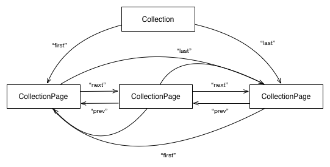

[목차로 돌아가기](ActivityStreams2.0Contents.md)

## 4. Model

The [Activity Vocabulary](https://www.w3.org/TR/activitystreams-vocabulary/) normatively defines the core object types and properties for Activity Streams 2.0.

The object types defined by the vocabulary are segmented into a set of eight core types and an extended set of Activity and Object types common to many social Web applications. The core types include:

- [Object](https://www.w3.org/TR/activitystreams-core/#asobject),
- [Link](https://www.w3.org/TR/activitystreams-core/#dfn-link),
- [Activity](https://www.w3.org/TR/activitystreams-core/#activity),
- [IntransitiveActivity](https://www.w3.org/TR/activitystreams-core/#intransitiveactivity),
- [Collection](https://www.w3.org/TR/activitystreams-core/#collection),
- [`OrderedCollection`](https://www.w3.org/TR/activitystreams-core/#dfn-orderedcollection),
- [`CollectionPage`](https://www.w3.org/TR/activitystreams-core/#dfn-collectionpage), and
- [`OrderedCollectionPage`](https://www.w3.org/TR/activitystreams-core/#dfn-orderedcollectionpage).

Every JSON object in an Activity Streams 2.0 document is either an [Object](https://www.w3.org/TR/activitystreams-core/#asobject) or a [Link](https://www.w3.org/TR/activitystreams-core/#dfn-link). All other types defined in the Activity Vocabulary, as well as all extension types, are derived from these two base types.

A JSON object in the Activity Streams 2.0 document is a [Link](https://www.w3.org/TR/activitystreams-core/#dfn-link) if either: (a) the object contains a `type` property whose value includes "`Link`" or (b) any of the types included in the value of the `type` property are defined as extensions of [Link](https://www.w3.org/TR/activitystreams-core/#dfn-link) (see [Mention](https://www.w3.org/TR/activitystreams-vocabulary/#dfn-mention) for instance); otherwise the JSON object is considered an instance or extension of [Object](https://www.w3.org/TR/activitystreams-core/#asobject).

### 4.1 Object

The [Object](https://www.w3.org/TR/activitystreams-vocabulary/#dfn-object) is the primary base type for the Activity Streams vocabulary.

In addition to having a global identifier (expressed as an absolute IRI using the `id` property) and an "object type" (expressed using the `type` property), all instances of the `Object` type share a common set of properties normatively defined by the [Activity Vocabulary](https://www.w3.org/TR/activitystreams-vocabulary/). 
These include: 
 [attachment](https://www.w3.org/TR/activitystreams-vocabulary/#dfn-attachment) |
 [attributedTo](https://www.w3.org/TR/activitystreams-vocabulary/#dfn-attributedto) |
 [audience](https://www.w3.org/TR/activitystreams-vocabulary/#dfn-audience) |
 [content](https://www.w3.org/TR/activitystreams-vocabulary/#dfn-content) |
 [context](https://www.w3.org/TR/activitystreams-vocabulary/#dfn-context) |
 [contentMap](https://www.w3.org/TR/activitystreams-vocabulary/#dfn-content) |
 [name](https://www.w3.org/TR/activitystreams-vocabulary/#dfn-name) |
 [nameMap](https://www.w3.org/TR/activitystreams-vocabulary/#dfn-name) |
 [endTime](https://www.w3.org/TR/activitystreams-vocabulary/#dfn-endtime) |
 [generator](https://www.w3.org/TR/activitystreams-vocabulary/#dfn-generator) |
 [icon](https://www.w3.org/TR/activitystreams-vocabulary/#dfn-icon) |
 [image](https://www.w3.org/TR/activitystreams-vocabulary/#dfn-image-term) |
 [inReplyTo](https://www.w3.org/TR/activitystreams-vocabulary/#dfn-inreplyto) |
 [location](https://www.w3.org/TR/activitystreams-vocabulary/#dfn-location) |
 [preview](https://www.w3.org/TR/activitystreams-vocabulary/#dfn-preview) |
 [published](https://www.w3.org/TR/activitystreams-vocabulary/#dfn-published) |
 [replies](https://www.w3.org/TR/activitystreams-vocabulary/#dfn-replies) |
 [startTime](https://www.w3.org/TR/activitystreams-vocabulary/#dfn-starttime) |
 [summary](https://www.w3.org/TR/activitystreams-vocabulary/#dfn-summary) |
 [summaryMap](https://www.w3.org/TR/activitystreams-vocabulary/#dfn-summary) |
 [tag](https://www.w3.org/TR/activitystreams-vocabulary/#dfn-tag) |
 [updated](https://www.w3.org/TR/activitystreams-vocabulary/#dfn-updated) |
 [url](https://www.w3.org/TR/activitystreams-vocabulary/#dfn-url) |
 [to](https://www.w3.org/TR/activitystreams-vocabulary/#dfn-to) |
 [bto](https://www.w3.org/TR/activitystreams-vocabulary/#dfn-bto) |
 [cc](https://www.w3.org/TR/activitystreams-vocabulary/#dfn-cc) |
 [bcc](https://www.w3.org/TR/activitystreams-vocabulary/#dfn-bcc) |
 [mediaType](https://www.w3.org/TR/activitystreams-vocabulary/#dfn-mediatype) |
 [duration](https://www.w3.org/TR/activitystreams-vocabulary/#dfn-duration)

All properties are optional (including the `id` and `type`).

<div align="center"><em>
Figure 7 Following is an example Object that uses the `id` and `type` properties to express the global identifier and object type:
</em></div>

><div align="center"> Example 7 </div>
>
>```json
>{
>  "@context": "https://www.w3.org/ns/activitystreams",
>  "id": "http://example.org/foo",
>  "type": "Note",
>  "name": "My favourite stew recipe",
>  "attributedTo": {
>    "id": "http://joe.website.example/",
>    "type": "Person",
>    "name": "Joe Smith"
>  },
>  "published": "2014-08-21T12:34:56Z"
>}
>```

The [Activity Vocabulary](https://www.w3.org/TR/activitystreams-vocabulary/) defines a range of `Object` types that are common to many social Web applications. This specification stops short of defining semantically specific properties for most of these objects. External vocabularies can be used to express additional detail not covered by the Activity Vocabulary.

Furthermore, while implementations are free to introduce new types of Objects beyond those defined by the Activity Vocabulary, interoperability issues can arise when applications rely too much on extension types that are not recognized by other implementations. Care should be taken to not unduly overlap with or duplicate the existing Object types.

When an implementation uses an extension type that overlaps with a core vocabulary type, the implementation *MUST* also specify the core vocabulary type. For instance, some vocabularies (e.g. The Good Relations Vocabulary) define their own types for describing locations. An implementation that wishes, for example, to use a http://purl.org/goodrelations/v1#Location as an object type *MUST* also identify the object as being a [Place](https://www.w3.org/TR/activitystreams-vocabulary/#dfn-place) as illustrated in the following:

<div align="center"><em>
Figure 8 An Object that is both a <code>Place</code> and a <code>gr:Location</code>:
</em></div>

><div align="center"> Example 8 </div>
>
>```json
>{
>  "@context": [
>    "https://www.w3.org/ns/activitystreams",
>    {
>      "gr": "http://purl.org/goodrelations/v1#"
>    }
>  ],
>  "type": ["Place", "gr:Location"],
>  "name": "Sally's Restaurant",
>  "longitude": 12.34,
>  "latitude": 56.78,
>  "gr:category": "restaurants/french_restaurants"
>}
>```

Certain properties defined by some External Vocabularies can overlap or duplicate those defined by the Activity Vocabulary. Where such overlap exists, for the sake of consistent interoperability, implementations MUST favor the use of properties defined by the Activity Vocabulary.

### 4.1.1 Text representations of Object types

Activity Streams consumers often need a text representation of an Activity Streams object, e.g. for display in a Web browser or console interface.

The [name](https://www.w3.org/TR/activitystreams-vocabulary/#dfn-name) property *SHOULD* be derived from input by the creator or another user.

The [summary](https://www.w3.org/TR/activitystreams-vocabulary/#dfn-summary) property *SHOULD* be used as a fallback text representation, possibly automatically generated by the publisher. If there is no `name` property, the `summary` property *SHOULD NOT* include markup, and *SHOULD* be short enough to be used as a reasonable text representation of the object.

<div align="center"><em>
Figure 9 A note with a name defined by the author
</em></div>

><div align="center"> Example 9 </div>
>
>```json
>{
>  "@context": "https://www.w3.org/ns/activitystreams",
>  "type": "Note",
>  "id": "http://example.org/note/123",
>  "name": "Our Weather Is Fine",
>  "content": "I feel that the weather is appropriate to our season and location."
>}
>```

<div align="center"><em>
Figure 10 A note with an automatically-generated summary
</em></div>

><div align="center"> Example 10 </div>
>
>```json
>{
>  "@context": "https://www.w3.org/ns/activitystreams",
>  "type": "Note",
>  "id": "http://example.org/note/124",
>  "summary": "A note by Sally",
>  "content": "Everything is OK here."
>}
>```

The `name` and `summary` *MAY* be absent, *MAY* lack explicit values in the end user's current language, and MAY be longer than appropriate for use as a text representation of the Object in the current language context. Consumer implementations *SHOULD* have fallback strategies for text representation of Objects in these cases.

### 4.2 Link

A `Link` describes a qualified, indirect reference to another resource that is closely related to the conceptual model of Links as established in [[RFC5988](https://www.w3.org/TR/activitystreams-core/#bib-RFC5988)]. The properties of the Link object are not the properties of the referenced resource, but are provided as hints for rendering agents to understand how to make use of the resource. For example, `height` and `width` might represent the desired rendered size of a referenced image, rather than the actual pixel dimensions of the referenced image.

The target URI of the Link is expressed using the required [href](https://www.w3.org/TR/activitystreams-vocabulary/#dfn-href) property. In addition, all `Link` instances share the following common set of optional properties as normatively defined by the [Activity Vocabulary](https://www.w3.org/TR/activitystreams-vocabulary/):
 [id](https://www.w3.org/TR/activitystreams-vocabulary/#dfn-id) |
 [name](https://www.w3.org/TR/activitystreams-vocabulary/#dfn-name) |
 [hreflang](https://www.w3.org/TR/activitystreams-vocabulary/#dfn-hreflang) |
 [mediaType](https://www.w3.org/TR/activitystreams-vocabulary/#dfn-mediatype) |
 [rel](https://www.w3.org/TR/activitystreams-vocabulary/#dfn-rel) |
 [height](https://www.w3.org/TR/activitystreams-vocabulary/#dfn-height) |
 [width](https://www.w3.org/TR/activitystreams-vocabulary/#dfn-width)

For example, all [Objects](https://www.w3.org/TR/activitystreams-core/#asobject) can contain an [image](https://www.w3.org/TR/activitystreams-vocabulary/#dfn-image-term) property whose value describes a graphical representation of the containing object. This property will typically be used to provide the URL to an image (e.g. JPEG, GIF or PNG) resource that can be displayed to the user. Any given object might have multiple such visual representations -- multiple screenshots, for instance, or the same image at different resolutions. In Activity Streams 2.0, there are essentially three ways of describing such references.

<div align="center"><em>
Figure 11 To reference a single image without any additional metadata, a direct association can be expressed as a JSON string containing an absolute IRI.
</em></div>

><div align="center"> Example 11 </em>
>
>```json
>{
>  "@context": "https://www.w3.org/ns/activitystreams",
>  "type": "Application",
>  "id": "http://example.org/application/123",
>  "name": "Exampletron 3000",
>  "image": "http://example.org/application/123.png"
>}
>```

<div align="center"><em>
Figure 12 Alternatively, if additional metadata is required (such as the MIME content type of the referenced resource) a <a href="https://www.w3.org/TR/activitystreams-core/#dfn-link">Link</a> can be used:
</em></div>

><div align="center"> Example 12 </div>
>
>```json
>{
>  "@context": "https://www.w3.org/ns/activitystreams",
>  "type": "Application",
>  "id": "http://example.org/application/123",
>  "name": "Exampletron 3000",
>  "image": {
>    "type": "Link",
>    "href": "http://example.org/application/123.png",
>    "mediaType": "image/png"
>  }
>}
>```

Formally, the former example establishes an unqualified direct relationship with the image resource while the latter creates a [qualified, indirect relationship](http://patterns.dataincubator.org/book/qualified-relation.html) that allows additional properties about the relationship to be specified.

<div align="center"><em>
Figure 13 If more than one value is to be expressed, A JSON Array with a mix of strings and <a href="https://www.w3.org/TR/activitystreams-core/#dfn-link">Link</a>s can be used:
</em></div>

><div align="center"> Example 13 </div>
>
>```json
>{
>  "@context": "https://www.w3.org/ns/activitystreams",
>  "type": "Application",
>  "id": "http://example.org/application/123",
>  "name": "Exampletron 3000",
>  "image": [
>    "http://example.org/application/abc.gif",
>    {
>      "type": "Link",
>      "href": "http://example.org/application/123.png",
>      "mediaType": "image/png"
>    }
>  ]
>}
>```

Individual items contained in such an array are independent of one another and no significance is given to the ordering.

RFC 5988 defines that all Links have a "link relation" that describes the contextual purpose of the link. Within a [Link](https://www.w3.org/TR/activitystreams-core/#dfn-link), the [rel](https://www.w3.org/TR/activitystreams-vocabulary/#dfn-rel) property provides the link relation value. If no `rel` property is specified, the link relation is considered to be unspecified. Any given Link can have multiple link relation values. In the JSON serialization, a single link relation is expressed as a single JSON string. Multiple link relations are expressed as an array of JSON strings.

The scope of the link relation is the object in which the [Link](https://www.w3.org/TR/activitystreams-core/#dfn-link) is an immediate child.

In the following example, two separate references are provided. The link relation of the first is unspecified, while the link relation of the second is "`thumbnail`".

<div align="center"><em>
Figure 14
</em></div>

><div align="center"> Example 14 </div>
>
>```json
>{
>  "@context": "https://www.w3.org/ns/activitystreams",
>  "type": "Application",
>  "id": "http://example.org/application/123",
>  "name": "Exampletron 3000",
>  "image": [
>    "http://example.org/application/abc.gif",
>    {
>      "type": "Link",
>      "href": "http://example.org/application/123.png",
>      "mediaType": "image/png",
>      "rel": "thumbnail"
>    }
>  ]
>}
>```

It ought to be noted that the [[HTML5](https://www.w3.org/TR/activitystreams-core/#bib-HTML5)] specification provides its own alternative definition of a "link relation" that differs slightly from the [[RFC5988](https://www.w3.org/TR/activitystreams-core/#bib-RFC5988)] definition. In the HTML5 definition, any string that does not contain the "space" U+0020, "tab" (U+0009), "LF" (U+000A), "FF" (U+000C), "CR" (U+000D) or "," (U+002C) characters can be used as a valid link relation. To promote interoperability, Activity Streams 2.0 implementations *MUST* only use link relations that are syntactically valid in terms of both the [[RFC5988](https://www.w3.org/TR/activitystreams-core/#bib-RFC5988)] and [[HTML5](https://www.w3.org/TR/activitystreams-core/#bib-HTML5)] definitions. Implementations *MAY* use link relation values that are not registered.

Note that the [Link](https://www.w3.org/TR/activitystreams-core/#dfn-link) and [Object](https://www.w3.org/TR/activitystreams-core/#asobject) types are disjoint from one another. That is, any given [Object](https://www.w3.org/TR/activitystreams-core/#asobject) cannot also be a [Link](https://www.w3.org/TR/activitystreams-core/#dfn-link).

### 4.3 Actor

Actor objects are specializations of the base [Object](https://www.w3.org/TR/activitystreams-core/#asobject) type that represent entities capable of carrying out an Activity. The [Activity Vocabulary](https://www.w3.org/TR/activitystreams-vocabulary/) provides the normative definition of five specific types of Actors:
 [Application](https://www.w3.org/TR/activitystreams-vocabulary/#dfn-application) |
 [Group](https://www.w3.org/TR/activitystreams-vocabulary/#dfn-group) |
 [Organization](https://www.w3.org/TR/activitystreams-vocabulary/#dfn-organization) |
 [Person](https://www.w3.org/TR/activitystreams-vocabulary/#dfn-person) |
 [Service](https://www.w3.org/TR/activitystreams-vocabulary/#dfn-service).

This specification intentionally defines Actors in only the most generalized way, stopping short of defining semantically specific properties for each. All Actor objects are specializations of [Object](https://www.w3.org/TR/activitystreams-core/#asobject) and inherit all of the core properties common to all Objects. External vocabularies can be used to express additional detail not covered by the Activity Vocabulary. VCard [ [vcard-rdf](https://www.w3.org/TR/activitystreams-core/#bib-vcard-rdf)] *SHOULD* be used to provide additional metadata for [Person](https://www.w3.org/TR/activitystreams-vocabulary/#dfn-person), [Group](https://www.w3.org/TR/activitystreams-vocabulary/#dfn-group), and [Organization](https://www.w3.org/TR/activitystreams-vocabulary/#dfn-organization) instances.

<div align="center"><em>
Figure 15 An Activity with a Person actor extended with VCard properties:
</em></div>

><div align="center"> Example 15 </div>
>
>```json
>{
>  "@context": [
>    "https://www.w3.org/ns/activitystreams",
>    {"vcard": "http://www.w3.org/2006/vcard/ns#"}
>  ],
>  "summary": "Sally created a note",
>  "type": "Create",
>  "actor": {
>    "type": ["Person", "vcard:Individual"],
>    "id": "http://sally.example.org",
>    "name": "Sally Smith",
>    "vcard:given-name": "Sally",
>    "vcard:family-name": "Smith"
>  },
>  "object": {
>    "type": "Note",
>    "content": "This is a simple note"
>  }
>}
>```

While implementations are free to introduce new types of Actors beyond those defined by the Activity Vocabulary, interoperability issues can arise when applications rely too much on extension types that are not recognized by other implementations. Care should be taken to not unduly overlap with or duplicate the existing Actor types.

When an implementation uses an extension type that overlaps with a core vocabulary type, the implementation *MUST* also specify the core vocabulary type. For instance, some vocabularies (e.g. VCard) define their own types for describing people. An implementation that wishes, for example, to use a `vcard:Individual` as an Actor *MUST* also identify that Actor as a [Person](https://www.w3.org/TR/activitystreams-vocabulary/#dfn-person) as illustrated in the previous example.

### 4.4 Activity

Activity objects are specializations of the base [Object](https://www.w3.org/TR/activitystreams-core/#asobject) type that provide information about actions that have either already occurred, are in the process of occurring, or may occur in the future.

In addition to common properties supported by all [Object](https://www.w3.org/TR/activitystreams-core/#asobject) instances, Activity objects support the following additional properties defined by the [Vocabulary](https://www.w3.org/TR/activitystreams-vocabulary/):
 [actor](https://www.w3.org/TR/activitystreams-vocabulary/#dfn-actor) |
 [object](https://www.w3.org/TR/activitystreams-vocabulary/#dfn-object-term) |
 [target](https://www.w3.org/TR/activitystreams-vocabulary/#dfn-target) |
 [origin](https://www.w3.org/TR/activitystreams-vocabulary/#dfn-origin) |
 [result](https://www.w3.org/TR/activitystreams-vocabulary/#dfn-result) |
 [instrument](https://www.w3.org/TR/activitystreams-vocabulary/#dfn-instrument)

The `type` property is used to identify the type of action the Activity Statement represents.

<div align="center"><em>
Figure 16 The following example illustrates a simple Activity:
</em></div>

><div align="center"> Example 16 </div>
>
>```json
>{
>  "@context": "https://www.w3.org/ns/activitystreams",
>  "summary": "Joe liked a note",
>  "type": "Like",
>  "id": "http://www.test.example/activity/1",
>  "actor": "http://example.org/profiles/joe",
>  "object": "http://example.com/notes/1",
>  "published": "2014-09-30T12:34:56Z"
>}
>```

The [Activity Vocabulary](https://www.w3.org/TR/activitystreams-vocabulary/) defines a small number of `Activity` types that are common to many social Web applications. This specification stops short of defining semantically specific properties for most of these activities. External vocabularies can be used to express additional detail not covered by the Activity Vocabulary.

While implementations are free to introduce new types of Activites beyond those defined by the Activity Vocabulary, interoperability issues can arise when applications rely too much on extension types that are not recognized by other implementations. Care should be taken to not unduly overlap with or duplicate the existing Activity types.

When an implementation uses an extension type that overlaps with a core vocabulary type, the implementation *MUST* also specify the core vocabulary type. For instance, some vocabularies (e.g. Schema.org) define their own types for describing actions. An implementation that wishes, for example, to use http://schema.org/LikeAction as an Activity *MUST* also identify that Object as being a [Like](https://www.w3.org/TR/activitystreams-vocabulary/#dfn-like) as illustrated in the following:

<div align="center"><em>
Figure 17 An Activity that is both a <a href="https://www.w3.org/TR/activitystreams-vocabulary/#dfn-like">Like</a> and a <code>http://schema.org/LikeAction:</code>
</em></div>

><div align="center"> Example 17 </div>
>
>```json
>{
>  "@context": "https://www.w3.org/ns/activitystreams",
>  "summary": "Joe liked a note",
>  "type": ["Like", "http://schema.org/LikeAction"],
>  "id": "http://www.test.example/activity/1",
>  "actor": "http://example.org/profiles/joe",
>  "object": "http://example.com/notes/1",
>  "published": "2014-09-30T12:34:56Z"
>}
>```

Implementations are free to use Activity objects in both passive and imperative operations. In the passive sense, the Activity is used to record that an activity has or is occurring. In the imperative sense, the Activity can be used as a form of command, instructing an application to modify state in some manner consistent with the action being described. However, because this specification does not define a normative processing model that constrains how applications make use of the format, the distinction about whether an Activity statement is to be interpreted as a passive notification or as an imperative command can vary across implementations.

### 4.5 IntransitiveActivity

IntransitiveActivity objects are specializations of the [Activity](https://www.w3.org/TR/activitystreams-core/#activity) type that represent intransitive actions. IntransitiveActivity objects do not have an [object](https://www.w3.org/TR/activitystreams-vocabulary/#dfn-object-term) property.

### 4.6 Collection

`Collection` objects are a specialization of the base [Object](https://www.w3.org/TR/activitystreams-core/#asobject) that serve as a container for other [Objects](https://www.w3.org/TR/activitystreams-core/#asobject) or [Links](https://www.w3.org/TR/activitystreams-core/#dfn-link).

In addition to the base properties inherited by all [Objects](https://www.w3.org/TR/activitystreams-core/#asobject), all [Collection](https://www.w3.org/TR/activitystreams-core/#collection) types contain the additional properties:
 [items](https://www.w3.org/TR/activitystreams-vocabulary/#dfn-items) |
 [totalItems](https://www.w3.org/TR/activitystreams-vocabulary/#dfn-totalitems) |
 [first](https://www.w3.org/TR/activitystreams-vocabulary/#dfn-first) |
 [last](https://www.w3.org/TR/activitystreams-vocabulary/#dfn-last) |
 [current](https://www.w3.org/TR/activitystreams-vocabulary/#dfn-current)

The items within a [Collection](https://www.w3.org/TR/activitystreams-core/#collection) can be ordered or unordered. The `OrderedCollection` type *MAY* be used to identify a Collection whose items are always ordered. In the JSON serialization, the unordered items of a Collection are represented using the `items` property while ordered items are represented using the `orderedItems` property.

<div align="center"><em>
Figure 18 The following is a simple unordered collection:
</em></div>

><div align="center"> Example 18 </div>
>
>```json
>{
>  "@context": "https://www.w3.org/ns/activitystreams",
>  "summary": "Object history",
>  "type": "Collection",
>  "totalItems": 2,
>  "items": [
>    {
>      "type": "Create",
>      "actor": "http://www.test.example/sally",
>      "object": "http://example.org/foo"
>    },
>    {
>      "type": "Like",
>      "actor": "http://www.test.example/joe",
>      "object": "http://example.org/foo"
>    }
>  ]
>}
>```

<div align="center"><em>
Figure 19 The following is a simple ordered collection:
</em></div>

><div align="center"> Example 19 </div>
>
>```json
>{
>  "@context": "https://www.w3.org/ns/activitystreams",
>  "summary": "Object history",
>  "type": "OrderedCollection",
>  "totalItems": 2,
>  "orderedItems": [
>    {
>      "type": "Create",
>      "actor": "http://www.test.example/sally",
>      "object": "http://example.org/foo"
>    },
>    {
>      "type": "Like",
>      "actor": "http://www.test.example/joe",
>      "object": "http://example.org/foo"
>    }
>  ]
>}
>```

### 4.6.1 Collection Paging

A Collection can contain a large number of items. Often, it becomes impractical for an implementation to serialize every item contained by a Collection using the `items` (or `orderedItems`) property alone. In such cases, the items within a Collection can be divided into distinct subsets or "pages". A page is identified using the `CollectionPage` type.

The [`CollectionPage`](https://www.w3.org/TR/activitystreams-core/#dfn-collectionpage) type extends from the base [Collection](https://www.w3.org/TR/activitystreams-core/#collection) type and inherits all of it's properties. The following additional properties can also be specified:
 [partOf](https://www.w3.org/TR/activitystreams-vocabulary/#dfn-partof) |
 [next](https://www.w3.org/TR/activitystreams-vocabulary/#dfn-next) |
 [prev](https://www.w3.org/TR/activitystreams-vocabulary/#dfn-prev) |

The `partOf` property identifies the [Collection](https://www.w3.org/TR/activitystreams-core/#collection) to which the items contained by the `CollectionPage` belong.

The `first`, `next`, `prev`, `last`, and `current` properties are used to reference other [`CollectionPage`](https://www.w3.org/TR/activitystreams-core/#dfn-collectionpage) instances that contain additional subsets of items from the parent collection.

As with `Collection` objects, the items within a `CollectionPage` might be ordered or unordered. The *`OrderedCollectionPage`* type *MAY* be used to identify a page whose items are strictly ordered.

The [`OrderedCollectionPage`](https://www.w3.org/TR/activitystreams-core/#dfn-orderedcollectionpage) type extends from both [`CollectionPage`](https://www.w3.org/TR/activitystreams-core/#dfn-collectionpage) and [`OrderedCollection`](https://www.w3.org/TR/activitystreams-core/#dfn-orderedcollection) . In addition to the properties inherited from each of those, the `OrderedCollectionPage` may contain an additional [startIndex](https://www.w3.org/TR/activitystreams-vocabulary/#dfn-startindex) property whose value indicates the relative index position of the first item contained by the page within the `OrderedCollection` to which the page belongs.

<div align="center"><em>
Figure 20 An illustration of the relationship between
 <code>Collection</code>,
 <code>OrderedCollection</code>,
 <code>CollectionPage</code>, and
 <code>OrderedCollectionPage</code>:
</em></div>


~~[Collection type Model](https://www.w3.org/TR/activitystreams-core/paging2.png)~~

[//Link]: # "https://www.w3.org/TR/activitystreams-core/paging2.png"

Whether ordered or not, the pages of a `Collection` are typically arranged in a sequence (either a singly or doubly-linked list). The `first` property is used to identify the first page in this sequence, while the `last` property is used to identify the final page in the sequence. The `prev` and `next` properties identify the pages immediately before and immediately following, respectively.

<div align="center"><em>
Figure 21 A visualization of the Collection paging model:
</em></div>



~~[The Paging Model](https://www.w3.org/TR/activitystreams-core/paging.png)~~

[//Link]: # "https://www.w3.org/TR/activitystreams-core/paging2.png"

The `current` property identifies a page containing the subset of items in the `Collection` that have been created or updated most recently.

The values for the `first`, `last`, `next`, `prev`, and `current` properties can be either a single [`CollectionPage`](https://www.w3.org/TR/activitystreams-core/#dfn-collectionpage) or a [Link](https://www.w3.org/TR/activitystreams-core/#dfn-link) referencing a separate resource containing a [`CollectionPage`](https://www.w3.org/TR/activitystreams-core/#dfn-collectionpage) .

<div align="center"><em>
Figure 22 The following is a simple unordered collection with paging:
</em></div>

><div align="center"> Example 20 </div>
>
>```json
>{
>  "@context": "https://www.w3.org/ns/activitystreams",
>  "summary": "Sally's recent activities",
>  "type": "Collection",
>  "id": "http://example.org/foo",
>  "totalItems": 10,
>  "first": {
>    "type": "CollectionPage",
>    "id": "http://example.org/foo?page=1",
>    "partOf": "http://example.org/foo",
>    "next": "http://example.org/foo?page=2",
>    "items": [
>      {
>        "type": "Create",
>        "actor": "http://www.test.example/sally",
>        "object": "http://example.org/foo"
>      }
>    ]
>  }
>}
>```

Using paging with an `OrderedCollection` can be tricky because there are no guarantees that implementations will process the sequence of pages in any predictable order. Implementations that wish to reconstruct the appropriate complete ordering of member items in the logical collection should navigate to the first (or last) page in the sequence then recursively follow the `next` (or `prev`) link until all pages have been processed. The pages of an `OrderedCollection` *SHOULD* be instances of `OrderedCollectionPage`. If the pages of an `OrderedCollection` are not instances of `OrderedCollectionPage`, a consumer will have no reliable means of reconstructing the appropriate ordering of items.

### 4.7 Natural Language Values

Several properties defined by the [Vocabulary](https://www.w3.org/TR/activitystreams-vocabulary/) are defined as having natural language values. These are human-readable strings using one or more languages. Within the JSON serialization, they are expressed as either (1) a single JSON string or (2) a JSON object mapping well-formed [[BCP47](https://www.w3.org/TR/activitystreams-core/#bib-BCP47)] Language-Tags to localized, equivalent translations of the same string value. In the serialized JSON, these two forms are differentiated using a simple property naming convention, for instance: "`name`" identifies the JSON string form for the [name](https://www.w3.org/TR/activitystreams-vocabulary/#dfn-name) property while "`nameMap`" represents the object form.

<div align="center"><em>
Figure 23 A single name String value without language information:
</em></div>

><div align="center"> Example 21 </div>
>
>```json
>{
>  "@context": "https://www.w3.org/ns/activitystreams",
>  "type": "Object",
>  "name": "This is the title"
>}
>```

<div align="center"><em>
Figure 24 Multiple, language-specific values:
</em></div>

><div align="center">
>Example 22
></div>
>
>```json
>{
>  "@context": "https://www.w3.org/ns/activitystreams",
>  "type": "Object",
>  "nameMap": {
>    "en": "This is the title",
>    "fr": "C'est le titre",
>    "es": "Este es el título"
>  }
>}
>```

Every key in the object form MUST be a well-formed [[BCP47](https://www.w3.org/TR/activitystreams-core/#bib-BCP47)] Language-Tag. The associated values MUST be strings.

The [Activity Vocabulary](https://www.w3.org/TR/activitystreams-vocabulary/) defines three properties that use natural language values:
 [name](https://www.w3.org/TR/activitystreams-vocabulary/#dfn-name),
 [summary](https://www.w3.org/TR/activitystreams-vocabulary/#dfn-summary), and
 [content](https://www.w3.org/TR/activitystreams-vocabulary/#dfn-content).
Accordingly, in the JSON serialization, the terms " `name`", "`summary`", and "`content`" represent the JSON string forms; and the terms " `nameMap`", "`summaryMap`", and " `contentMap`" for represent the object forms.

The special language tag "`und`" can be used within the object form to explicitly identify a value whose language is unknown or undetermined.

<div align="center"><em>
Figure 25 Using the <code>"und"</code> language tag:
</em></div>

><div align="center">
>Example 23
></div>
>
>```json
>{
>  "@context": "https://www.w3.org/ns/activitystreams",
>  "type": "Object",
>  "nameMap": {
>    "und": "This is the title"
>  }
>}
>```

### 4.7.1 Default Language Context

When using [[JSON-LD](https://www.w3.org/TR/activitystreams-core/#bib-JSON-LD)] mechanisms to produce or consume Activity Streams 2.0 documents, the `@language` property *MAY* be used within a `@context` to identify the default language. This mechanism may not be understood by implementations that do not choose to process Activity Streams 2.0 documents using JSON-LD.

<div align="center"><em>
Figure 26 Specifying the default "@language" within the JSON-LD @context:
</em></div>

><div align="center"> Example 24 </div>
>
>```json
>{
>  "@context": [
>    "https://www.w3.org/ns/activitystreams",
>    {
>      "@language": "en"
>    }],
>  "type": "Object",
>  "name": "This is the title"
>}
>```

[//Comment]: # "@language가 en으로 설정되어 있으므로 따로 번역을 하지 않겠습니다."

### 4.7.2 Bidirectional Text

Natural language values within an Activity Streams 2.0 document *MAY* contain bidirectional text. The default base direction of an Activity Streams 2.0 document is Left-to-Right. The base direction of individual natural language values *MAY* be modified as described below.

When specifying bidirectional text for a natural language value, and the base direction of the text cannot be correctly identified by the first strong directional character of that text, publishers *SHOULD* explicitly identify the default direction either by prefixing the value with an appropriate Unicode bidirectional control character, or by using HTML directional markup where permitted.

Consumers of Activity Streams 2.0 documents that contain bidirectional text *SHOULD* identify the base direction of any given natural language value by either scanning the text for the first strong directional character not contained within a markup tag; or by utilizing directional markup where provided. Once the base direction has been identified, consumers *MUST* determine the appropriate rendering and display of natural language values, according to the Unicode Bidirectional Algorithm [[BIDI](https://www.w3.org/TR/activitystreams-core/#bib-BIDI)]. This may necessitate wrapping additional control characters or markup around the string prior to display, in order to apply the base direction.

Property | Value | Direction | Method
--|--|--|--
`name` | `"פעילות הבינאום, W3C"` | Right-to-Left | First strong directional character
`name` | `"The document was titled, '\u2067פעילות הבינאום, W3C\u2069'"` | Left-to-Right | First strong directional character
`name` | `"\u200FHTML היא שפת סימון"` | Right-to-Left | Bidi Control Character
`name` | `"\u200E'سلام' is hello in Persian."` | Left-to-Right | Bidi Control Character
`summary` | `<p dir=\"rtl\">HTML היא שפת סימון>/p>` | Right-to-Left | HTML Markup
`summary` | `<p>פעילות הבינאום, W3C</p>` | Right-to-Left | First strong directional character (ignoring markup)
`summary` | `<p title="سلام">Hello</p>` | Left-to-Right | First strong directional character (ignoring markup)

[//Comment]: # "영문 부분만 번역하는것으로 하겠습니다."

### 4.8 Marking up language

Activity Streams 2.0 publishers *SHOULD* explicitly mark the language of natural language properties if they are known, using either map properties or a default language tag.

>Note: Examples
>
>Not all examples in this specification explicitly mark the language of natural language properties. This is intentional. The authors and the working group wished to avoid having implementers cut-and-paste examples from the document with explicit language markup as a template for new documents, which would consequently have inaccurate language markup.
